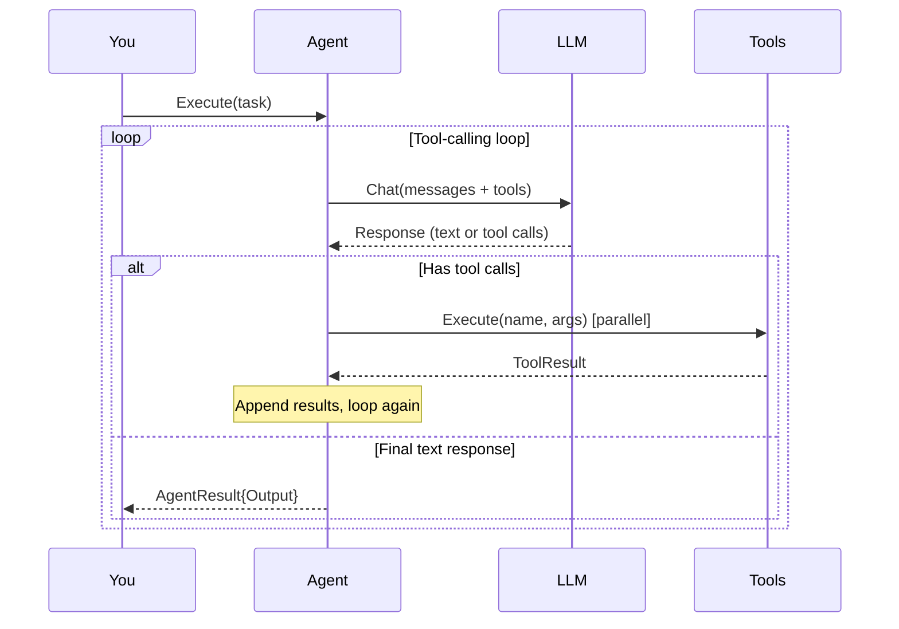
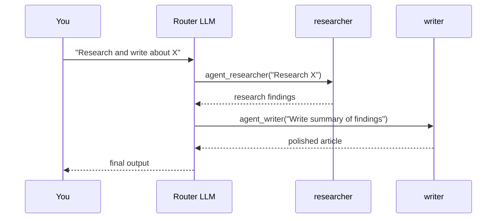

# Quick Start

Build a working AI agent with tools, memory, and streaming in 5 minutes.

## 1. Agent with Tools

Add tools so the agent can take actions — search the web, read files, call APIs:

```go
package main

import (
    "context"
    "fmt"
    "log"

    oasis "github.com/nevindra/oasis"
    "github.com/nevindra/oasis/provider/gemini"
    "github.com/nevindra/oasis/store/sqlite"
    "github.com/nevindra/oasis/tools/knowledge"
    "github.com/nevindra/oasis/tools/search"
)

func main() {
    ctx := context.Background()

    // Providers (or use resolve.Provider for config-driven setup — see Provider Resolution)
    llm := gemini.New("your-api-key", "gemini-2.5-flash")
    embedding := gemini.NewEmbedding("your-api-key", "gemini-embedding-001", 1536)

    // Storage
    store := sqlite.New("oasis.db")
    store.Init(ctx)

    // Agent with tools
    agent := oasis.NewLLMAgent("researcher", "Searches for information", llm,
        oasis.WithTools(
            knowledge.New(store, embedding),
            search.New(embedding, "your-brave-api-key"),
        ),
        oasis.WithPrompt("You are a research assistant. Search thoroughly before answering."),
        oasis.WithMaxIter(5),
    )

    result, err := agent.Execute(ctx, oasis.AgentTask{
        Input: "What are the latest developments in Go generics?",
    })
    if err != nil {
        log.Fatal(err)
    }
    fmt.Println(result.Output)
}
```

The agent loop works like this:



## 2. Multi-Agent Network

When a task needs multiple specialists, compose agents into a Network:

```go
researcher := oasis.NewLLMAgent("researcher", "Searches for information", llm,
    oasis.WithTools(searchTool),
)
writer := oasis.NewLLMAgent("writer", "Writes polished content", llm,
    oasis.WithPrompt("You are a skilled technical writer."),
)

team := oasis.NewNetwork("team", "Research and writing team", llm,
    oasis.WithAgents(researcher, writer),
)

result, _ := team.Execute(ctx, oasis.AgentTask{
    Input: "Research Go error handling best practices and write a summary",
})
```

The router LLM sees subagents as tools (`agent_researcher`, `agent_writer`) and decides which to invoke:



## 3. Deterministic Workflow

When you know the exact execution order, use a Workflow instead of letting an LLM route:

```go
pipeline, err := oasis.NewWorkflow("pipeline", "Research then write",
    oasis.Step("prepare", func(ctx context.Context, wCtx *oasis.WorkflowContext) error {
        wCtx.Set("query", "Research thoroughly: "+wCtx.Input())
        return nil
    }),
    oasis.AgentStep("research", researcher,
        oasis.InputFrom("query"),
        oasis.After("prepare"),
    ),
    oasis.AgentStep("write", writer,
        oasis.InputFrom("research.output"),
        oasis.After("research"),
    ),
)

result, _ := pipeline.Execute(ctx, oasis.AgentTask{Input: "Go error handling"})
```

## 4. Conversation Memory

Make agents remember past conversations:

```go
agent := oasis.NewLLMAgent("assistant", "Helpful assistant", llm,
    oasis.WithTools(searchTool),
    oasis.WithConversationMemory(store,
        oasis.CrossThreadSearch(embedding),  // recall from past threads
    ),
    oasis.WithUserMemory(memoryStore, embedding),  // learn user facts
)

// Pass thread_id to enable history
result, _ := agent.Execute(ctx, oasis.AgentTask{
    Input: "What did we discuss yesterday?",
    Context: map[string]any{
        oasis.ContextThreadID: "thread-123",
        oasis.ContextUserID:   "user-42",
    },
})
```

## 5. Streaming

Stream tokens as they arrive instead of waiting for the full response:

```go
if sa, ok := agent.(oasis.StreamingAgent); ok {
    ch := make(chan string, 64)
    go func() {
        for token := range ch {
            fmt.Print(token)  // print each token as it arrives
        }
    }()
    result, _ := sa.ExecuteStream(ctx, task, ch)
}
```

## Built-in Tools

| Package | Tool Functions | What it does |
|---------|---------------|-------------|
| `tools/knowledge` | `knowledge_search` | RAG search over stored documents |
| `tools/remember` | `remember` | Store facts to knowledge base |
| `tools/search` | `web_search` | Web search via Brave API |
| `tools/schedule` | `schedule_create`, `schedule_list`, `schedule_update`, `schedule_delete` | Time-based task scheduling |
| `tools/shell` | `shell_exec` | Execute shell commands (sandboxed) |
| `tools/file` | `file_read`, `file_write`, `file_list` | File operations (sandboxed) |
| `tools/http` | `http_fetch` | Fetch URLs |

## What's Next

- [Concepts](../concepts/index.md) — deep-dive into each primitive
- [Custom Tool Guide](../guides/custom-tool.md) — build your own tool
- [Configuration](../configuration/index.md) — all config options
