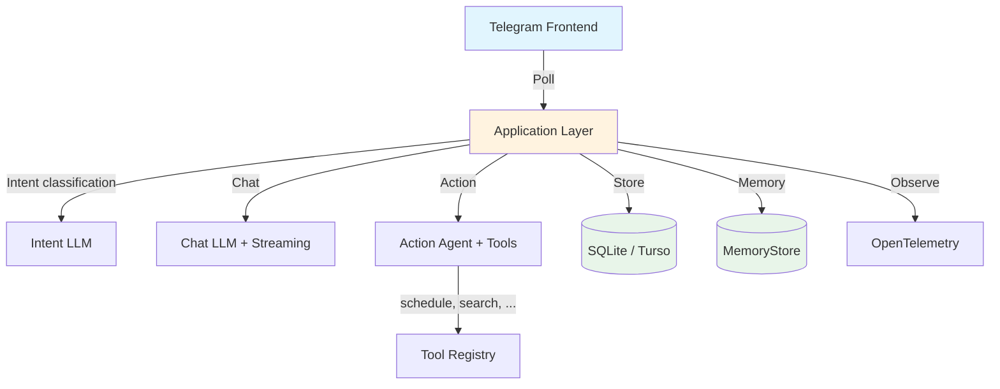

# Reference App

Oasis ships with a reference Telegram bot that demonstrates how to wire framework primitives into a real application. The bot is a demo — the framework is the product.

## Prerequisites

| Requirement | Purpose |
|-------------|---------|
| **Go 1.24+** | Build |
| **Telegram Bot Token** | Get from [@BotFather](https://t.me/BotFather) |
| **Gemini API Key** | Get from [Google AI Studio](https://aistudio.google.com/) |

Optional:
- **Brave Search API Key** — enables `web_search` tool ([brave.com/search/api](https://brave.com/search/api/))
- **Turso account** — managed remote database instead of local SQLite

## Build and Run

```bash
git clone https://github.com/nevindra/oasis.git
cd oasis
go build ./cmd/bot_example/
```

Configure environment variables:

```bash
# Required
export OASIS_TELEGRAM_TOKEN="your-telegram-bot-token"
export OASIS_LLM_API_KEY="your-gemini-api-key"
export OASIS_EMBEDDING_API_KEY="your-gemini-api-key"

# Optional
export OASIS_BRAVE_API_KEY="your-brave-search-key"
```

Run:

```bash
./bot_example
```

## Configuration

The default `oasis.toml` ships with sensible defaults. You typically only need to change `timezone_offset`:

```toml
[telegram]
allowed_user_id = 0  # 0 = auto-register first user as owner

[llm]
provider = "gemini"
model = "gemini-2.5-flash"

[embedding]
provider = "gemini"
model = "gemini-embedding-001"
dimensions = 1536

[brain]
timezone_offset = 7  # UTC+7 (WIB)
```

See [Configuration Reference](../configuration/reference.md) for all options.

## Try It

Open Telegram, find your bot, and send a message. The first user to message the bot is automatically registered as the owner.

| Message | What happens |
|---------|-------------|
| "Hello, how are you?" | Conversational response |
| "Search the web for Go 1.24 release notes" | Uses `web_search` tool |
| "Remember that my favorite color is blue" | Saves to knowledge base |
| "What's my favorite color?" | Retrieves from knowledge base + memory |
| Send a `.txt` or `.md` file | Ingests into knowledge base |
| Send a URL | Ingests page content |

## What Gets Created

| File | Purpose |
|------|---------|
| `oasis.db` | SQLite database (threads, messages, documents, chunks, memory) |
| `~/oasis-workspace/` | Sandboxed directory for shell and file tools |

## Docker

```bash
docker build -f cmd/bot_example/Dockerfile -t oasis .
docker run --env-file .env oasis
```

## Architecture

The reference app in `internal/bot/` demonstrates:



This is one way to compose Oasis primitives. The framework doesn't enforce this architecture — you can wire components together however you need.
