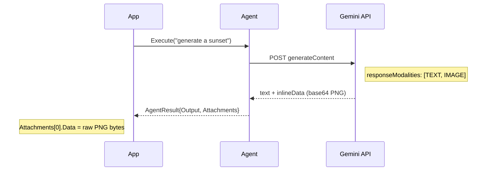

# Image Generation

Generate images from text prompts using multimodal LLMs. The LLM returns generated images as attachments alongside optional text content.

## Quick Start

```go
import (
    "github.com/nevindra/oasis"
    "github.com/nevindra/oasis/provider/gemini"
)

imageProvider := gemini.New(apiKey, "gemini-2.0-flash-exp-image-generation",
    gemini.WithResponseModalities("TEXT", "IMAGE"),
)

agent := oasis.NewLLMAgent("artist", "You generate images from text descriptions.", imageProvider)

result, err := agent.Execute(ctx, oasis.AgentTask{
    Input: "Generate an image of a sunset over the ocean",
})
if err != nil {
    log.Fatal(err)
}

// Text response (if any)
fmt.Println(result.Output)

// Generated images
for _, att := range result.Attachments {
    fmt.Printf("Image: %s (%d bytes)\n", att.MimeType, len(att.Data))
    os.WriteFile("output.png", att.Data, 0644)
}
```

## How It Works

Image generation is not a separate tool — it's a provider capability. When `WithResponseModalities("TEXT", "IMAGE")` is set, the Gemini API can return `inlineData` parts containing generated images. The provider decodes these into `Attachment` structs on `ChatResponse.Attachments`, which flow through to `AgentResult.Attachments`.



## Provider Setup

Use `WithResponseModalities` to tell the model what output types to produce:

```go
// Text + image output (recommended — model can explain the image)
provider := gemini.New(apiKey, "gemini-2.0-flash-exp-image-generation",
    gemini.WithResponseModalities("TEXT", "IMAGE"),
)

// Image-only output
provider := gemini.New(apiKey, "gemini-2.0-flash-exp-image-generation",
    gemini.WithResponseModalities("IMAGE"),
)
```

Compatible models (as of February 2026):
- `gemini-2.0-flash-exp-image-generation`

## Streaming

Image generation works with streaming. Generated images arrive in the SSE stream as `inlineData` chunks and are collected into `ChatResponse.Attachments`:

```go
if sa, ok := agent.(oasis.StreamingAgent); ok {
    ch := make(chan oasis.StreamEvent, 64)
    go func() {
        for ev := range ch {
            if ev.Type == oasis.EventTextDelta {
                fmt.Print(ev.Content)
            }
        }
    }()

    result, err := sa.ExecuteStream(ctx, task, ch)
    // result.Attachments contains generated images
}
```

## Image Editing

Send an existing image with a text prompt to edit it:

```go
imageData, _ := os.ReadFile("photo.png")

result, err := agent.Execute(ctx, oasis.AgentTask{
    Input: "Add a rainbow to this image",
    Attachments: []oasis.Attachment{
        {MimeType: "image/png", Data: imageData},
    },
})
// result.Attachments contains the edited image
```

## Multi-Agent with Image Generation

Use a Network to combine image generation with other capabilities:

```go
imageAgent := oasis.NewLLMAgent("artist", "Generate images from descriptions", imageProvider)
textAgent := oasis.NewLLMAgent("writer", "Write creative descriptions", textProvider,
    oasis.WithTools(searchTool),
)

network := oasis.NewNetwork("creative", "Creative assistant", router,
    oasis.WithAgents(imageAgent, textAgent),
)
```

## Handling Attachments

`Attachment.Data` contains raw bytes (typically PNG). Common patterns:

```go
for _, att := range result.Attachments {
    switch {
    case strings.HasPrefix(att.MimeType, "image/"):
        // Save to file
        os.WriteFile("output.png", att.Data, 0644)

        // Or encode to base64 for HTTP response
        b64 := base64.StdEncoding.EncodeToString(att.Data)
        fmt.Fprintf(w, ``, att.MimeType, b64)

        // Or send via API (Telegram, Slack, etc.)
        sendPhoto(chatID, att.Data)
    }
}
```

## Important Notes

- **Separate provider instance.** Image-gen models require `WithResponseModalities`. Create a dedicated provider for image generation rather than reusing a text-only provider.
- **No tools with image-gen.** Image generation models do not support function calling. If you need tools + images, use a Network with separate agents.
- **No thinking mode.** Image generation models do not support `thinkingConfig`. Leave `WithThinking` at its default (`false`).
- **Response size.** Generated images are returned as base64 in the API response, which can be large. Use buffered channels for streaming.

## See Also

- [Provider Concept](../concepts/provider.md) — Provider interface, Attachment type
- [Streaming Guide](streaming.md) — StreamingAgent, SSE
- [Agent Concept](../concepts/agent.md) — AgentResult.Attachments
