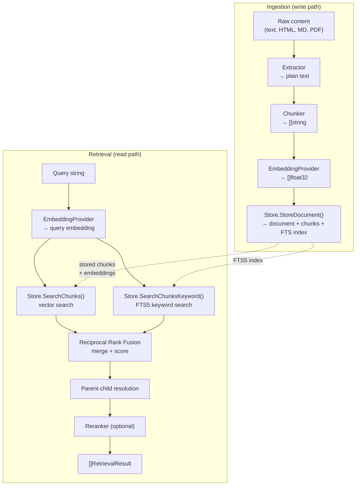
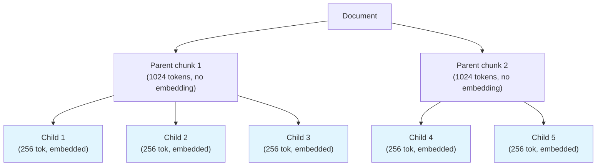
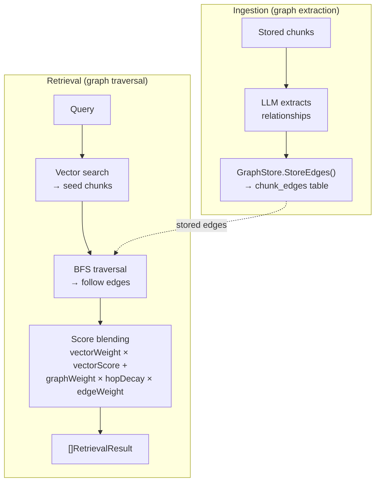

# RAG Pipeline

This guide walks through Oasis's complete Retrieval-Augmented Generation pipeline — from raw documents to search results in an agent's context. It covers ingestion, retrieval, and how to wire everything together.

## Architecture Overview



## Quick Start

```go
import (
    "github.com/nevindra/oasis"
    "github.com/nevindra/oasis/ingest"
    "github.com/nevindra/oasis/tools/knowledge"
    "github.com/nevindra/oasis/store/sqlite"
    "github.com/nevindra/oasis/provider/gemini"
)

// 1. Set up dependencies
store := sqlite.New("oasis.db")
store.Init(ctx)
embedding := gemini.NewEmbedding(apiKey, "text-embedding-004", 768)

// 2. Ingest documents
ingestor := ingest.NewIngestor(store, embedding)
result, _ := ingestor.IngestText(ctx, content, "https://example.com", "My Document")
fmt.Printf("Stored %d chunks\n", result.ChunkCount)

// 3. Search with the retrieval pipeline
retriever := oasis.NewHybridRetriever(store, embedding)
results, _ := retriever.Retrieve(ctx, "what is the main idea?", 5)

// 4. Give it to an agent via KnowledgeTool
knowledgeTool := knowledge.New(store, embedding)
agent := oasis.NewLLMAgent("assistant", "Helpful assistant", llm,
    oasis.WithTools(knowledgeTool),
)
```

## Ingestion (Write Path)

The ingestion pipeline converts raw content into searchable, embedded chunks stored in the database. It runs: **extract → chunk → embed → store**.

**Package:** `github.com/nevindra/oasis/ingest`

### Step 1: Extraction

Extractors convert raw bytes into plain text. Content type is detected from file extension.

| Extractor | Content Types | Notes |
|-----------|--------------|-------|
| `PlainTextExtractor` | `text/plain` | Pass-through |
| `HTMLExtractor` | `text/html` | Strips tags, scripts, styles; decodes entities |
| `MarkdownExtractor` | `text/markdown` | Strips formatting, preserves content |
| `pdf.NewExtractor()` | PDF | Opt-in, `ingest/pdf` subpackage |

```go
// Custom extractor for unsupported formats
type CSVExtractor struct{}
func (CSVExtractor) Extract(content []byte) (string, error) {
    return convertCSVToText(content)
}

ingestor := ingest.NewIngestor(store, embedding,
    ingest.WithExtractor("text/csv", CSVExtractor{}),
)
```

### Step 2: Chunking

Chunkers split plain text into pieces suitable for embedding. Token counts are approximated as `tokens * 4` characters.

#### RecursiveChunker (default)

Splits hierarchically: paragraphs → sentences → words. Handles edge cases:
- Abbreviations (Mr., Dr., vs., etc., e.g., i.e.) — not treated as sentence boundaries
- Decimal numbers (3.14, $1.50) — dots preserved
- CJK punctuation (。！？) — recognized as sentence boundaries
- Overlapping chunks for context continuity

```go
chunker := ingest.NewRecursiveChunker(
    ingest.WithMaxTokens(512),    // max tokens per chunk (default)
    ingest.WithOverlapTokens(50), // overlap between chunks (default)
)
```

#### MarkdownChunker

Splits at heading boundaries, preserving heading context within each chunk. Falls back to RecursiveChunker for sections that exceed the token limit.

```go
chunker := ingest.NewMarkdownChunker(ingest.WithMaxTokens(1024))
```

Auto-selected for markdown content when no explicit chunker is set.

#### SemanticChunker

Splits text at semantic boundaries by computing cosine similarity between consecutive sentence embeddings. When similarity drops below a percentile threshold, a chunk boundary is inserted. Produces topic-coherent chunks that respect natural content transitions.

```go
chunker := ingest.NewSemanticChunker(embedding.Embed,
    ingest.WithMaxTokens(512),
    ingest.WithBreakpointPercentile(25), // split at 25th percentile of similarity drops
)

ingestor := ingest.NewIngestor(store, embedding,
    ingest.WithChunker(chunker),
)
```

The first argument is an `EmbedFunc` — pass `embedding.Embed` directly (the signatures match). On embedding errors, falls back to `RecursiveChunker` automatically.

### Step 3: Chunking Strategy

#### Flat (default)

Single-level chunking. Every chunk gets its own embedding and is independently searchable.

```go
ingestor := ingest.NewIngestor(store, embedding)
// or explicitly:
ingestor := ingest.NewIngestor(store, embedding,
    ingest.WithStrategy(ingest.StrategyFlat),
)
```

#### Parent-Child

Two-level hierarchical chunking. Small child chunks (~256 tokens) are embedded for precise matching. Large parent chunks (~1024 tokens) store richer context. On retrieval, matched children are resolved to their parent's content.



```go
ingestor := ingest.NewIngestor(store, embedding,
    ingest.WithStrategy(ingest.StrategyParentChild),
)

// Full control over chunk sizes
ingestor := ingest.NewIngestor(store, embedding,
    ingest.WithStrategy(ingest.StrategyParentChild),
    ingest.WithParentChunker(ingest.NewMarkdownChunker(ingest.WithMaxTokens(1024))),
    ingest.WithChildChunker(ingest.NewRecursiveChunker(ingest.WithMaxTokens(256))),
)
```

### Step 4: Embedding

Chunks are embedded in configurable batches (default 64 per `Embed()` call) to respect provider rate limits. Only child chunks get embeddings in parent-child strategy — parent chunks are stored without embeddings.

```go
// Adjust batch size for rate-limited providers
ingestor := ingest.NewIngestor(store, embedding,
    ingest.WithBatchSize(32),
)
```

### Step 5: Storage

`Store.StoreDocument()` persists the document, all chunks (with embeddings), and updates the FTS5 index for keyword search.

### Ingestion Methods

```go
// From plain text
result, _ := ingestor.IngestText(ctx, text, "source-url", "Title")

// From file bytes (auto-detects content type by extension)
result, _ := ingestor.IngestFile(ctx, fileBytes, "report.md")

// From io.Reader
result, _ := ingestor.IngestReader(ctx, resp.Body, "page.html")
```

All methods return `IngestResult{DocumentID, Document, ChunkCount}`.

### Ingestion Options Summary

| Option | Default | Description |
|--------|---------|-------------|
| `WithChunker(c)` | RecursiveChunker | Custom chunker for flat strategy |
| `WithParentChunker(c)` | RecursiveChunker(1024) | Parent-level chunker |
| `WithChildChunker(c)` | RecursiveChunker(256) | Child-level chunker |
| `WithStrategy(s)` | `StrategyFlat` | `StrategyFlat` or `StrategyParentChild` |
| `WithParentTokens(n)` | 1024 | Parent chunk size |
| `WithChildTokens(n)` | 256 | Child chunk size |
| `WithBatchSize(n)` | 64 | Chunks per `Embed()` call |
| `WithExtractor(ct, e)` | — | Register custom extractor for content type |

---

## Retrieval (Read Path)

The retrieval pipeline searches ingested chunks and returns ranked results. It composes vector search, keyword search, rank fusion, parent resolution, and optional re-ranking.

**Package:** root `oasis` package

### Basic Retrieval

```go
retriever := oasis.NewHybridRetriever(store, embedding)
results, _ := retriever.Retrieve(ctx, "how does authentication work?", 5)

for _, r := range results {
    fmt.Printf("[%.3f] %s\n", r.Score, r.Content[:100])
}
```

### Hybrid Search (Vector + Keyword)

When the Store implements `KeywordSearcher` (both `store/sqlite` and `store/libsql` do), `HybridRetriever` automatically uses both vector and keyword search, merging results with Reciprocal Rank Fusion (RRF).

Vector search excels at semantic similarity ("What does the auth module do?"). Keyword search excels at exact matches ("JWT", "OAuth2", specific error codes). Combined, they provide better recall than either alone.

```go
retriever := oasis.NewHybridRetriever(store, embedding,
    oasis.WithKeywordWeight(0.3), // keyword gets 30%, vector gets 70%
)
```

If the Store doesn't implement `KeywordSearcher`, the retriever falls back to vector-only — no error.

### Re-ranking

Re-ranking improves precision by re-scoring the merged results after initial retrieval.

#### ScoreReranker (no external calls)

Filters below a minimum score and re-sorts. Useful as a baseline when no LLM reranker is available.

```go
retriever := oasis.NewHybridRetriever(store, embedding,
    oasis.WithReranker(oasis.NewScoreReranker(0.1)),
)
```

#### LLMReranker (LLM-powered)

Uses an LLM to score query-document relevance on a 0-10 scale. More accurate but costs an extra LLM call per retrieval. Degrades gracefully on LLM failure — results pass through unmodified.

```go
retriever := oasis.NewHybridRetriever(store, embedding,
    oasis.WithReranker(oasis.NewLLMReranker(llmProvider)),
)
```

#### Custom Reranker

Implement the `Reranker` interface for custom logic (cross-encoders, external APIs, etc.):

```go
type Reranker interface {
    Rerank(ctx context.Context, query string, results []RetrievalResult, topK int) ([]RetrievalResult, error)
}
```

### Parent-Child Resolution

When documents are ingested with `StrategyParentChild`, the retriever automatically resolves child chunks to their parent's content:

1. Vector search matches small, precisely-embedded child chunks
2. Retriever looks up each child's `ParentID`
3. Child is replaced with the parent's richer content
4. If multiple children share a parent, only the highest-scored survives

This gives you the best of both worlds: precise matching via small chunks, rich context via large chunks.

### Filtering by Metadata

`WithFilters` scopes retrieval to specific documents, sources, metadata, or time ranges. Filters are applied at the store level — both vector and keyword search paths respect them.

```go
// Retrieve only from a specific document
retriever := oasis.NewHybridRetriever(store, embedding,
    oasis.WithFilters(oasis.ByDocument("doc-abc")),
)

// Retrieve from a specific source, created recently
retriever := oasis.NewHybridRetriever(store, embedding,
    oasis.WithFilters(
        oasis.BySource("https://docs.example.com"),
        oasis.CreatedAfter(1700000000),
    ),
)

// Retrieve chunks with specific metadata
retriever := oasis.NewHybridRetriever(store, embedding,
    oasis.WithFilters(oasis.ByMeta("section_heading", "API Reference")),
)
```

Available filter constructors: `ByDocument(ids...)`, `BySource(source)`, `ByMeta(key, value)`, `CreatedAfter(unix)`, `CreatedBefore(unix)`. Multiple filters are AND-combined.

### Retrieval Options Summary

| Option | Default | Description |
|--------|---------|-------------|
| `WithReranker(r)` | nil | Re-ranking stage after hybrid merge |
| `WithMinRetrievalScore(s)` | 0 | Drop results below this score |
| `WithKeywordWeight(w)` | 0.3 | Keyword weight in RRF merge |
| `WithOverfetchMultiplier(n)` | 3 | Fetch topK*n candidates before trim |
| `WithFilters(f...)` | none | Metadata filters passed to both search paths |

---

## Graph RAG

Graph RAG adds a knowledge graph layer on top of vector search. During ingestion, an LLM extracts relationships between chunks. During retrieval, `GraphRetriever` traverses these edges to discover contextually related content that vector similarity alone would miss — such as prerequisite concepts, contradictions, or causal chains.



### Enabling Graph Extraction

Pass an LLM provider to `WithGraphExtraction` during ingestion. The ingestor sends chunks to the LLM in batches after storage and stores discovered edges via `GraphStore.StoreEdges()`.

```go
ingestor := ingest.NewIngestor(store, embedding,
    ingest.WithGraphExtraction(llm),      // enable graph extraction
    ingest.WithMinEdgeWeight(0.3),         // drop low-confidence edges
    ingest.WithMaxEdgesPerChunk(5),        // limit edges per chunk
    ingest.WithGraphBatchSize(10),         // chunks per LLM call
)
result, _ := ingestor.IngestText(ctx, content, "source", "Title")
```

Graph extraction degrades gracefully — LLM errors are silently skipped, and stores that don't implement `GraphStore` skip the step entirely.

#### Graph Ingestion Options

| Option | Default | Description |
|--------|---------|-------------|
| `WithGraphExtraction(p)` | nil | Enable LLM-based graph extraction |
| `WithMinEdgeWeight(w)` | 0 | Minimum edge weight to keep |
| `WithMaxEdgesPerChunk(n)` | 0 (unlimited) | Cap edges per source chunk |
| `WithGraphBatchSize(n)` | 5 | Chunks per LLM graph extraction call |
| `WithCrossDocumentEdges(b)` | false | Enable cross-document edge discovery |

### Relationship Types

The LLM identifies 8 relationship types between chunks:

| Type | Description |
|------|-------------|
| `references` | Chunk A cites or mentions content from chunk B |
| `elaborates` | Chunk A provides more detail on chunk B's topic |
| `depends_on` | Chunk A assumes knowledge from chunk B |
| `contradicts` | Chunk A conflicts with chunk B |
| `part_of` | Chunk A is a component or subset of chunk B |
| `similar_to` | Chunks cover overlapping topics |
| `sequence` | Chunk A follows chunk B in logical order |
| `caused_by` | Chunk A is a consequence of chunk B |

Each edge includes a confidence weight (0.0–1.0). Low-confidence edges can be pruned with `WithMinEdgeWeight`.

### Using GraphRetriever

`GraphRetriever` implements the `Retriever` interface, so it works everywhere `HybridRetriever` works — including `KnowledgeTool`.

```go
// Basic graph retrieval
retriever := oasis.NewGraphRetriever(store, embedding)

// Tuned graph retrieval
retriever := oasis.NewGraphRetriever(store, embedding,
    oasis.WithMaxHops(2),                              // traverse up to 2 hops
    oasis.WithGraphWeight(0.3),                        // graph score contribution
    oasis.WithVectorWeight(0.7),                       // vector score contribution
    oasis.WithHopDecay([]float32{1.0, 0.7, 0.5}),     // decay per hop
    oasis.WithBidirectional(true),                     // follow incoming edges too
    oasis.WithRelationFilter(oasis.RelElaborates,      // only follow these types
        oasis.RelDependsOn, oasis.RelReferences),
    oasis.WithSeedTopK(10),                            // seed chunks from vector search
)

// Wire to agent via KnowledgeTool
knowledgeTool := knowledge.New(store, embedding,
    knowledge.WithRetriever(retriever),
)
```

If the Store doesn't implement `GraphStore`, `GraphRetriever` falls back to vector-only search — no error, no configuration needed.

#### GraphRetriever Options

| Option | Default | Description |
|--------|---------|-------------|
| `WithMaxHops(n)` | 2 | Maximum graph traversal depth |
| `WithGraphWeight(w)` | 0.3 | Weight for graph-derived scores |
| `WithVectorWeight(w)` | 0.7 | Weight for vector similarity scores |
| `WithHopDecay([]float32)` | {1.0, 0.7, 0.5} | Score decay per hop level |
| `WithBidirectional(b)` | false | Traverse both outgoing and incoming edges |
| `WithRelationFilter(types...)` | all | Restrict traversal to specific relation types |
| `WithMinTraversalScore(s)` | 0 | Minimum edge weight to follow |
| `WithSeedTopK(k)` | 10 | Seed chunks from initial vector search |
| `WithGraphFilters(f...)` | none | Metadata filters for vector search |

### When to Use Graph RAG

Graph RAG adds value when your documents have **structured relationships** between concepts — technical documentation with dependencies, legal texts with cross-references, scientific papers with citation chains, or multi-part tutorials where concepts build on each other.

For collections of independent documents with little inter-chunk context (e.g., FAQ lists, product descriptions), `HybridRetriever` is simpler and sufficient.

### Full Graph RAG Example

```go
// 1. Ingest with graph extraction
ingestor := ingest.NewIngestor(store, embedding,
    ingest.WithGraphExtraction(llm),
    ingest.WithMinEdgeWeight(0.3),
)
ingestor.IngestFile(ctx, docBytes, "architecture.md")

// 2. Retrieve with graph traversal
retriever := oasis.NewGraphRetriever(store, embedding,
    oasis.WithMaxHops(2),
    oasis.WithBidirectional(true),
)
results, _ := retriever.Retrieve(ctx, "what are the system dependencies?", 5)

// 3. Wire to agent
knowledgeTool := knowledge.New(store, embedding,
    knowledge.WithRetriever(retriever),
)
agent := oasis.NewLLMAgent("assistant", "Answer using your knowledge base.", llm,
    oasis.WithTools(knowledgeTool),
)
```

---

## Wiring RAG to Agents

### Using KnowledgeTool

The simplest integration — `KnowledgeTool` wraps a `Retriever` and exposes it as an agent tool:

```go
// Default: creates HybridRetriever automatically
knowledgeTool := knowledge.New(store, embedding)

// Custom retriever
retriever := oasis.NewHybridRetriever(store, embedding,
    oasis.WithReranker(oasis.NewLLMReranker(llm)),
    oasis.WithMinRetrievalScore(0.05),
)
knowledgeTool := knowledge.New(store, embedding,
    knowledge.WithRetriever(retriever),
    knowledge.WithTopK(10),
)

agent := oasis.NewLLMAgent("assistant", "Knowledge-augmented assistant", llm,
    oasis.WithTools(knowledgeTool),
)
```

The agent can then call `knowledge_search` with a query, and results are returned as formatted text including both knowledge base chunks and relevant past conversations.

### Using Retriever Directly

For workflows or custom agents that need raw retrieval results:

```go
retriever := oasis.NewHybridRetriever(store, embedding)
results, _ := retriever.Retrieve(ctx, userQuery, 5)

// Format results into agent context
var context strings.Builder
for _, r := range results {
    fmt.Fprintf(&context, "---\n%s\n", r.Content)
}

// Inject into agent prompt
agent := oasis.NewLLMAgent("assistant", "...", llm,
    oasis.WithPrompt("Use the following context:\n" + context.String()),
)
```

### Custom Retriever

Implement the `Retriever` interface for specialized search strategies:

```go
type Retriever interface {
    Retrieve(ctx context.Context, query string, topK int) ([]RetrievalResult, error)
}

// Example: external vector database
type PineconeRetriever struct { /* ... */ }

func (p *PineconeRetriever) Retrieve(ctx context.Context, query string, topK int) ([]oasis.RetrievalResult, error) {
    // Query Pinecone, map to RetrievalResult
}

knowledgeTool := knowledge.New(store, embedding,
    knowledge.WithRetriever(&PineconeRetriever{...}),
)
```

---

## Full Example

End-to-end: ingest a document, configure the retrieval pipeline, wire it to an agent.

```go
package main

import (
    "context"
    "fmt"

    "github.com/nevindra/oasis"
    "github.com/nevindra/oasis/ingest"
    "github.com/nevindra/oasis/provider/gemini"
    "github.com/nevindra/oasis/store/sqlite"
    "github.com/nevindra/oasis/tools/knowledge"
)

func main() {
    ctx := context.Background()

    // Dependencies
    store := sqlite.New("knowledge.db")
    store.Init(ctx)
    defer store.Close()

    llm := gemini.New(apiKey, "gemini-2.0-flash")
    embedding := gemini.NewEmbedding(apiKey, "text-embedding-004", 768)

    // Ingest with parent-child strategy for rich context
    ingestor := ingest.NewIngestor(store, embedding,
        ingest.WithStrategy(ingest.StrategyParentChild),
        ingest.WithParentTokens(1024),
        ingest.WithChildTokens(256),
    )
    result, _ := ingestor.IngestText(ctx, longDocument, "source", "My Document")
    fmt.Printf("Ingested: %d chunks\n", result.ChunkCount)

    // Configure retrieval with hybrid search + re-ranking
    retriever := oasis.NewHybridRetriever(store, embedding,
        oasis.WithKeywordWeight(0.3),
        oasis.WithOverfetchMultiplier(3),
        oasis.WithReranker(oasis.NewScoreReranker(0.05)),
        oasis.WithMinRetrievalScore(0.01),
    )

    // Wire to agent via KnowledgeTool
    knowledgeTool := knowledge.New(store, embedding,
        knowledge.WithRetriever(retriever),
        knowledge.WithTopK(5),
    )

    agent := oasis.NewLLMAgent("assistant",
        "You answer questions using your knowledge base. Always cite sources.",
        llm,
        oasis.WithTools(knowledgeTool),
    )

    result, _ := agent.Execute(ctx, oasis.AgentTask{
        Input: "Summarize the main points of the document",
    })
    fmt.Println(result.Output)
}
```

## See Also

- [Ingest Concept](../concepts/ingest.md) — pipeline architecture details
- [Retrieval Concept](../concepts/retrieval.md) — interfaces and internals
- [Store Concept](../concepts/store.md) — persistence and vector search
- [Ingesting Documents Guide](ingesting-documents.md) — more ingestion examples
- [Memory and Recall Guide](memory-and-recall.md) — conversation memory (separate from RAG)
