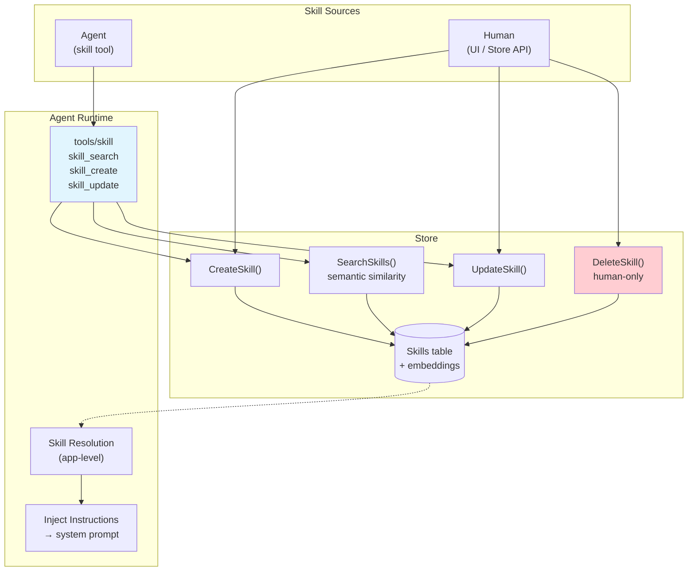
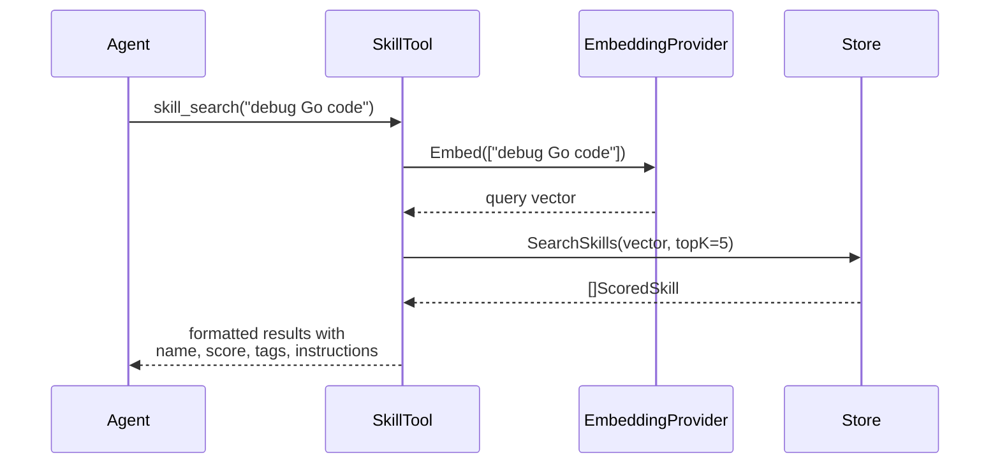
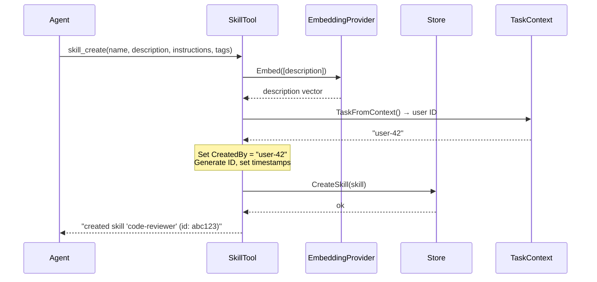
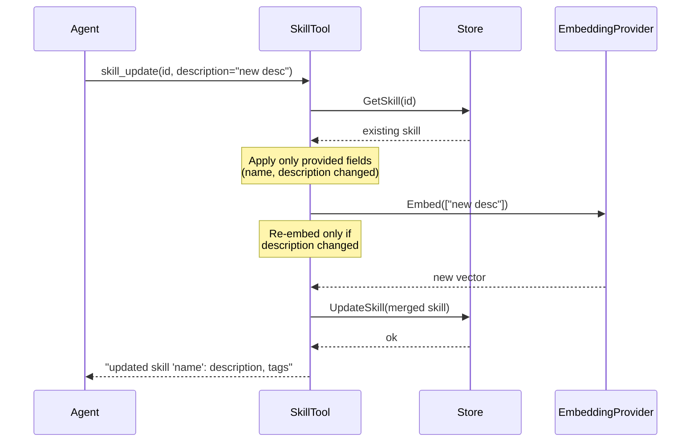
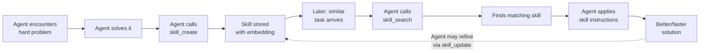
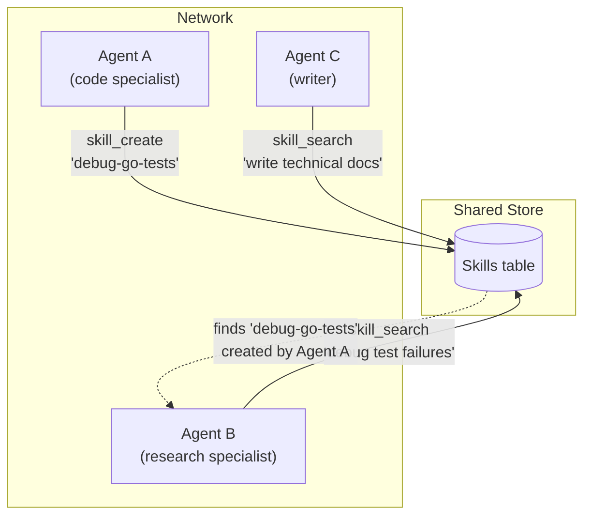

# Skills

Skills are stored instruction packages that specialize agent behavior. They live in the database and can be managed at runtime — by both humans and agents.

## Architecture Overview



Two entry points, one storage layer. Humans have full CRUD access. Agents get search, create, and update through the skill tool — but **not** delete. This separation is the governance boundary.

## What's in a Skill

```go
type Skill struct {
    ID           string    // unique identifier
    Name         string    // "code-reviewer"
    Description  string    // used for semantic search matching
    Instructions string    // injected into the agent's system prompt
    Tools        []string  // restrict available tools (empty = all)
    Model        string    // override default LLM model (empty = default)
    Tags         []string  // categorization labels
    CreatedBy    string    // origin: user ID or agent ID
    References   []string  // skill IDs this skill builds on
    Embedding    []float32 // vector for semantic search
    CreatedAt    int64
    UpdatedAt    int64
}
```

| Field          | Purpose                                                                                    |
| -------------- | ------------------------------------------------------------------------------------------ |
| `Instructions` | The core payload — detailed text injected into the agent's system prompt when skill is active |
| `Description`  | Short summary embedded as a vector for semantic search discovery                           |
| `Tools`        | Restricts which tools the agent can use under this skill (empty = all tools available)     |
| `Model`        | Overrides the agent's default LLM (e.g. use a stronger model for complex skills)           |
| `Tags`         | Labels for filtering and categorization (e.g. `["dev", "review"]`)                         |
| `CreatedBy`    | Tracks origin — set automatically by the skill tool from task context                      |
| `References`   | Links to other skill IDs this skill builds on, enabling skill composability                 |

---

## Creating a Skill (Human)

Humans create skills directly through the Store API:

```go
skill := oasis.Skill{
    ID:           oasis.NewID(),
    Name:         "code-reviewer",
    Description:  "Review code changes and suggest improvements",
    Instructions: "You are a code reviewer. Analyze code for style, correctness, and performance.",
    Tools:        []string{"shell_exec", "file_read"},
    Tags:         []string{"dev", "review"},
    CreatedBy:    "admin",
    CreatedAt:    oasis.NowUnix(),
    UpdatedAt:    oasis.NowUnix(),
}

// Embed for semantic search
vectors, _ := embedding.Embed(ctx, []string{skill.Description})
skill.Embedding = vectors[0]

// Store
store.CreateSkill(ctx, skill)
```

When creating skills through the Store API, you must embed the `Description` manually. The skill tool handles this automatically.

## Searching Skills

Find skills by semantic similarity:

```go
queryVec, _ := embedding.Embed(ctx, []string{"review my pull request"})
matches, _ := store.SearchSkills(ctx, queryVec[0], 3)
// matches[0].Name == "code-reviewer"
```

Results are `[]ScoredSkill` sorted by cosine similarity score (descending). Higher score = more relevant.

---

## Skill Tool (Agent-Facing)

The `tools/skill` package exposes skill management to agents through the standard Tool interface. This is what enables the self-improvement loop — agents can discover, create, and refine skills at runtime.

**Package:** `github.com/nevindra/oasis/tools/skill`

### Setup

```go
import "github.com/nevindra/oasis/tools/skill"

skillTool := skill.New(store, embeddingProvider)
agent := oasis.NewLLMAgent("assistant", "Helpful assistant", provider,
    oasis.WithTools(skillTool),
)
```

**Dependencies:** `Store` (for CRUD) and `EmbeddingProvider` (for auto-embedding descriptions and search queries).

### Actions

| Action         | Parameters                                                           | Description                                   |
| -------------- | -------------------------------------------------------------------- | --------------------------------------------- |
| `skill_search` | `query` (string, required)                                           | Embed query and search for matching skills     |
| `skill_create` | `name`, `description`, `instructions` (required); `tags`, `tools`, `model`, `references` (optional) | Create a new skill, auto-embed, auto-set metadata |
| `skill_update` | `id` (required); all other fields optional                           | Partial update — only provided fields change   |

### How Each Action Works

#### `skill_search`



Returns up to 5 skills ranked by relevance. Each result includes the skill's name, ID, score, tags, creator, and full instructions — giving the agent everything it needs to decide whether to apply the skill.

#### `skill_create`



The `CreatedBy` field is automatically populated from `TaskFromContext()` — the user ID or agent ID that triggered the execution. If no task context is present (e.g., direct testing), it defaults to `"unknown"`.

Embeddings are generated automatically from the `Description` field — the agent doesn't need to handle embedding.

#### `skill_update`



Uses a read-modify-write pattern. Only provided fields are changed — omitted fields keep their current values. If the `description` changes, the embedding is automatically refreshed. If only `instructions` or `tags` change, no embedding call is made.

---

## Self-Improvement Loop

The skill tool enables agents to learn from experience and encode reusable patterns:



1. **Agent encounters a difficult task** and works through it
2. **Agent encodes the approach** by calling `skill_create` with a name, description, and instructions
3. **The skill is embedded and stored**, discoverable by semantic search
4. **Next time a similar task arrives**, the agent calls `skill_search`
5. **The matching skill is found** and the agent uses its instructions
6. **Optionally**, the agent refines the skill via `skill_update` if it discovers improvements

This is not a framework feature you toggle on — it's an emergent behavior that arises when you give an agent the skill tool. The agent decides when to create and search for skills based on its own judgment.

---

## Network Sharing

Agents in a `Network` that share a `Store` automatically share skills:



No configuration needed — the sharing happens through the Store. One agent's learned skill becomes discoverable by any other agent in the network via `skill_search`. The `CreatedBy` field tracks which agent created each skill, so humans can audit the skill ecosystem.

---

## Governance

The skill tool intentionally exposes **create, search, and update** — but **not delete**. This is the governance boundary:

| Operation | Agent Access | Human Access |
| --------- | ------------ | ------------ |
| Search    | `skill_search` (tool) | `Store.SearchSkills()` |
| Create    | `skill_create` (tool) | `Store.CreateSkill()` |
| Update    | `skill_update` (tool) | `Store.UpdateSkill()` |
| Delete    | **blocked** | `Store.DeleteSkill()` |
| List all  | not exposed | `Store.ListSkills()` |

Agents can create and evolve skills, but humans retain the ability to:
- **Delete** harmful, incorrect, or outdated skills
- **List** all skills for review and audit
- **Filter by `CreatedBy`** to separate human-authored from agent-authored skills

This design scales with agent autonomy — as agents get smarter, you tighten or loosen the leash by controlling what the skill tool exposes, not by redesigning the system.

---

## Skill Composability

The `References` field enables skills that build on other skills:

```go
advancedSkill := oasis.Skill{
    Name:         "full-stack-reviewer",
    Description:  "Full-stack code review across frontend and backend",
    Instructions: "Review code holistically. Check API contracts, type safety, and UI consistency.",
    References:   []string{"skill-frontend-review", "skill-backend-review"},
}
```

An agent can follow `References` to load foundational skills and compose their instructions. This is a data-level primitive — how the agent uses references is up to the application.

---

## Skill Resolution Pattern

The reference app uses two-stage resolution for app-level skill selection:

1. Embed user message and `SearchSkills` for top candidates
2. Ask an intent LLM to pick the best match (or "none")

This is an application-level pattern — the framework provides storage and search, you decide how to select and apply skills. The skill tool provides a different path: the agent itself decides when and how to use skills during execution.

## See Also

- [Store Concept](../concepts/store.md) — persistence layer
- [Tool Concept](../concepts/tool.md) — tool interface and built-in tools
