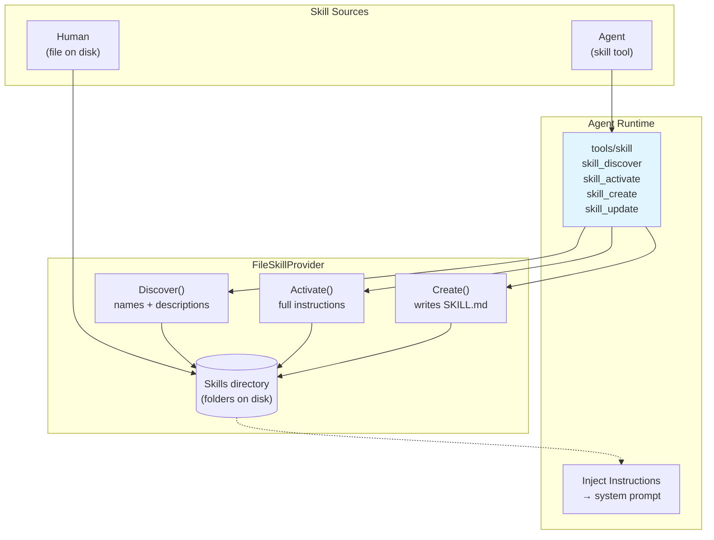
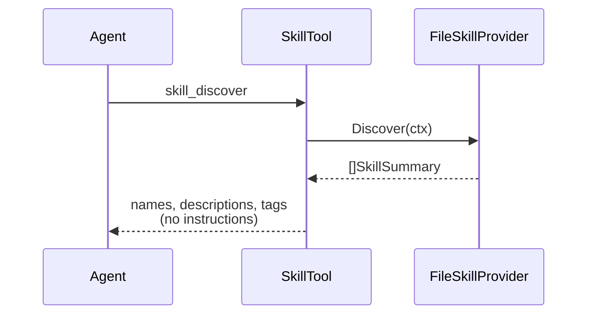
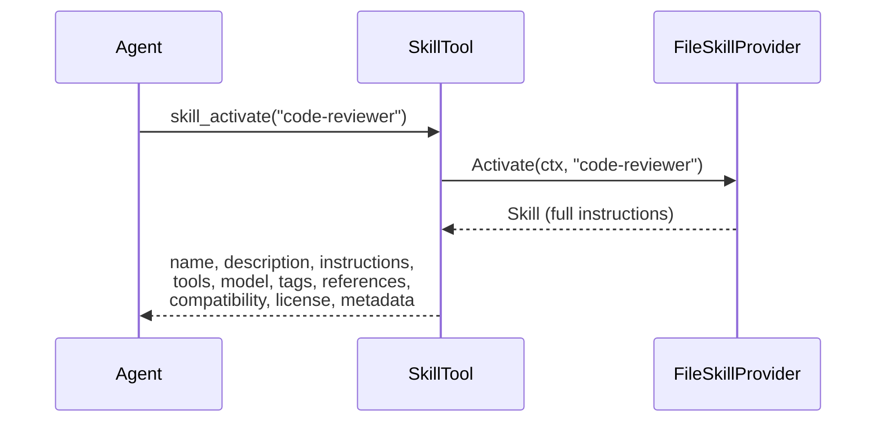
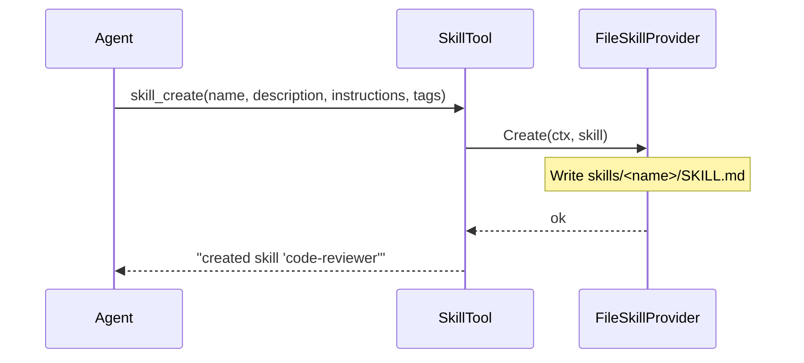
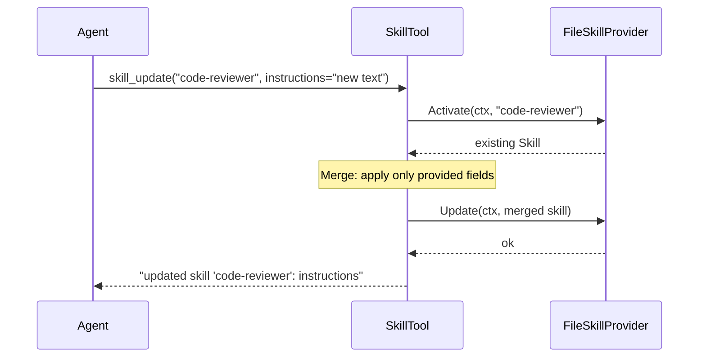
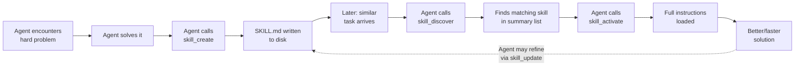

# Skills

Skills are file-based instruction packages that specialize agent behavior. They live on disk as folders containing a `SKILL.md` file and can be created, discovered, and activated at runtime — by both humans and agents.

## Architecture Overview


```mermaid
flowchart TB
    subgraph "Skill Sources"
        HUMAN["Human<br>(file on disk)"]
        AGENT["Agent<br>(skill tool)"]
    end

    subgraph "FileSkillProvider"
        DISCOVER["Discover()<br>names + descriptions"]
        ACTIVATE["Activate()<br>full instructions"]
        CREATE["Create()<br>writes SKILL.md"]
        DIR[("Skills directory<br>(folders on disk)")]
    end

    subgraph "Agent Runtime"
        TOOL["tools/skill<br>skill_discover<br>skill_activate<br>skill_create<br>skill_update"]
        INJECT["Inject Instructions<br>→ system prompt"]
    end

    HUMAN --> DIR
    AGENT --> TOOL
    TOOL --> DISCOVER
    TOOL --> ACTIVATE
    TOOL --> CREATE
    DISCOVER --> DIR
    ACTIVATE --> DIR
    CREATE --> DIR
    DIR -.-> INJECT

    style TOOL fill:#e1f5fe
```

Two entry points, one directory. Humans drop skill folders on disk. Agents get discover, activate, create, and update through the skill tool. The filesystem is the source of truth — no database, no embeddings, no migrations.

## SKILL.md Format

Each skill is a folder containing a `SKILL.md` file with YAML frontmatter and a markdown body:

```markdown
---
name: code-reviewer
description: Review code changes and suggest improvements
compatibility: oasis >= 0.13
license: MIT
tools:
  - shell_exec
  - file_read
model: ""
tags:
  - dev
  - review
references:
  - frontend-review
  - backend-review
metadata:
  author: team-name
  version: "1.0"
---

You are a code reviewer. Analyze code for style, correctness, and performance.

When reviewing:
- Check for common Go pitfalls: nil dereferences, goroutine leaks, error shadowing
- Suggest idiomatic patterns when you see non-idiomatic code
- Be constructive — explain why a change is better, not just what to change
- Focus on correctness first, performance second, style third
```

**Frontmatter fields:**

| Field           | Purpose                                                                                       |
| --------------- | --------------------------------------------------------------------------------------------- |
| `name`          | Unique identifier for the skill (matches the folder name by convention)                       |
| `description`   | Short summary used during discovery — agents read this to decide whether to activate          |
| `compatibility` | Host/runtime requirements (e.g., `"oasis >= 0.13"`, `"claude-code >= 1.0"`) — shown during discovery |
| `license`       | SPDX license identifier (e.g., `"MIT"`, `"Apache-2.0"`) — shown during activation            |
| `tools`         | Restrict available tools when this skill is active (empty = all tools available)              |
| `model`         | Override the agent's default LLM (e.g. use a stronger model for complex skills)               |
| `tags`          | Labels for categorization (e.g. `["dev", "review"]`)                                         |
| `references`    | Names of other skills this skill builds on, enabling composability                            |
| `metadata`      | Arbitrary key-value pairs (e.g., `author`, `version`) — passed through on activation          |

The `Compatibility`, `License`, and `Metadata` fields align with the [AgentSkills open specification](https://agentskills.io).

**Markdown body:** The full instructions injected into the agent's system prompt when the skill is activated. No length limit — write as much as needed.

**`{dir}` placeholder:** Any occurrence of `{dir}` in the instruction body is replaced with the absolute path to the skill's directory at activation time. This lets skills reference their own files (e.g., `{dir}/templates/report.html`, `{dir}/scripts/setup.sh`).

## Skill Directory Structure

```
skills/
├── code-reviewer/
│   ├── SKILL.md          # required — frontmatter + instructions
│   ├── scripts/          # optional — helper scripts the skill references
│   └── references/       # optional — external docs, examples
├── sql-optimizer/
│   ├── SKILL.md
│   └── assets/           # optional — diagrams, templates
└── go-debugger/
    └── SKILL.md
```

Each skill is a self-contained folder. Only `SKILL.md` is required. The optional subdirectories (`scripts/`, `references/`, `assets/`) are conventions — the framework does not interpret them, but agents can reference them in instructions.

## FileSkillProvider

`FileSkillProvider` reads skills from a directory on disk. No database, no caching — it reads from disk on every call, which means hot reload for free.

**Package:** `github.com/nevindra/oasis/skills`

```go
import "github.com/nevindra/oasis/skills"

// Create a provider pointing at a directory.
provider := skills.NewFileSkillProvider("./skills")
```

**Constructor:**

```go
func NewFileSkillProvider(dir string) *FileSkillProvider
```

`dir` is the path to the directory containing skill folders. Each subdirectory containing a `SKILL.md` file is loaded as a skill.

**Directory scanning:** On each `Discover` or `Activate` call, the provider scans the directory for `SKILL.md` files. There is no startup loading and no in-memory cache — reads are always from disk.

**Hot reload:** Because there is no cache, adding, editing, or deleting a skill folder takes effect on the next call. No restart required.

**`FileSkillProvider` also implements `SkillWriter`**, enabling agents to create and update skills at runtime:

```go
// FileSkillProvider implements both SkillProvider and SkillWriter.
var _ oasis.SkillProvider = (*skills.FileSkillProvider)(nil)
var _ oasis.SkillWriter   = (*skills.FileSkillProvider)(nil)
```

## Progressive Disclosure

Skills use a two-phase access pattern: **Discover** returns lightweight summaries, **Activate** loads full instructions. This keeps discovery cheap — agents get names and descriptions without loading every skill's full text.

```
Discover()  →  []SkillSummary   (name + description + tags only)
                     |
              Agent reads summaries,
              decides which skill fits
                     |
Activate(name)  →  Skill   (full instructions + all fields)
```

**Why this matters:** A skill library with 50 skills could have thousands of lines of instructions total. Discovery returns only the summaries — a few hundred tokens. The agent picks the right skill, then activates exactly one — loading only what it needs.

## Skill Tool (Agent-Facing)

The `tools/skill` package exposes skill management to agents through the standard Tool interface. This enables the self-improvement loop — agents can discover, activate, create, and refine skills at runtime.

**Package:** `github.com/nevindra/oasis/tools/skill`

### Actions

| Action           | Parameters                                                                               | Description                                              |
| ---------------- | ---------------------------------------------------------------------------------------- | -------------------------------------------------------- |
| `skill_discover` | _(none)_                                                                                 | List all skills as lightweight summaries (name + description + tags + compatibility) |
| `skill_activate` | `name` (string, required)                                                                | Load full instructions for a named skill (includes compatibility, license, metadata) |
| `skill_create`   | `name`, `description`, `instructions` (required); `tags`, `tools`, `model`, `references`, `compatibility`, `license`, `metadata` (optional) | Write a new SKILL.md to disk |
| `skill_update`   | `name` (required); all other fields optional (including `compatibility`, `license`, `metadata`) | Partial update — only provided fields change |

### How Each Action Works

#### `skill_discover`


```mermaid
sequenceDiagram
    participant Agent
    participant SkillTool
    participant Provider as FileSkillProvider

    Agent->>SkillTool: skill_discover
    SkillTool->>Provider: Discover(ctx)
    Provider-->>SkillTool: []SkillSummary
    SkillTool-->>Agent: names, descriptions, tags<br>(no instructions)
```

Returns all skills as summaries — name, description, tags, and compatibility. No instruction text is loaded. The agent reads the list and decides which skill to activate.

#### `skill_activate`


```mermaid
sequenceDiagram
    participant Agent
    participant SkillTool
    participant Provider as FileSkillProvider

    Agent->>SkillTool: skill_activate("code-reviewer")
    SkillTool->>Provider: Activate(ctx, "code-reviewer")
    Provider-->>SkillTool: Skill (full instructions)
    SkillTool-->>Agent: name, description, instructions,<br>tools, model, tags, references,<br>compatibility, license, metadata
```

Loads a single skill by name. Returns the full `Skill` struct including the complete instruction text. The agent uses the instructions in its system prompt or reasoning.

#### `skill_create`


```mermaid
sequenceDiagram
    participant Agent
    participant SkillTool
    participant Writer as FileSkillProvider

    Agent->>SkillTool: skill_create(name, description, instructions, tags)
    SkillTool->>Writer: Create(ctx, skill)
    Note over Writer: Write skills/<name>/SKILL.md
    Writer-->>SkillTool: ok
    SkillTool-->>Agent: "created skill 'code-reviewer'"
```

Creates a new skill folder and `SKILL.md` on disk. The skill is immediately discoverable — no restart, no reload step.

#### `skill_update`

Uses a read-modify-write pattern. Reads the existing `SKILL.md`, applies only the provided fields, writes the result back.


```mermaid
sequenceDiagram
    participant Agent
    participant SkillTool
    participant Provider as FileSkillProvider

    Agent->>SkillTool: skill_update("code-reviewer", instructions="new text")
    SkillTool->>Provider: Activate(ctx, "code-reviewer")
    Provider-->>SkillTool: existing Skill
    Note over SkillTool: Merge: apply only provided fields
    SkillTool->>Provider: Update(ctx, merged skill)
    Provider-->>SkillTool: ok
    SkillTool-->>Agent: "updated skill 'code-reviewer': instructions"
```

Only provided fields are changed — omitted fields keep their current values. The updated `SKILL.md` is written to disk immediately.

---

## Agent Self-Improvement

The skill tool enables agents to encode reusable patterns by writing skills to disk:


```mermaid
flowchart LR
    A["Agent encounters<br>hard problem"] --> B["Agent solves it"]
    B --> C["Agent calls<br>skill_create"]
    C --> D["SKILL.md written<br>to disk"]
    D --> E["Later: similar<br>task arrives"]
    E --> F["Agent calls<br>skill_discover"]
    F --> G["Finds matching skill<br>in summary list"]
    G --> H["Agent calls<br>skill_activate"]
    H --> I["Full instructions<br>loaded"]
    I --> J["Better/faster<br>solution"]
    J -.->|"Agent may refine<br>via skill_update"| D
```

1. **Agent encounters a difficult task** and works through it
2. **Agent encodes the approach** by calling `skill_create` with a name, description, and instructions
3. **The skill is written to disk**, discoverable immediately
4. **Next time a similar task arrives**, the agent calls `skill_discover`
5. **The agent reads summaries** and recognizes the relevant skill
6. **Agent calls `skill_activate`** to load the full instructions
7. **Optionally**, the agent refines the skill via `skill_update` if it discovers improvements

This is not a framework feature you toggle on — it's an emergent behavior that arises when you give an agent the skill tool. The agent decides when to create and use skills based on its own judgment.

---

## Integration Pattern

### WithSkills — Runtime Discovery

`WithSkills` registers a `SkillProvider` and automatically adds `skill_discover` and `skill_activate` tools. If the provider also implements `SkillWriter`, `skill_create` and `skill_update` are added too.

```go
import (
    "github.com/nevindra/oasis"
    "github.com/nevindra/oasis/skills"
)

// Create a provider pointing at your skills directory.
skillProvider := skills.NewFileSkillProvider("./skills")

// WithSkills auto-registers discovery and activation tools.
agent := oasis.NewLLMAgent("assistant", "Helpful assistant", provider,
    oasis.WithSkills(skillProvider),
)
```

The agent can now discover, activate, create, and update skills at runtime via tool calls.

### WithActiveSkills — Pre-Activated Skills

`WithActiveSkills` injects skill instructions into the system prompt on every LLM call. Use for capabilities that should always be available:

```go
// Pre-activate with reference resolution.
pdfSkill, _ := oasis.ActivateWithReferences(ctx, skillProvider, "oasis-pdf")

agent := oasis.NewLLMAgent("doc-agent", "Document generation agent", provider,
    oasis.WithActiveSkills(pdfSkill),
    oasis.WithSandbox(sb, sandbox.Tools(sb)...),
)
```

References are NOT auto-resolved by `WithActiveSkills` — call `ActivateWithReferences` before passing skills if you need reference resolution.

### Combining Both

Use `WithSkills` for runtime discovery alongside `WithActiveSkills` for always-on capabilities:

```go
agent := oasis.NewLLMAgent("assistant", "Helpful assistant", provider,
    oasis.WithActiveSkills(pdfSkill),     // always available
    oasis.WithSkills(skillProvider),       // discoverable at runtime
    oasis.WithSandbox(sb, sandbox.Tools(sb)...),
)
```

### DefaultSkillDirs

`DefaultSkillDirs()` returns AgentSkills-compatible scan paths:
- `<cwd>/.agents/skills/` (project-level)
- `~/.agents/skills/` (user-level)

```go
// Scan standard AgentSkills directories.
for _, dir := range oasis.DefaultSkillDirs() {
    providers = append(providers, skills.NewFileSkillProvider(dir))
}
```

### ActivateWithReferences

`ActivateWithReferences` loads a skill and prepends instructions from all referenced skills. References are resolved one level deep — a referenced skill's own references are not followed. Missing references are silently skipped.

```go
// Loads oasis-pdf + its reference oasis-design-system in one call.
skill, err := oasis.ActivateWithReferences(ctx, provider, "oasis-pdf")
// skill.Instructions now contains design-system instructions + pdf instructions
```

### ChainSkillProviders

Merge multiple providers. Earlier providers take priority:

```go
builtin := oasis.NewBuiltinSkillProvider()
fileProvider := skills.NewFileSkillProvider("./skills")

// User file-based skills override built-in ones.
combined := oasis.ChainSkillProviders(fileProvider, builtin)
```

### Agent-Driven Skill Creation

```go
const systemPrompt = `You are a helpful assistant.

At the start of complex tasks:
1. Call skill_discover to see available skills.
2. If a relevant skill exists, call skill_activate to load its instructions.
3. Apply the skill's instructions to improve your approach.

After solving a hard problem:
1. Call skill_create to encode your approach for future use.
2. Use a descriptive name and clear instructions.`

agent := oasis.NewLLMAgent("assistant", systemPrompt, provider,
    oasis.WithSkills(skillProvider),
)
```

**Seeding skills from code:** Drop skill folders in your `skills/` directory before starting. They are picked up automatically — no initialization call needed:

```go
skillProvider := skills.NewFileSkillProvider("./skills")

skill := oasis.Skill{
    Name:          "go-debugger",
    Description:   "Debug Go applications including race conditions and goroutine leaks",
    Instructions:  "Use delve or print-based debugging. Check for goroutine leaks with runtime.NumGoroutine(). Look for data races with -race flag.",
    Tools:         []string{"shell_exec", "file_read"},
    Tags:          []string{"dev", "go", "debug"},
    Compatibility: "oasis >= 0.14",
    License:       "MIT",
}

if err := skillProvider.Create(ctx, skill); err != nil {
    log.Fatal(err)
}
// skills/go-debugger/SKILL.md is now on disk, immediately discoverable.
```

---

## Skill Composability

The `References` field links skills into dependency chains. A composite skill references foundational skills by name:

```go
// skills/full-stack-reviewer/SKILL.md references two other skills.
fullStack := oasis.Skill{
    Name:         "full-stack-reviewer",
    Description:  "Full-stack code review across frontend and backend",
    Instructions: "Review code holistically. Check API contracts, type safety, and UI consistency.",
    References:   []string{"frontend-review", "backend-review"},
    Tags:         []string{"dev", "review"},
}
```

Use `ActivateWithReferences` to resolve references at activation time. It loads the skill and prepends instructions from all referenced skills (one level deep, missing refs silently skipped):

```go
// Loads full-stack-reviewer + frontend-review + backend-review instructions.
skill, err := oasis.ActivateWithReferences(ctx, provider, "full-stack-reviewer")
// skill.Instructions = "## frontend-review\n\n...\n\n---\n\n## backend-review\n\n...\n\n---\n\n<own instructions>"
```

For custom resolution strategies (recursive, selective, etc.), you can still call `provider.Activate` directly and merge instructions yourself.

---

## Dynamic Tool Injection

The `Tools` field recommends which tools an agent should use when a skill is active. This is a recommendation, not enforcement — the application reads the field and configures the agent accordingly:

```go
// Read the active skill's tool list and filter.
func applySkillTools(skill oasis.Skill, allTools []oasis.Tool) []oasis.Tool {
    if len(skill.Tools) == 0 {
        return allTools // empty = no restriction
    }

    allowed := make(map[string]bool, len(skill.Tools))
    for _, name := range skill.Tools {
        allowed[name] = true
    }

    var filtered []oasis.Tool
    for _, tool := range allTools {
        for _, def := range tool.Definitions() {
            if allowed[def.Name] {
                filtered = append(filtered, tool)
                break
            }
        }
    }
    return filtered
}
```

---

## See Also

- [AgentSkills specification](https://agentskills.io) — open specification for skill compatibility, licensing, and metadata
- [Document Generation](../concepts/document-generation.md) — built-in document generation skills
- [Store Concept](../concepts/store.md) — persistence layer
- [Tool Concept](../concepts/tool.md) — tool interface and built-in tools
