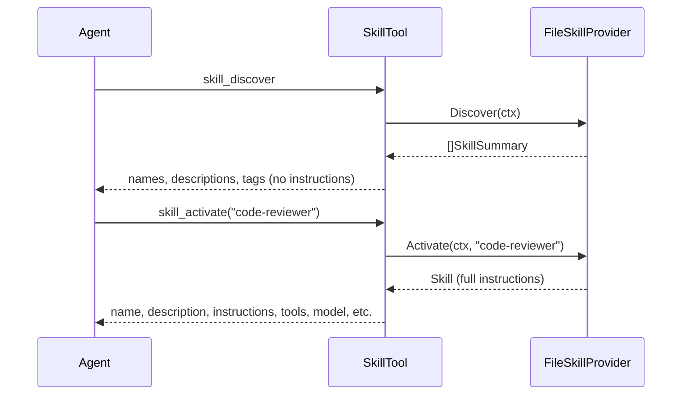
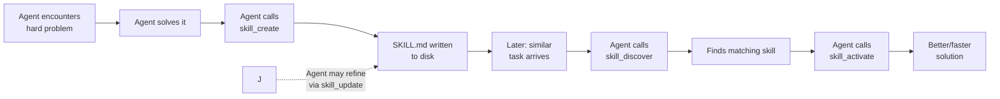

# Skills Guide

How to integrate skills into your agents — from pre-activated capabilities to runtime discovery and agent-driven creation.

For the underlying types, interfaces, and providers, see the [Skill concept doc](../concepts/skill.md).

## WithSkills — Runtime Discovery

`WithSkills` registers a `SkillProvider` and automatically adds `skill_discover` and `skill_activate` tools. If the provider also implements `SkillWriter`, `skill_create` and `skill_update` are added too.

```go
import (
    "github.com/nevindra/oasis"
    "github.com/nevindra/oasis/skills"
)

// Create a provider pointing at your skills directory.
skillProvider := skills.NewFileSkillProvider("./skills")

// WithSkills auto-registers discovery and activation tools.
agent := oasis.NewLLMAgent("assistant", "Helpful assistant", provider,
    oasis.WithSkills(skillProvider),
)
```

The agent can now discover, activate, create, and update skills at runtime via tool calls.

## WithActiveSkills — Pre-Activated Skills

`WithActiveSkills` injects skill instructions into the system prompt on every LLM call. Use for capabilities that should always be available:

```go
// Pre-activate with reference resolution.
pdfSkill, _ := oasis.ActivateWithReferences(ctx, skillProvider, "oasis-pdf")

agent := oasis.NewLLMAgent("doc-agent", "Document generation agent", provider,
    oasis.WithActiveSkills(pdfSkill),
    oasis.WithSandbox(sb, sandbox.Tools(sb)...),
)
```

References are NOT auto-resolved by `WithActiveSkills` — call `ActivateWithReferences` before passing skills if you need reference resolution.

## Combining Both

Use `WithSkills` for runtime discovery alongside `WithActiveSkills` for always-on capabilities:

```go
agent := oasis.NewLLMAgent("assistant", "Helpful assistant", provider,
    oasis.WithActiveSkills(pdfSkill),     // always available
    oasis.WithSkills(skillProvider),       // discoverable at runtime
    oasis.WithSandbox(sb, sandbox.Tools(sb)...),
)
```

## DefaultSkillDirs

`DefaultSkillDirs()` returns AgentSkills-compatible scan paths:
- `<cwd>/.agents/skills/` (project-level)
- `~/.agents/skills/` (user-level)

```go
// Scan standard AgentSkills directories.
for _, dir := range oasis.DefaultSkillDirs() {
    providers = append(providers, skills.NewFileSkillProvider(dir))
}
```

## ChainSkillProviders

Merge multiple providers. Earlier providers take priority:

```go
builtin := oasis.NewBuiltinSkillProvider()
fileProvider := skills.NewFileSkillProvider("./skills")

// User file-based skills override built-in ones.
combined := oasis.ChainSkillProviders(fileProvider, builtin)
```

---

## Skill Tool Actions

The `tools/skill` package exposes skill management to agents through the standard Tool interface:

| Action           | Parameters                                                                               | Description                                              |
| ---------------- | ---------------------------------------------------------------------------------------- | -------------------------------------------------------- |
| `skill_discover` | _(none)_                                                                                 | List all skills as lightweight summaries (name + description + tags + compatibility) |
| `skill_activate` | `name` (string, required)                                                                | Load full instructions for a named skill (includes compatibility, license, metadata) |
| `skill_create`   | `name`, `description`, `instructions` (required); `tags`, `tools`, `model`, `references`, `compatibility`, `license`, `metadata` (optional) | Write a new SKILL.md to disk |
| `skill_update`   | `name` (required); all other fields optional (including `compatibility`, `license`, `metadata`) | Partial update — only provided fields change |

### How Actions Work


```mermaid
sequenceDiagram
    participant Agent
    participant SkillTool
    participant Provider as FileSkillProvider

    Agent->>SkillTool: skill_discover
    SkillTool->>Provider: Discover(ctx)
    Provider-->>SkillTool: []SkillSummary
    SkillTool-->>Agent: names, descriptions, tags (no instructions)

    Agent->>SkillTool: skill_activate("code-reviewer")
    SkillTool->>Provider: Activate(ctx, "code-reviewer")
    Provider-->>SkillTool: Skill (full instructions)
    SkillTool-->>Agent: name, description, instructions, tools, model, etc.
```

**skill_update** uses a read-modify-write pattern — reads the existing SKILL.md, applies only the provided fields, writes the result back.

---

## Agent Self-Improvement

The skill tool enables agents to encode reusable patterns by writing skills to disk:


```mermaid
flowchart LR
    A["Agent encounters<br>hard problem"] --> B["Agent solves it"]
    B --> C["Agent calls<br>skill_create"]
    C --> D["SKILL.md written<br>to disk"]
    D --> E["Later: similar<br>task arrives"]
    E --> F["Agent calls<br>skill_discover"]
    F --> G["Finds matching skill"]
    G --> H["Agent calls<br>skill_activate"]
    H --> I["Better/faster<br>solution"]
    J -.->|"Agent may refine<br>via skill_update"| D
```

This is not a framework feature you toggle on — it's an emergent behavior that arises when you give an agent the skill tool.

### Prompting for Self-Improvement

```go
const systemPrompt = `You are a helpful assistant.

At the start of complex tasks:
1. Call skill_discover to see available skills.
2. If a relevant skill exists, call skill_activate to load its instructions.
3. Apply the skill's instructions to improve your approach.

After solving a hard problem:
1. Call skill_create to encode your approach for future use.
2. Use a descriptive name and clear instructions.`

agent := oasis.NewLLMAgent("assistant", systemPrompt, provider,
    oasis.WithSkills(skillProvider),
)
```

### Seeding Skills from Code

Drop skill folders in your `skills/` directory before starting, or create them programmatically:

```go
skill := oasis.Skill{
    Name:          "go-debugger",
    Description:   "Debug Go applications including race conditions and goroutine leaks",
    Instructions:  "Use delve or print-based debugging. Check for goroutine leaks...",
    Tools:         []string{"shell_exec", "file_read"},
    Tags:          []string{"dev", "go", "debug"},
    Compatibility: "oasis >= 0.14",
    License:       "MIT",
}

if err := skillProvider.Create(ctx, skill); err != nil {
    log.Fatal(err)
}
// skills/go-debugger/SKILL.md is now on disk, immediately discoverable.
```

---

## Skill Composability

The `References` field links skills into dependency chains:

```go
fullStack := oasis.Skill{
    Name:         "full-stack-reviewer",
    Description:  "Full-stack code review across frontend and backend",
    Instructions: "Review code holistically. Check API contracts and type safety.",
    References:   []string{"frontend-review", "backend-review"},
}
```

Use `ActivateWithReferences` to resolve references at activation time (one level deep, missing refs silently skipped):

```go
skill, err := oasis.ActivateWithReferences(ctx, provider, "full-stack-reviewer")
// skill.Instructions = "## frontend-review\n\n...\n\n---\n\n## backend-review\n\n...\n\n---\n\n<own instructions>"
```

---

## Dynamic Tool Injection

The `Tools` field recommends which tools an agent should use when a skill is active. This is a recommendation, not enforcement — the application reads the field and configures the agent accordingly:

```go
func applySkillTools(skill oasis.Skill, allTools []oasis.Tool) []oasis.Tool {
    if len(skill.Tools) == 0 {
        return allTools // empty = no restriction
    }

    allowed := make(map[string]bool, len(skill.Tools))
    for _, name := range skill.Tools {
        allowed[name] = true
    }

    var filtered []oasis.Tool
    for _, tool := range allTools {
        for _, def := range tool.Definitions() {
            if allowed[def.Name] {
                filtered = append(filtered, tool)
                break
            }
        }
    }
    return filtered
}
```

---

## See Also

- [Skill Concept](../concepts/skill.md) — types, interfaces, providers, SKILL.md format
- [Document Generation Guide](document-generation.md) — built-in document generation skills
- [AgentSkills specification](https://agentskills.io) — open specification for cross-tool compatibility
