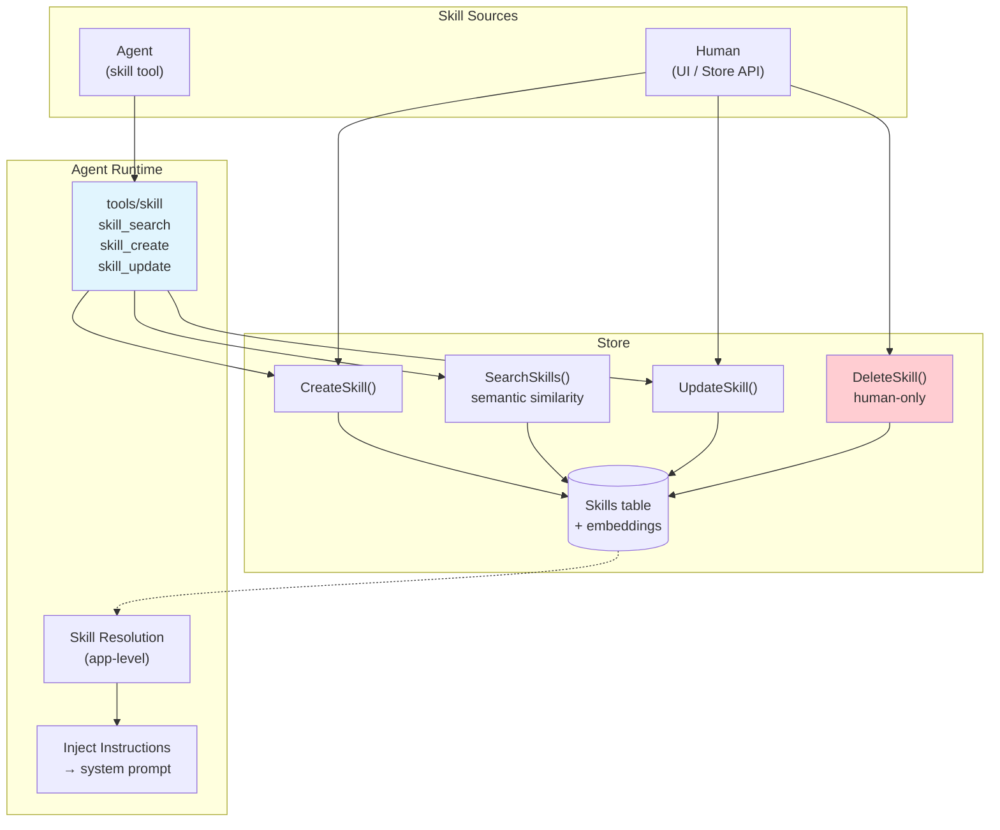
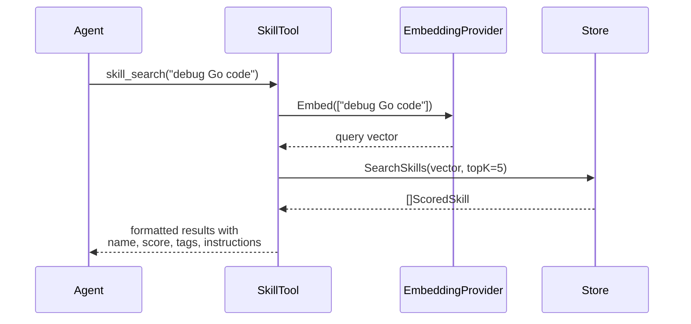
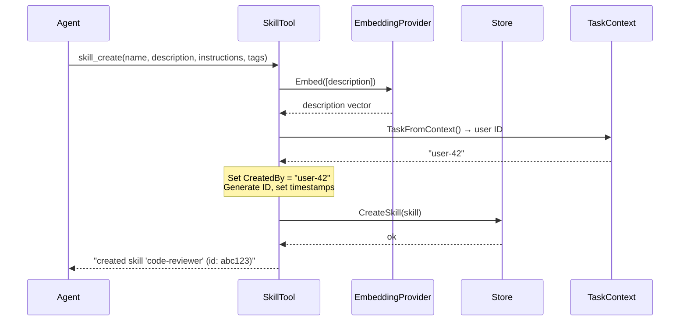
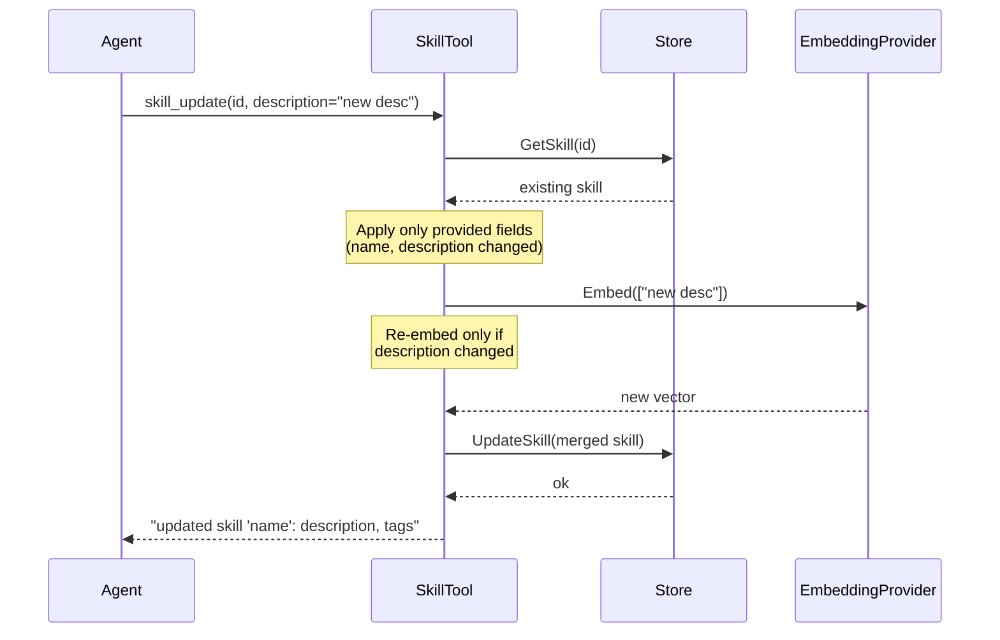
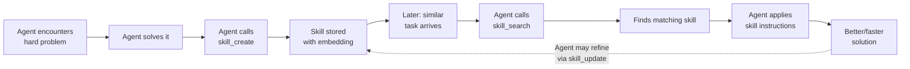
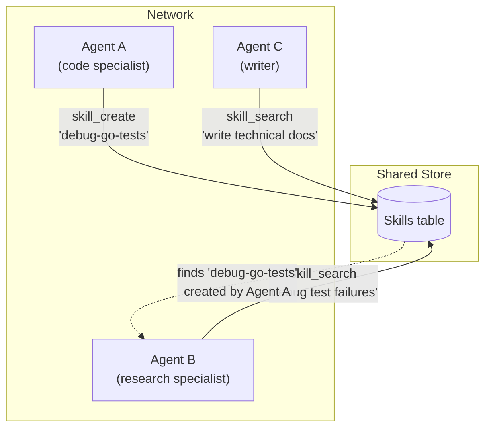

# Skills

Skills are stored instruction packages that specialize agent behavior. They live in the database and can be managed at runtime — by both humans and agents.

## Architecture Overview


```mermaid
flowchart TB
    subgraph "Skill Sources"
        HUMAN["Human<br>(UI / Store API)"]
        AGENT["Agent<br>(skill tool)"]
    end

    subgraph "Store"
        CREATE["CreateSkill()"]
        SEARCH["SearchSkills()<br>semantic similarity"]
        UPDATE["UpdateSkill()"]
        DELETE["DeleteSkill()<br>human-only"]
        DB[("Skills table<br>+ embeddings")]
    end

    subgraph "Agent Runtime"
        TOOL["tools/skill<br>skill_search<br>skill_create<br>skill_update"]
        RESOLVE["Skill Resolution<br>(app-level)"]
        INJECT["Inject Instructions<br>→ system prompt"]
    end

    HUMAN --> CREATE
    HUMAN --> UPDATE
    HUMAN --> DELETE
    AGENT --> TOOL
    TOOL --> CREATE
    TOOL --> SEARCH
    TOOL --> UPDATE
    CREATE --> DB
    SEARCH --> DB
    UPDATE --> DB
    DELETE --> DB
    DB -.-> RESOLVE
    RESOLVE --> INJECT

    style DELETE fill:#ffcdd2
    style TOOL fill:#e1f5fe
```

Two entry points, one storage layer. Humans have full CRUD access. Agents get search, create, and update through the skill tool — but **not** delete. This separation is the governance boundary.

## What's in a Skill

```go
type Skill struct {
    ID           string    // unique identifier
    Name         string    // "code-reviewer"
    Description  string    // used for semantic search matching
    Instructions string    // injected into the agent's system prompt
    Tools        []string  // restrict available tools (empty = all)
    Model        string    // override default LLM model (empty = default)
    Tags         []string  // categorization labels
    CreatedBy    string    // origin: user ID or agent ID
    References   []string  // skill IDs this skill builds on
    Embedding    []float32 // vector for semantic search
    CreatedAt    int64
    UpdatedAt    int64
}
```

| Field          | Purpose                                                                                    |
| -------------- | ------------------------------------------------------------------------------------------ |
| `Instructions` | The core payload — detailed text injected into the agent's system prompt when skill is active |
| `Description`  | Short summary embedded as a vector for semantic search discovery                           |
| `Tools`        | Restricts which tools the agent can use under this skill (empty = all tools available)     |
| `Model`        | Overrides the agent's default LLM (e.g. use a stronger model for complex skills)           |
| `Tags`         | Labels for filtering and categorization (e.g. `["dev", "review"]`)                         |
| `CreatedBy`    | Tracks origin — set automatically by the skill tool from task context                      |
| `References`   | Links to other skill IDs this skill builds on, enabling skill composability                 |

---

## Creating a Skill (Human)

Humans create skills directly through the Store API:

```go
skill := oasis.Skill{
    ID:           oasis.NewID(),
    Name:         "code-reviewer",
    Description:  "Review code changes and suggest improvements",
    Instructions: "You are a code reviewer. Analyze code for style, correctness, and performance.",
    Tools:        []string{"shell_exec", "file_read"},
    Tags:         []string{"dev", "review"},
    CreatedBy:    "admin",
    CreatedAt:    oasis.NowUnix(),
    UpdatedAt:    oasis.NowUnix(),
}

// Embed for semantic search
vectors, _ := embedding.Embed(ctx, []string{skill.Description})
skill.Embedding = vectors[0]

// Store
store.CreateSkill(ctx, skill)
```

When creating skills through the Store API, you must embed the `Description` manually. The skill tool handles this automatically.

## Searching Skills

Find skills by semantic similarity:

```go
queryVec, _ := embedding.Embed(ctx, []string{"review my pull request"})
matches, _ := store.SearchSkills(ctx, queryVec[0], 3)
// matches[0].Name == "code-reviewer"
```

Results are `[]ScoredSkill` sorted by cosine similarity score (descending). Higher score = more relevant.

---

## Skill Tool (Agent-Facing)

The `tools/skill` package exposes skill management to agents through the standard Tool interface. This is what enables the self-improvement loop — agents can discover, create, and refine skills at runtime.

**Package:** `github.com/nevindra/oasis/tools/skill`

### Setup

```go
import "github.com/nevindra/oasis/tools/skill"

skillTool := skill.New(store, embeddingProvider)
agent := oasis.NewLLMAgent("assistant", "Helpful assistant", provider,
    oasis.WithTools(skillTool),
)
```

**Dependencies:** `Store` (for CRUD) and `EmbeddingProvider` (for auto-embedding descriptions and search queries).

### Actions

| Action         | Parameters                                                           | Description                                   |
| -------------- | -------------------------------------------------------------------- | --------------------------------------------- |
| `skill_search` | `query` (string, required)                                           | Embed query and search for matching skills     |
| `skill_create` | `name`, `description`, `instructions` (required); `tags`, `tools`, `model`, `references` (optional) | Create a new skill, auto-embed, auto-set metadata |
| `skill_update` | `id` (required); all other fields optional                           | Partial update — only provided fields change   |

### How Each Action Works

#### `skill_search`


```mermaid
sequenceDiagram
    participant Agent
    participant SkillTool
    participant Embedding as EmbeddingProvider
    participant Store

    Agent->>SkillTool: skill_search("debug Go code")
    SkillTool->>Embedding: Embed(["debug Go code"])
    Embedding-->>SkillTool: query vector
    SkillTool->>Store: SearchSkills(vector, topK=5)
    Store-->>SkillTool: []ScoredSkill
    SkillTool-->>Agent: formatted results with<br>name, score, tags, instructions
```

Returns up to 5 skills ranked by relevance. Each result includes the skill's name, ID, score, tags, creator, and full instructions — giving the agent everything it needs to decide whether to apply the skill.

#### `skill_create`


```mermaid
sequenceDiagram
    participant Agent
    participant SkillTool
    participant Embedding as EmbeddingProvider
    participant Store
    participant Ctx as TaskContext

    Agent->>SkillTool: skill_create(name, description, instructions, tags)
    SkillTool->>Embedding: Embed([description])
    Embedding-->>SkillTool: description vector
    SkillTool->>Ctx: TaskFromContext() → user ID
    Ctx-->>SkillTool: "user-42"
    Note over SkillTool: Set CreatedBy = "user-42"<br>Generate ID, set timestamps
    SkillTool->>Store: CreateSkill(skill)
    Store-->>SkillTool: ok
    SkillTool-->>Agent: "created skill 'code-reviewer' (id: abc123)"
```

The `CreatedBy` field is automatically populated from `TaskFromContext()` — the user ID or agent ID that triggered the execution. If no task context is present (e.g., direct testing), it defaults to `"unknown"`.

Embeddings are generated automatically from the `Description` field — the agent doesn't need to handle embedding.

#### `skill_update`


```mermaid
sequenceDiagram
    participant Agent
    participant SkillTool
    participant Store
    participant Embedding as EmbeddingProvider

    Agent->>SkillTool: skill_update(id, description="new desc")
    SkillTool->>Store: GetSkill(id)
    Store-->>SkillTool: existing skill
    Note over SkillTool: Apply only provided fields<br>(name, description changed)
    SkillTool->>Embedding: Embed(["new desc"])
    Note over SkillTool: Re-embed only if<br>description changed
    Embedding-->>SkillTool: new vector
    SkillTool->>Store: UpdateSkill(merged skill)
    Store-->>SkillTool: ok
    SkillTool-->>Agent: "updated skill 'name': description, tags"
```

Uses a read-modify-write pattern. Only provided fields are changed — omitted fields keep their current values. If the `description` changes, the embedding is automatically refreshed. If only `instructions` or `tags` change, no embedding call is made.

---

## Self-Improvement Loop

The skill tool enables agents to learn from experience and encode reusable patterns:


```mermaid
flowchart LR
    A["Agent encounters<br>hard problem"] --> B["Agent solves it"]
    B --> C["Agent calls<br>skill_create"]
    C --> D["Skill stored<br>with embedding"]
    D --> E["Later: similar<br>task arrives"]
    E --> F["Agent calls<br>skill_search"]
    F --> G["Finds matching skill"]
    G --> H["Agent applies<br>skill instructions"]
    H --> I["Better/faster<br>solution"]
    I -.->|"Agent may refine<br>via skill_update"| D
```

1. **Agent encounters a difficult task** and works through it
2. **Agent encodes the approach** by calling `skill_create` with a name, description, and instructions
3. **The skill is embedded and stored**, discoverable by semantic search
4. **Next time a similar task arrives**, the agent calls `skill_search`
5. **The matching skill is found** and the agent uses its instructions
6. **Optionally**, the agent refines the skill via `skill_update` if it discovers improvements

This is not a framework feature you toggle on — it's an emergent behavior that arises when you give an agent the skill tool. The agent decides when to create and search for skills based on its own judgment.

---

## Network Sharing

Agents in a `Network` that share a `Store` automatically share skills:


```mermaid
flowchart TB
    subgraph "Shared Store"
        DB[("Skills table")]
    end

    subgraph "Network"
        A1["Agent A<br>(code specialist)"]
        A2["Agent B<br>(research specialist)"]
        A3["Agent C<br>(writer)"]
    end

    A1 -->|"skill_create<br>'debug-go-tests'"| DB
    A2 -->|"skill_search<br>'debug test failures'"| DB
    DB -.->|"finds 'debug-go-tests'<br>created by Agent A"| A2

    A3 -->|"skill_search<br>'write technical docs'"| DB
```

No configuration needed — the sharing happens through the Store. One agent's learned skill becomes discoverable by any other agent in the network via `skill_search`. The `CreatedBy` field tracks which agent created each skill, so humans can audit the skill ecosystem.

---

## Governance

The skill tool intentionally exposes **create, search, and update** — but **not delete**. This is the governance boundary:

| Operation | Agent Access | Human Access |
| --------- | ------------ | ------------ |
| Search    | `skill_search` (tool) | `Store.SearchSkills()` |
| Create    | `skill_create` (tool) | `Store.CreateSkill()` |
| Update    | `skill_update` (tool) | `Store.UpdateSkill()` |
| Delete    | **blocked** | `Store.DeleteSkill()` |
| List all  | not exposed | `Store.ListSkills()` |

Agents can create and evolve skills, but humans retain the ability to:
- **Delete** harmful, incorrect, or outdated skills
- **List** all skills for review and audit
- **Filter by `CreatedBy`** to separate human-authored from agent-authored skills

This design scales with agent autonomy — as agents get smarter, you tighten or loosen the leash by controlling what the skill tool exposes, not by redesigning the system.

---

## Skill Composability

The `References` field enables skills that build on other skills:

```go
advancedSkill := oasis.Skill{
    Name:         "full-stack-reviewer",
    Description:  "Full-stack code review across frontend and backend",
    Instructions: "Review code holistically. Check API contracts, type safety, and UI consistency.",
    References:   []string{"skill-frontend-review", "skill-backend-review"},
}
```

An agent can follow `References` to load foundational skills and compose their instructions. This is a data-level primitive — how the agent uses references is up to the application.

---

## Skill Resolution Pattern

The reference app uses two-stage resolution for app-level skill selection:

1. Embed user message and `SearchSkills` for top candidates
2. Ask an intent LLM to pick the best match (or "none")

This is an application-level pattern — the framework provides storage and search, you decide how to select and apply skills. The skill tool provides a different path: the agent itself decides when and how to use skills during execution.

## Task Context for CreatedBy

The skill tool reads `CreatedBy` from `TaskFromContext()` — the user ID propagated through the agent's execution context. `LLMAgent` and `Network` inject this automatically. If you're using the skill tool in a custom agent, ensure task context is propagated:

```go
ctx = oasis.WithTaskContext(ctx, task)
result, _ := skillTool.Execute(ctx, "skill_create", args)
```

---

## Advanced Patterns

### Skill Composition via References

The `References` field links skills into dependency chains. A composite skill references foundational skills by ID, and the application resolves those references at runtime to assemble a combined instruction set.

```go
// Create foundational skills first.
frontendSkill := oasis.Skill{
    ID:           oasis.NewID(),
    Name:         "frontend-review",
    Description:  "Review frontend code for React best practices",
    Instructions: "Check component structure, hook usage, prop drilling, and accessibility.",
    Tags:         []string{"dev", "frontend"},
    CreatedBy:    "admin",
    CreatedAt:    oasis.NowUnix(),
    UpdatedAt:    oasis.NowUnix(),
}

backendSkill := oasis.Skill{
    ID:           oasis.NewID(),
    Name:         "backend-review",
    Description:  "Review backend Go code for correctness and performance",
    Instructions: "Check error handling, concurrency, resource leaks, and SQL injection.",
    Tags:         []string{"dev", "backend"},
    CreatedBy:    "admin",
    CreatedAt:    oasis.NowUnix(),
    UpdatedAt:    oasis.NowUnix(),
}

// Composite skill that builds on both.
fullStackSkill := oasis.Skill{
    ID:           oasis.NewID(),
    Name:         "full-stack-reviewer",
    Description:  "Full-stack code review across frontend and backend",
    Instructions: "Review code holistically. Check API contracts, type safety, and UI consistency.",
    References:   []string{frontendSkill.ID, backendSkill.ID},
    Tags:         []string{"dev", "review"},
    CreatedBy:    "admin",
    CreatedAt:    oasis.NowUnix(),
    UpdatedAt:    oasis.NowUnix(),
}
```

To resolve references and merge instructions at runtime:

```go
func resolveSkill(ctx context.Context, store oasis.Store, skill oasis.Skill) (string, error) {
    var parts []string

    // Load referenced skills first (depth-1 — no recursive resolution).
    for _, refID := range skill.References {
        ref, err := store.GetSkill(ctx, refID)
        if err != nil {
            continue // skip broken references gracefully
        }
        parts = append(parts, fmt.Sprintf("## %s\n%s", ref.Name, ref.Instructions))
    }

    // Append the composite skill's own instructions last.
    parts = append(parts, skill.Instructions)
    return strings.Join(parts, "\n\n"), nil
}
```

The framework stores references as data — how you resolve them (depth-1, recursive, selective) is an application-level decision. Keep resolution shallow unless you have a specific reason for deep chains.

### Dynamic Tool Injection

The `Tools` field narrows which tools an agent should use when a skill is active. This is a recommendation, not enforcement — the application reads the field and configures the agent accordingly.

```go
// Skill that recommends specific tools.
researchSkill := oasis.Skill{
    ID:           oasis.NewID(),
    Name:         "web-researcher",
    Description:  "Research topics using web search and summarization",
    Instructions: "Search the web for authoritative sources. Summarize findings with citations.",
    Tools:        []string{"http_get", "knowledge_search"},
    CreatedBy:    "admin",
    CreatedAt:    oasis.NowUnix(),
    UpdatedAt:    oasis.NowUnix(),
}
```

When applying a matched skill, filter the agent's tools to the recommended set:

```go
func applySkillTools(skill oasis.Skill, allTools []oasis.Tool) []oasis.Tool {
    if len(skill.Tools) == 0 {
        return allTools // empty = no restriction
    }

    allowed := make(map[string]bool, len(skill.Tools))
    for _, name := range skill.Tools {
        allowed[name] = true
    }

    var filtered []oasis.Tool
    for _, tool := range allTools {
        for _, def := range tool.Definitions() {
            if allowed[def.Name] {
                filtered = append(filtered, tool)
                break
            }
        }
    }
    return filtered
}
```

An empty `Tools` slice means "use all available tools." When populated, the list acts as a whitelist — the application should only provide the named tools to the agent for that task.

### Model Override

The `Model` field recommends a specific LLM for a skill. Use this when a skill requires capabilities that differ from the agent's default model — for example, a complex reasoning skill that needs a stronger model, or a simple classification skill that can use a cheaper one.

```go
complexSkill := oasis.Skill{
    ID:           oasis.NewID(),
    Name:         "formal-verifier",
    Description:  "Formally verify correctness of algorithms and proofs",
    Instructions: "Apply formal methods to verify the algorithm. Check invariants and edge cases.",
    Model:        "gemini-2.5-pro",
    CreatedBy:    "admin",
    CreatedAt:    oasis.NowUnix(),
    UpdatedAt:    oasis.NowUnix(),
}
```

At the application level, read `skill.Model` and swap the provider before executing:

```go
func providerForSkill(skill oasis.Skill, defaultProvider, strongProvider oasis.Provider) oasis.Provider {
    if skill.Model == "" {
        return defaultProvider
    }
    // Map model names to providers at the application level.
    // The framework doesn't enforce this — you decide the mapping.
    switch skill.Model {
    case "gemini-2.5-pro":
        return strongProvider
    default:
        return defaultProvider
    }
}
```

### Tags for Filtering and Categorization

Tags are stored as a JSON array and returned with every skill in search results. While `SearchSkills` uses semantic similarity (not tag filtering), tags enable application-level filtering after search.

```go
// Post-filter search results by tag.
func filterByTag(results []oasis.ScoredSkill, tag string) []oasis.ScoredSkill {
    var filtered []oasis.ScoredSkill
    for _, r := range results {
        for _, t := range r.Tags {
            if t == tag {
                filtered = append(filtered, r)
                break
            }
        }
    }
    return filtered
}

// Usage: find skills that match "review code" AND have the "dev" tag.
queryVec, _ := embedding.Embed(ctx, []string{"review code"})
all, _ := store.SearchSkills(ctx, queryVec[0], 10)
devSkills := filterByTag(all, "dev")
```

Tags are also useful for auditing. List all skills and group by tag to see what your skill library covers:

```go
skills, _ := store.ListSkills(ctx)
byTag := make(map[string][]oasis.Skill)
for _, sk := range skills {
    for _, tag := range sk.Tags {
        byTag[tag] = append(byTag[tag], sk)
    }
}
```

---

## Semantic Search Pipeline

### How Skill Embeddings Work

Every skill's `Description` field is embedded into a dense vector using the `EmbeddingProvider` you pass to the skill tool. The resulting `[]float32` is stored alongside the skill in the database.

```
Description: "Review code changes and suggest improvements"
    | EmbeddingProvider.Embed()
Embedding: [0.023, -0.114, 0.087, ..., 0.041]   // e.g. 768 dimensions
```

The `Embedding` field is excluded from JSON serialization (`json:"-"`) — it is a storage-only field, never exposed in API responses. Only the `Description` is embedded; `Instructions` are not part of the vector. This keeps the search signal focused on *what* a skill does rather than *how* it does it.

### How SearchSkills Works

Search follows a three-step process:

1. **Embed the query** — the user's natural language query is converted to a vector using the same `EmbeddingProvider`
2. **Compute similarity** — each stored skill's embedding is compared to the query vector using cosine similarity
3. **Rank and truncate** — results are sorted by score (descending) and truncated to `topK`

The implementation differs by store backend:

| Backend  | Search Strategy | Index Type |
| -------- | --------------- | ---------- |
| SQLite   | Full scan + in-app cosine similarity via `CosineSimilarity()` | None (brute force) |
| Postgres | `1 - (embedding <=> query)` with `ORDER BY` + `LIMIT` | HNSW (pgvector) |

**SQLite** loads all skills with non-null embeddings, computes cosine similarity in Go at query time, sorts in memory, and returns the top K. This is fine for hundreds of skills. For thousands, use Postgres.

**Postgres** pushes the similarity computation into the database using pgvector's `<=>` (cosine distance) operator with an HNSW index. The database handles ranking and limiting, so only the final results cross the wire.

### TopK and Score Interpretation

The skill tool defaults to `topK = 5`. The store returns up to `topK` results — there is no minimum score threshold. All results are returned ranked by score, and the agent (or application) decides which ones are relevant.

Score ranges:
- **0.85+** — strong match, the skill is almost certainly relevant
- **0.70-0.85** — moderate match, worth considering
- **Below 0.70** — weak match, likely not relevant

These ranges are approximate and depend on the embedding model. If you need stricter matching, apply a threshold in your application:

```go
queryVec, _ := embedding.Embed(ctx, []string{"debug memory leak"})
results, _ := store.SearchSkills(ctx, queryVec[0], 5)

var relevant []oasis.ScoredSkill
for _, r := range results {
    if r.Score >= 0.75 {
        relevant = append(relevant, r)
    }
}
```

### Embedding Re-computation

Embeddings are automatically refreshed when necessary:

- **On create** — `skill_create` always embeds the `Description`
- **On update** — `skill_update` re-embeds only if the `Description` field changed; changes to `Instructions`, `Tags`, or other fields skip the embedding call
- **Manual creation** — when using the Store API directly, you must embed the `Description` yourself before calling `CreateSkill`

---

## Skill Lifecycle

### Creating Skills Programmatically

For bulk provisioning or seeding a skill library, create skills directly through the Store API:

```go
func seedSkills(ctx context.Context, store oasis.Store, emb oasis.EmbeddingProvider) error {
    skills := []oasis.Skill{
        {
            Name:         "go-debugger",
            Description:  "Debug Go applications including race conditions and goroutine leaks",
            Instructions: "Use delve or print-based debugging. Check for goroutine leaks with runtime.NumGoroutine(). Look for data races with -race flag.",
            Tools:        []string{"shell_exec", "file_read"},
            Tags:         []string{"dev", "go", "debug"},
        },
        {
            Name:         "sql-optimizer",
            Description:  "Optimize SQL queries for performance",
            Instructions: "Analyze query plans with EXPLAIN ANALYZE. Look for sequential scans, missing indexes, and N+1 patterns.",
            Tools:        []string{"shell_exec"},
            Tags:         []string{"dev", "database"},
        },
    }

    // Batch-embed all descriptions in one call.
    descriptions := make([]string, len(skills))
    for i, sk := range skills {
        descriptions[i] = sk.Description
    }
    vectors, err := emb.Embed(ctx, descriptions)
    if err != nil {
        return fmt.Errorf("embed descriptions: %w", err)
    }

    now := oasis.NowUnix()
    for i := range skills {
        skills[i].ID = oasis.NewID()
        skills[i].CreatedBy = "seed"
        skills[i].Embedding = vectors[i]
        skills[i].CreatedAt = now
        skills[i].UpdatedAt = now
        if err := store.CreateSkill(ctx, skills[i]); err != nil {
            return fmt.Errorf("create skill %q: %w", skills[i].Name, err)
        }
    }
    return nil
}
```

Note the batch embedding call — `Embed(ctx, descriptions)` processes all descriptions in a single request, which is more efficient than embedding one at a time.

### Updating Skills (Partial Updates)

The `skill_update` tool action uses a read-modify-write pattern with pointer fields to distinguish "not provided" from "set to empty":

1. **Read** the existing skill from the store via `GetSkill`
2. **Merge** only the fields that were provided (non-nil pointers)
3. **Re-embed** if the `Description` changed
4. **Write** the merged skill back via `UpdateSkill`

When using the Store API directly, updates are full replacements — the store overwrites all fields. To do partial updates at the application level, follow the same read-modify-write pattern:

```go
func updateSkillInstructions(ctx context.Context, store oasis.Store, id, newInstructions string) error {
    skill, err := store.GetSkill(ctx, id)
    if err != nil {
        return err
    }
    skill.Instructions = newInstructions
    skill.UpdatedAt = oasis.NowUnix()
    // No re-embedding needed — only Description triggers that.
    return store.UpdateSkill(ctx, skill)
}
```

### How Skills Are Stored

Skills are persisted in the `skills` table with the following schema:

| Column         | SQLite Type | Postgres Type | Notes |
| -------------- | ----------- | ------------- | ----- |
| `id`           | TEXT PK     | TEXT PK       | Framework-generated via `NewID()` |
| `name`         | TEXT        | TEXT          | |
| `description`  | TEXT        | TEXT          | Embedded for semantic search |
| `instructions` | TEXT        | TEXT          | The payload injected into system prompts |
| `tools`        | TEXT (JSON) | TEXT (JSON)   | `["tool_a", "tool_b"]` or NULL/empty |
| `model`        | TEXT        | TEXT          | Empty string = use default |
| `tags`         | TEXT (JSON) | TEXT (JSON)   | `["dev", "review"]` or NULL/empty |
| `created_by`   | TEXT        | TEXT          | User ID or agent ID |
| `refs`         | TEXT (JSON) | TEXT (JSON)   | `["skill-id-1", "skill-id-2"]` or NULL/empty |
| `embedding`    | BLOB        | vector        | Binary float32 (SQLite) or pgvector type (Postgres) |
| `created_at`   | INTEGER     | BIGINT        | Unix timestamp |
| `updated_at`   | INTEGER     | BIGINT        | Unix timestamp |

**SQLite** stores embeddings as compact binary blobs (little-endian, 4 bytes per float32) and computes cosine similarity in Go at query time. Slice fields (`Tools`, `Tags`, `References`) are JSON-encoded strings or NULL.

**Postgres** uses pgvector's native `vector` type with an HNSW index for cosine distance search, pushing similarity computation into the database. Slice fields are non-null strings (default `''`).

---

## Integration Patterns

### Skill-Aware Agent: Search Before Execution

The most common pattern is searching for relevant skills before the agent begins a task, then injecting the matched skill's instructions into the system prompt:

```go
func runWithSkills(
    ctx context.Context,
    store oasis.Store,
    emb oasis.EmbeddingProvider,
    provider oasis.Provider,
    userMessage string,
    allTools []oasis.Tool,
) (string, error) {
    // Step 1: Search for relevant skills.
    queryVec, err := emb.Embed(ctx, []string{userMessage})
    if err != nil {
        return "", err
    }
    matches, err := store.SearchSkills(ctx, queryVec[0], 3)
    if err != nil {
        return "", err
    }

    // Step 2: Pick the best match (if above threshold).
    var activeSkill *oasis.Skill
    if len(matches) > 0 && matches[0].Score >= 0.80 {
        activeSkill = &matches[0].Skill
    }

    // Step 3: Build agent with skill-specific configuration.
    systemPrompt := "You are a helpful assistant."
    tools := allTools
    if activeSkill != nil {
        systemPrompt += "\n\n## Active Skill: " + activeSkill.Name + "\n" + activeSkill.Instructions

        // Narrow tools if the skill specifies them.
        if len(activeSkill.Tools) > 0 {
            tools = filterTools(allTools, activeSkill.Tools)
        }
    }

    agent := oasis.NewLLMAgent("assistant", systemPrompt, provider,
        oasis.WithTools(tools...),
    )

    // Step 4: Run.
    result, err := agent.Execute(ctx, oasis.AgentTask{Input: userMessage})
    if err != nil {
        return "", err
    }
    return result.Output, nil
}

func filterTools(allTools []oasis.Tool, allowed []string) []oasis.Tool {
    set := make(map[string]bool, len(allowed))
    for _, name := range allowed {
        set[name] = true
    }
    var out []oasis.Tool
    for _, tool := range allTools {
        for _, def := range tool.Definitions() {
            if set[def.Name] {
                out = append(out, tool)
                break
            }
        }
    }
    return out
}
```

### Two-Stage Skill Resolution

For higher precision, combine semantic search with an LLM intent check. This avoids false-positive skill activation on ambiguous queries:

```go
func resolveSkillTwoStage(
    ctx context.Context,
    store oasis.Store,
    emb oasis.EmbeddingProvider,
    provider oasis.Provider,
    userMessage string,
) (*oasis.Skill, error) {
    // Stage 1: Semantic search for candidates.
    queryVec, _ := emb.Embed(ctx, []string{userMessage})
    candidates, _ := store.SearchSkills(ctx, queryVec[0], 5)
    if len(candidates) == 0 {
        return nil, nil
    }

    // Stage 2: Ask an LLM to pick the best match (or "none").
    var prompt strings.Builder
    prompt.WriteString("Given the user message, pick the most relevant skill or respond 'none'.\n\n")
    prompt.WriteString("User message: " + userMessage + "\n\n")
    prompt.WriteString("Skills:\n")
    for i, c := range candidates {
        fmt.Fprintf(&prompt, "%d. %s (score: %.2f) — %s\n", i+1, c.Name, c.Score, c.Description)
    }
    prompt.WriteString("\nRespond with ONLY the skill name, or 'none'.")

    resp, err := provider.Chat(ctx, oasis.ChatRequest{
        Messages: []oasis.ChatMessage{
            {Role: "user", Content: prompt.String()},
        },
    })
    if err != nil || strings.TrimSpace(resp.Content) == "none" {
        return nil, err
    }

    // Match the LLM's pick back to a candidate.
    pick := strings.TrimSpace(resp.Content)
    for _, c := range candidates {
        if strings.EqualFold(c.Name, pick) {
            skill := c.Skill
            return &skill, nil
        }
    }
    return nil, nil
}
```

### Building a Skill Library

A skill library is a curated set of skills seeded at startup and evolved by agents at runtime. The pattern:

1. **Seed** — create foundational skills programmatically (see "Creating Skills Programmatically" above)
2. **Discover** — agents use `skill_search` before tasks to find relevant skills
3. **Evolve** — agents use `skill_create` to encode new patterns and `skill_update` to refine existing ones
4. **Audit** — humans use `ListSkills` to review the library, `DeleteSkill` to prune bad entries

```go
// Periodic audit: list all agent-created skills for review.
skills, _ := store.ListSkills(ctx)
for _, sk := range skills {
    if sk.CreatedBy != "admin" && sk.CreatedBy != "seed" {
        fmt.Printf("Agent-created: %s (%s) by %s — %s\n",
            sk.Name, sk.ID, sk.CreatedBy, sk.Description)
    }
}
```

Over time, the skill library becomes a knowledge base of operational patterns — human-authored foundational skills augmented by agent-discovered techniques. The governance boundary (agents cannot delete) ensures the library grows safely.

---

## See Also

- [Store Concept](../concepts/store.md) — persistence layer
- [Tool Concept](../concepts/tool.md) — tool interface and built-in tools
