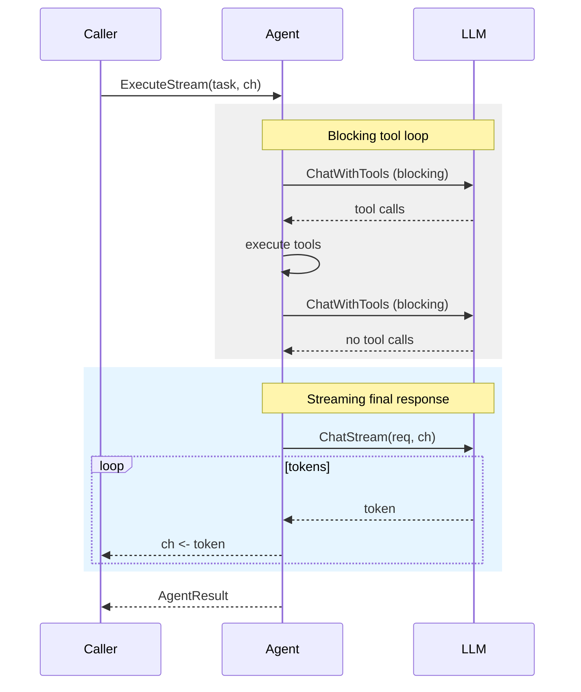

# Streaming

Stream LLM tokens as they arrive instead of waiting for the full response. Both LLMAgent and Network support streaming via the `StreamingAgent` interface.

## Basic Streaming

```go
agent := oasis.NewLLMAgent("assistant", "Helpful assistant", llm)

if sa, ok := agent.(oasis.StreamingAgent); ok {
    ch := make(chan string, 64)
    go func() {
        for token := range ch {
            fmt.Print(token)
        }
        fmt.Println()  // newline after stream ends
    }()
    result, err := sa.ExecuteStream(ctx, task, ch)
}
```

## How It Works

Tool-calling iterations run in blocking mode (`ChatWithTools`). Only the final text response streams via `ChatStream`:



## Frontend Streaming Pattern

For messaging platforms (Telegram, Discord), use the poll-send-edit cycle:

```go
msgID, _ := frontend.Send(ctx, chatID, "...")  // placeholder

ch := make(chan string, 64)
go func() {
    var buf strings.Builder
    for token := range ch {
        buf.WriteString(token)
        // Throttle edits to max 1/sec
        frontend.Edit(ctx, chatID, msgID, buf.String())
    }
    frontend.EditFormatted(ctx, chatID, msgID, formatHTML(buf.String()))
}()

sa := agent.(oasis.StreamingAgent)
result, _ := sa.ExecuteStream(ctx, task, ch)
```

## Channel Buffering

Use a buffered channel to avoid blocking the LLM stream:

```go
ch := make(chan string, 64)  // buffered — recommended
ch := make(chan string)       // unbuffered — may slow down the LLM
```

The channel is always closed by the agent when streaming completes.

## See Also

- [Agent Concept](../concepts/agent.md) — StreamingAgent interface
- [Frontend Concept](../concepts/frontend.md) — poll-send-edit cycle
