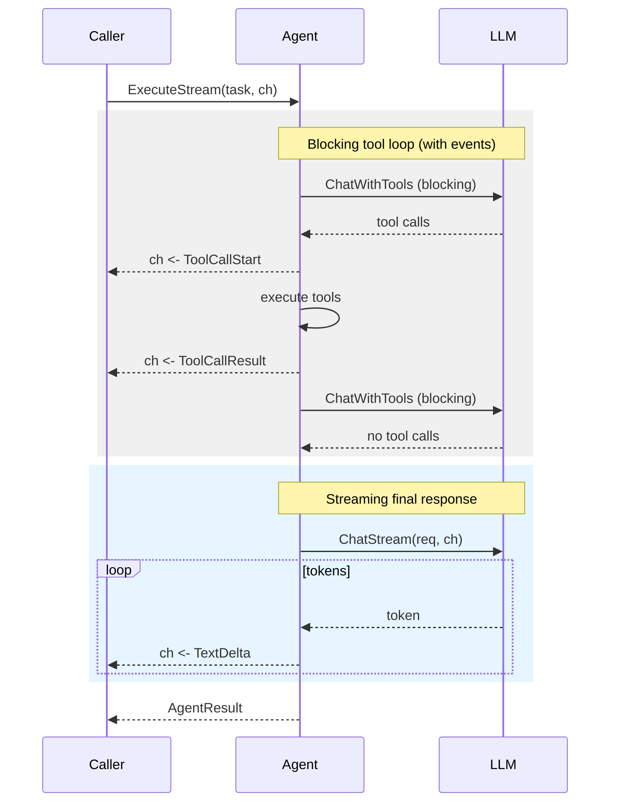

# Streaming

Stream LLM tokens and execution events as they happen instead of waiting for the full response. Both LLMAgent and Network support streaming via the `StreamingAgent` interface.

## Basic Streaming

```go
agent := oasis.NewLLMAgent("assistant", "Helpful assistant", llm)

if sa, ok := agent.(oasis.StreamingAgent); ok {
    ch := make(chan oasis.StreamEvent, 64)
    go func() {
        for ev := range ch {
            switch ev.Type {
            case oasis.EventTextDelta:
                fmt.Print(ev.Content)
            case oasis.EventToolCallStart:
                fmt.Printf("\n[calling %s...]\n", ev.Name)
            case oasis.EventToolCallResult:
                fmt.Printf("[%s done]\n", ev.Name)
            case oasis.EventAgentStart:
                fmt.Printf("\n[agent %s working...]\n", ev.Name)
            case oasis.EventAgentFinish:
                fmt.Printf("[agent %s done]\n", ev.Name)
            }
        }
    }()
    result, err := sa.ExecuteStream(ctx, task, ch)
}
```

## Stream Events

The channel carries typed `StreamEvent` values. Five event types:

| Event Type            | Emitted By                     | Payload                                  |
| --------------------- | ------------------------------ | ---------------------------------------- |
| `EventTextDelta`      | Provider (ChatStream)          | `Content` = text chunk                   |
| `EventToolCallStart`  | runLoop (before tool dispatch) | `Name` = tool name, `Args` = arguments   |
| `EventToolCallResult` | runLoop (after tool completes) | `Name` = tool name, `Content` = result, `Usage`, `Duration` |
| `EventAgentStart`     | Network dispatch               | `Name` = agent name, `Content` = task    |
| `EventAgentFinish`    | Network dispatch               | `Name` = agent name, `Content` = output, `Usage`, `Duration` |

```go
type StreamEvent struct {
    Type     StreamEventType  `json:"type"`
    Name     string           `json:"name,omitempty"`
    Content  string           `json:"content,omitempty"`
    Args     json.RawMessage  `json:"args,omitempty"`
    Usage    Usage            `json:"usage,omitempty"`    // tool-call-result, agent-finish
    Duration time.Duration    `json:"duration,omitempty"` // tool-call-result, agent-finish
}
```

## How It Works

Tool-calling iterations run in blocking mode (`ChatWithTools`), but emit tool events on the channel. The final text response streams token-by-token via `ChatStream`:



## Channel Buffering

Use a buffered channel to avoid blocking the LLM stream:

```go
ch := make(chan oasis.StreamEvent, 64)  // buffered — recommended
ch := make(chan oasis.StreamEvent)       // unbuffered — may slow down the LLM
```

The channel is always closed by the agent when streaming completes.

## HTTP Server-Sent Events

Use `ServeSSE` to stream agent responses over HTTP with zero boilerplate:

```go
http.HandleFunc("/chat", func(w http.ResponseWriter, r *http.Request) {
    task := oasis.AgentTask{Input: r.URL.Query().Get("q")}
    result, err := oasis.ServeSSE(r.Context(), w, agent, task)
    if err != nil {
        log.Printf("stream error: %v", err)
        return
    }
    log.Printf("completed: %s", result.Output)
})
```

`ServeSSE` handles the full SSE lifecycle:

1. Validates that the `ResponseWriter` supports flushing
2. Sets `Content-Type: text/event-stream`, `Cache-Control`, and `Connection` headers
3. Runs the agent in a goroutine, writes each `StreamEvent` as an SSE event
4. Sends `event: done` on completion, or `event: error` on failure
5. Propagates client disconnection via context cancellation

Each SSE event is formatted as:

```text
event: text-delta
data: {"type":"text-delta","content":"Hello"}
```

Works with any router (Echo, Chi, Gin) since they all expose `http.ResponseWriter`.

## See Also

- [Agent Concept](../concepts/agent.md) — StreamingAgent interface
