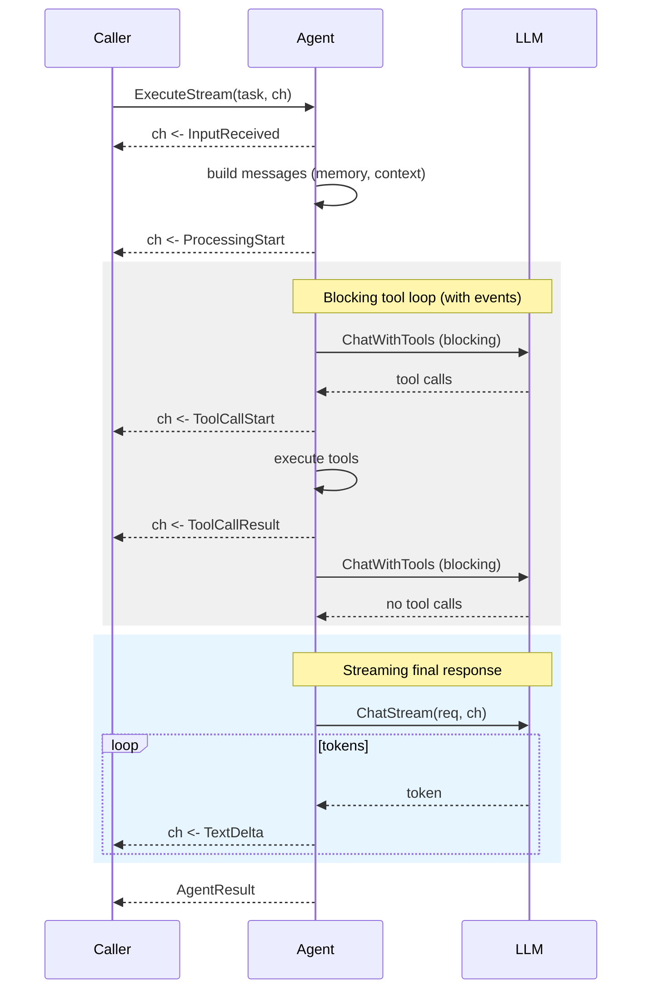

# Streaming

Stream LLM tokens and execution events as they happen instead of waiting for the full response. Both LLMAgent and Network support streaming via the `StreamingAgent` interface.

## Basic Streaming

```go
agent := oasis.NewLLMAgent("assistant", "Helpful assistant", llm)

if sa, ok := agent.(oasis.StreamingAgent); ok {
    ch := make(chan oasis.StreamEvent, 64)
    go func() {
        for ev := range ch {
            switch ev.Type {
            case oasis.EventInputReceived:
                fmt.Printf("[%s received: %s]\n", ev.Name, ev.Content)
            case oasis.EventProcessingStart:
                fmt.Printf("[%s processing...]\n", ev.Name)
            case oasis.EventTextDelta:
                fmt.Print(ev.Content)
            case oasis.EventToolCallStart:
                fmt.Printf("\n[calling %s...]\n", ev.Name)
            case oasis.EventToolCallResult:
                fmt.Printf("[%s done]\n", ev.Name)
            case oasis.EventAgentStart:
                fmt.Printf("\n[agent %s working...]\n", ev.Name)
            case oasis.EventAgentFinish:
                fmt.Printf("[agent %s done]\n", ev.Name)
            }
        }
    }()
    result, err := sa.ExecuteStream(ctx, task, ch)
}
```

## Stream Events

The channel carries typed `StreamEvent` values. Seven event types:

| Event Type             | Emitted By                      | Payload                                                       |
| ---------------------- | ------------------------------- | ------------------------------------------------------------- |
| `EventInputReceived`   | LLMAgent/Network entry          | `Name` = agent name, `Content` = task input                   |
| `EventProcessingStart` | runLoop (after context loading) | `Name` = loop identifier (e.g. `agent:name`)                  |
| `EventTextDelta`       | Provider (ChatStream)           | `Content` = text chunk                                        |
| `EventToolCallStart`   | runLoop (before tool dispatch)  | `Name` = tool name, `Args` = arguments                        |
| `EventToolCallResult`  | runLoop (after tool completes)  | `Name` = tool name, `Content` = result, `Usage`, `Duration`   |
| `EventAgentStart`      | Network dispatch                | `Name` = agent name, `Content` = task                         |
| `EventAgentFinish`     | Network dispatch                | `Name` = agent name, `Content` = output, `Usage`, `Duration`  |

```go
type StreamEvent struct {
    Type     StreamEventType  `json:"type"`
    Name     string           `json:"name,omitempty"`
    Content  string           `json:"content,omitempty"`
    Args     json.RawMessage  `json:"args,omitempty"`
    Usage    Usage            `json:"usage,omitempty"`    // tool-call-result, agent-finish
    Duration time.Duration    `json:"duration,omitempty"` // tool-call-result, agent-finish
}
```

## How It Works

Tool-calling iterations run in blocking mode (`ChatWithTools`), but emit tool events on the channel. The final text response streams token-by-token via `ChatStream`:



## Channel Buffering

Use a buffered channel to avoid blocking the LLM stream:

```go
ch := make(chan oasis.StreamEvent, 64)  // buffered — recommended
ch := make(chan oasis.StreamEvent)       // unbuffered — may slow down the LLM
```

The channel is always closed by the agent when streaming completes.

## HTTP Server-Sent Events

Use `ServeSSE` to stream agent responses over HTTP with zero boilerplate:

```go
http.HandleFunc("/chat", func(w http.ResponseWriter, r *http.Request) {
    task := oasis.AgentTask{Input: r.URL.Query().Get("q")}
    result, err := oasis.ServeSSE(r.Context(), w, agent, task)
    if err != nil {
        log.Printf("stream error: %v", err)
        return
    }
    log.Printf("completed: %s", result.Output)
})
```

`ServeSSE` handles the full SSE lifecycle:

1. Validates that the `ResponseWriter` supports flushing
2. Sets `Content-Type: text/event-stream`, `Cache-Control`, and `Connection` headers
3. Runs the agent in a goroutine, writes each `StreamEvent` as an SSE event
4. Sends `event: done` with the full `AgentResult` (output, steps, usage) on completion, or `event: error` on failure
5. Propagates client disconnection via context cancellation

Each SSE event is formatted as:

```text
event: text-delta
data: {"type":"text-delta","content":"Hello"}
```

Works with any router (Echo, Chi, Gin) since they all expose `http.ResponseWriter`.

> **Note:** `ServeSSE` handles real-time streaming only. If `WithConversationMemory` is configured on the agent, messages and execution traces are persisted to the database automatically by the memory pipeline — you don't need to store them separately in your handler.

## Custom SSE Loops

For full control over the SSE lifecycle (custom done payloads, app-specific metadata, filtering events), use `WriteSSEEvent` with `ExecuteStream` directly:

```go
http.HandleFunc("/chat", func(w http.ResponseWriter, r *http.Request) {
    w.Header().Set("Content-Type", "text/event-stream")
    w.Header().Set("Cache-Control", "no-cache")
    w.Header().Set("Connection", "keep-alive")

    task := oasis.AgentTask{Input: r.URL.Query().Get("q")}
    ch := make(chan oasis.StreamEvent, 64)

    var result oasis.AgentResult
    var execErr error
    done := make(chan struct{})
    go func() {
        result, execErr = agent.(oasis.StreamingAgent).ExecuteStream(r.Context(), task, ch)
        close(done)
    }()

    for ev := range ch {
        oasis.WriteSSEEvent(w, string(ev.Type), ev)
    }
    <-done

    if execErr != nil {
        oasis.WriteSSEEvent(w, "error", map[string]string{"error": execErr.Error()})
        return
    }

    // Custom done payload with app-specific metadata
    oasis.WriteSSEEvent(w, "done", map[string]any{
        "conversationId": convID,
        "result":         result,
        "sources":        sources,
    })
})
```

`WriteSSEEvent` handles JSON marshaling and flushing — you compose the loop, it handles the SSE mechanics.

## Processors and Streaming

PostProcessors run for side effects even on the streaming path. When an agent streams its final response, the framework still calls `RunPostLLM` after streaming completes — the PostProcessor sees the full assembled response.

This means logging, analytics, and guardrail processors work identically regardless of whether the caller used `Execute` or `ExecuteStream`.

## Execution Trace Persistence

When `WithConversationMemory` is enabled, execution traces (`result.Steps`) are **automatically saved** to the database in the assistant message's `Metadata` field — no extra code needed. This happens in the background after `ExecuteStream` completes, the same as with `Execute`.

This means the SSE stream is for real-time display, but you don't need to persist steps yourself. They're already in the database:

```go
// Steps are automatically persisted — just query them back
messages, _ := store.GetMessages(ctx, threadID, 10)
for _, m := range messages {
    if steps, ok := m.Metadata["steps"]; ok {
        // execution traces from the agent run
    }
}
```

See [Memory: Execution Trace Persistence](../concepts/memory.md#execution-trace-persistence) for full details.

## Observability

Streaming works with `WithTracer` — the same span hierarchy (`agent.execute` → `agent.llm.call` → `agent.tool.call`) applies to `ExecuteStream`. Tool events appear as child spans within the streaming execution.

```go
agent := oasis.NewLLMAgent("assistant", "Helpful assistant", llm,
    oasis.WithTracer(tracer),
)
// ExecuteStream produces the same trace spans as Execute
```

## See Also

- [Agent Concept](../concepts/agent.md) — StreamingAgent interface
- [Processors Guide](processors-and-guardrails.md) — PostProcessor details
- [Observability](../concepts/observability.md) — Tracer/Span interfaces
