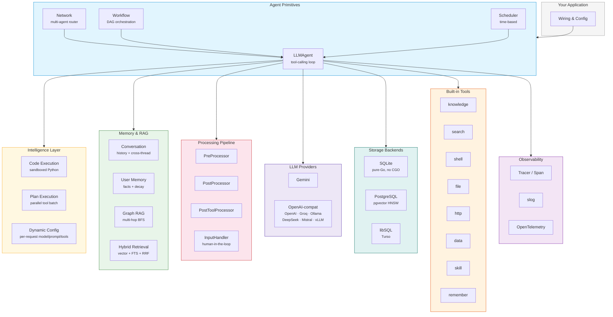
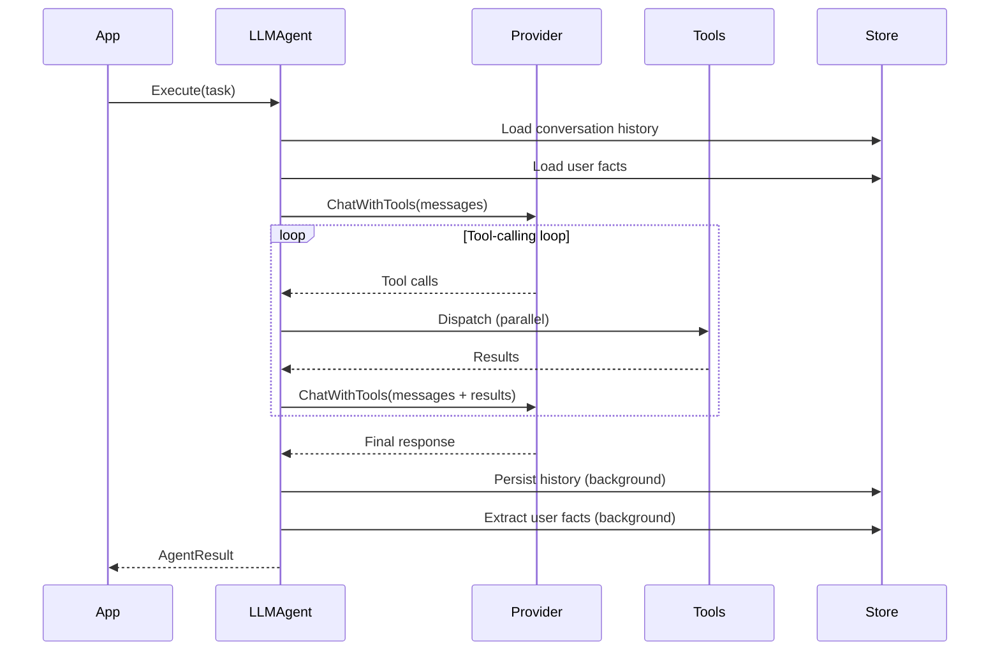
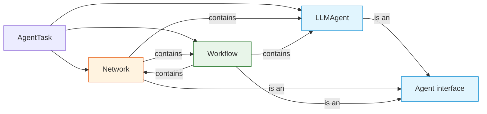
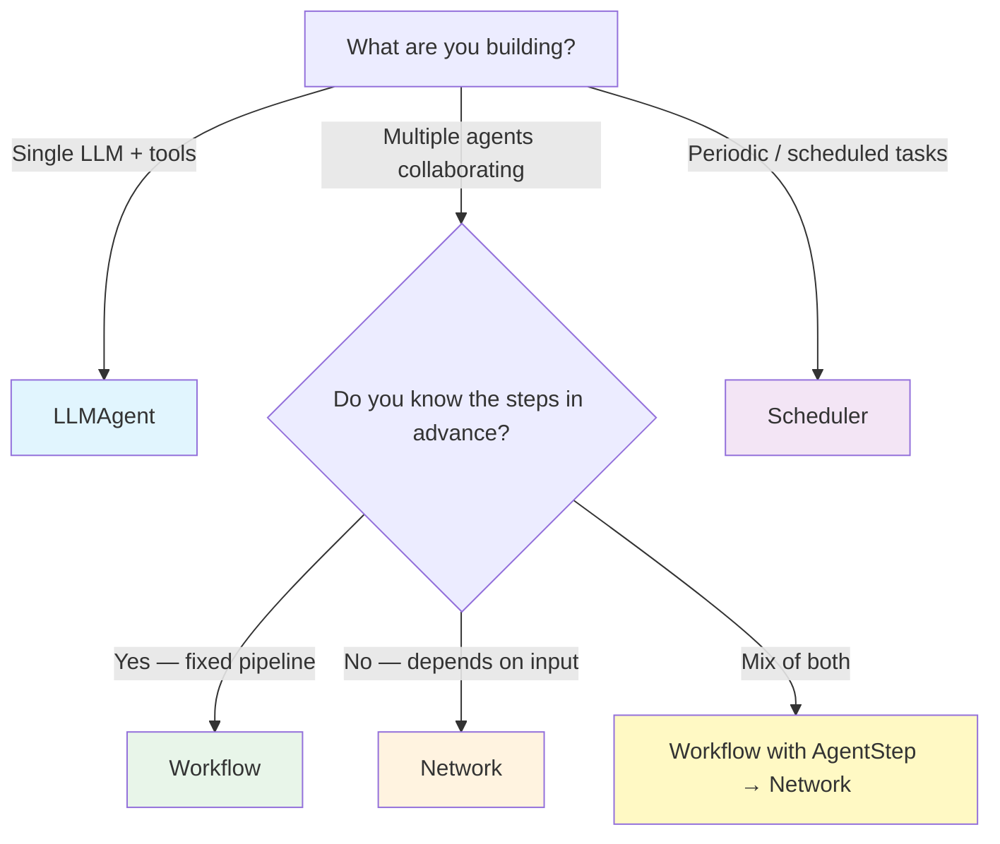
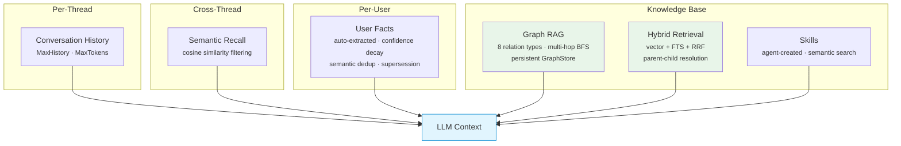
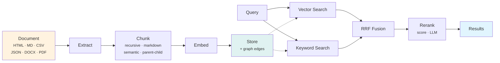
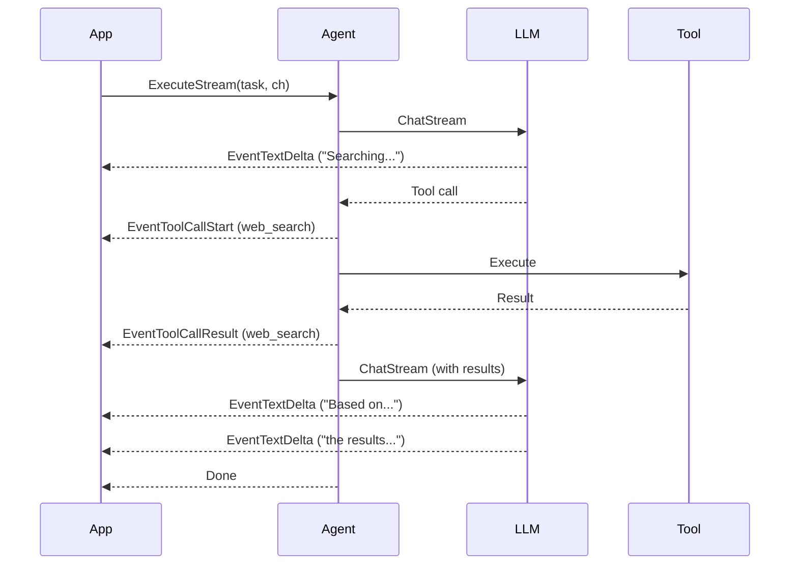
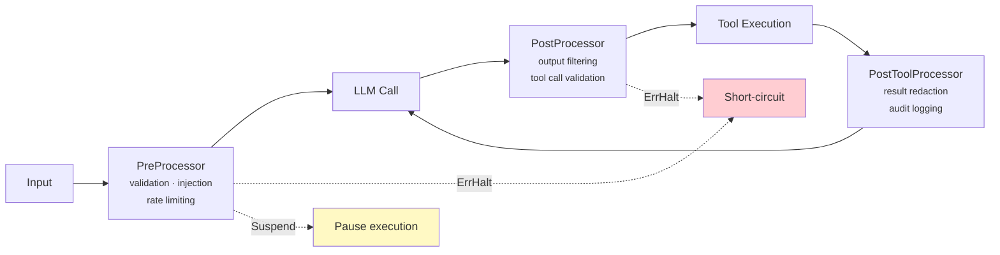
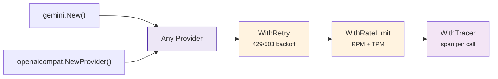

# Oasis

An AI agent framework for Go. Composable primitives for tool-calling agents, multi-agent networks, deterministic workflows, Graph RAG, code execution, and long-term memory — designed to evolve alongside AI capabilities.

```go
import oasis "github.com/nevindra/oasis"
```

## Architecture



Everything above is a Go interface (or built on one). Swap any box without touching the others.

---

## How It Works

Oasis agents run a simple loop: receive input → call LLM → execute tools → repeat until done.



When an agent is wrapped in a **Network**, the LLM router decides which subagent to invoke. When it's a step in a **Workflow**, the DAG engine schedules it based on dependencies.

---

## Core Primitives

### Agent Primitives



| Primitive | Routing | Parallelism | Best for |
| --------- | ------- | ----------- | -------- |
| [**LLMAgent**](concepts/agent.md) | N/A — single LLM | Parallel tool dispatch | Tool-calling tasks with a single provider |
| [**Network**](concepts/network.md) | Runtime (LLM decides) | LLM can invoke multiple agents | Open-ended tasks, ambiguous input |
| [**Workflow**](concepts/workflow.md) | Compile-time (you declare) | Steps without deps run concurrently | Pipelines, ETL, multi-step processing |
| [**Scheduler**](concepts/scheduler.md) | Time-based | N/A | Periodic jobs, reminders |

All implement `Agent`, so they compose recursively — a Network can contain Workflows, a Workflow can orchestrate Networks.

### Choosing the Right Primitive



---

## Intelligence Capabilities

Beyond basic tool calling, agents can leverage advanced execution patterns:

| Capability | Option | What it does |
| ---------- | ------ | ------------ |
| [**Code Execution**](concepts/code-execution.md) | `WithCodeExecution(runner)` | LLM writes Python, executed in sandbox with `call_tool()` bridge |
| [**Plan Execution**](guides/execution-plans.md) | `WithPlanExecution()` | LLM batches tool calls → all run in parallel → results returned in one turn |
| **Dynamic Config** | `WithDynamicPrompt` / `WithDynamicModel` / `WithDynamicTools` | Per-request prompt, model, and tool resolution |
| **Structured Output** | `WithResponseSchema(schema)` | Enforce JSON output schema on every LLM call |
| **Suspend/Resume** | `Suspend(payload)` / `Resume(ctx, data)` | Pause execution for external input, continue later |

---

## Memory System



| Feature | Setup | Docs |
| ------- | ----- | ---- |
| **Conversation memory** | `WithConversationMemory(store)` | [Memory guide](guides/memory-and-recall.md) |
| **Cross-thread recall** | `WithConversationMemory(store, CrossThreadSearch(emb))` | [Memory guide](guides/memory-and-recall.md) |
| **User memory** | `WithUserMemory(memStore, emb)` | [Memory guide](guides/memory-and-recall.md) |
| **Graph RAG** | `WithGraphExtraction(provider)` on Ingestor + `GraphRetriever` | [RAG pipeline](guides/rag-pipeline.md) |
| **Hybrid retrieval** | `HybridRetriever` with `WithReranker`, `WithFilters` | [RAG pipeline](guides/rag-pipeline.md) |
| **Skills** | `tools/skill` with `Store` | [Skills guide](guides/skills.md) |

---

## RAG Pipeline



Ingestion and retrieval are fully composable — swap chunkers, add extractors, chain rerankers. See [Ingesting Documents](guides/ingesting-documents.md) and [RAG Pipeline](guides/rag-pipeline.md).

---

## Streaming & Events

Agents emit structured events during execution — not just text tokens:



Five event types: `EventTextDelta`, `EventToolCallStart`, `EventToolCallResult`, `EventAgentStart`, `EventAgentFinish`. Plus `ServeSSE` for zero-boilerplate Server-Sent Events.

Every `AgentResult` also includes `Steps []StepTrace` — per-tool timing, token usage, and I/O — with no OTEL setup required.

---

## Processing Pipeline



See [Processors & Guardrails](guides/processors-and-guardrails.md) and [Human-in-the-Loop](guides/human-in-the-loop.md).

---

## Provider Architecture



Provider decorators compose — `WithRateLimit(WithRetry(provider), RPM(60), TPM(100000))`. All providers use raw `net/http`, no LLM SDKs.

Optional: `BatchProvider` and `BatchEmbeddingProvider` for async batch processing at reduced cost.

---

## At a Glance

```go
// Single agent with memory, code execution, and streaming
agent := oasis.NewLLMAgent("assistant", "Helpful assistant", llm,
    oasis.WithTools(searchTool, knowledgeTool),
    oasis.WithPrompt("You are a helpful assistant."),
    oasis.WithConversationMemory(store, oasis.CrossThreadSearch(embedding)),
    oasis.WithUserMemory(memoryStore, embedding),
    oasis.WithCodeExecution(runner),
    oasis.WithPlanExecution(),
    oasis.WithTracer(observer.NewTracer()),
)

// Multi-agent network
team := oasis.NewNetwork("team", "Research and writing", router,
    oasis.WithAgents(researcher, writer),
)

// Deterministic workflow
pipeline, _ := oasis.NewWorkflow("pipeline", "Research then write",
    oasis.AgentStep("research", researcher),
    oasis.AgentStep("write", writer,
        oasis.InputFrom("research.output"),
        oasis.After("research"),
    ),
)
```

---

## Documentation

| Section | What you'll learn |
| ------- | ----------------- |
| [**Getting Started**](getting-started/index.md) | Installation, first agent, reference app |
| [**Concepts**](concepts/index.md) | How the framework works — one page per primitive |
| [**Guides**](guides/) | Step-by-step how-tos |
| [**Configuration**](configuration/index.md) | All config options and environment variables |
| [**API Reference**](api/interfaces.md) | Complete interface definitions and types |
| [**Contributing**](contributing.md) | Engineering principles and coding conventions |

### Guides

| Guide | Topic |
| ----- | ----- |
| [Custom Tool](guides/custom-tool.md) | Build your own tools |
| [Custom Provider](guides/custom-provider.md) | Implement a new LLM provider |
| [Custom Store](guides/custom-store.md) | Write a storage backend |
| [Custom Agent](guides/custom-agent.md) | Create a custom agent type |
| [Memory & Recall](guides/memory-and-recall.md) | Conversation history, cross-thread, user facts |
| [RAG Pipeline](guides/rag-pipeline.md) | Ingestion, retrieval, Graph RAG |
| [Ingesting Documents](guides/ingesting-documents.md) | Extract, chunk, embed, store |
| [Streaming](guides/streaming.md) | Token streaming and SSE |
| [Processors & Guardrails](guides/processors-and-guardrails.md) | Input/output middleware |
| [Human-in-the-Loop](guides/human-in-the-loop.md) | InputHandler and suspend/resume |
| [Background Agents](guides/background-agents.md) | Spawn, cancel, select |
| [Code Execution](guides/code-execution.md) | Sandboxed Python with tool bridge |
| [Execution Plans](guides/execution-plans.md) | Parallel tool batching |
| [Skills](guides/skills.md) | Agent-created instruction packages |

---

## Requirements

- **Go 1.24+**
- No CGO required (pure-Go SQLite via `modernc.org/sqlite`)

## Installation

```bash
go get github.com/nevindra/oasis
```

This pulls the core framework. Provider, store, and tool packages are imported individually as needed:

```go
import (
    "github.com/nevindra/oasis/provider/gemini"
    "github.com/nevindra/oasis/store/sqlite"
    "github.com/nevindra/oasis/tools/knowledge"
)
```
