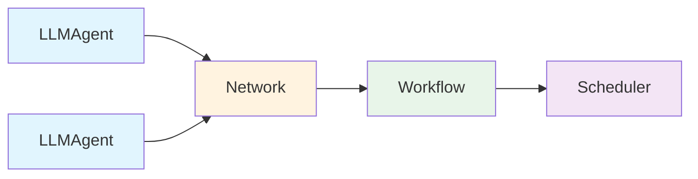

# Oasis

Oasis is an AI agent framework for Go. It provides composable, interface-driven primitives for building tool-calling agents, multi-agent networks, deterministic workflows, and conversational assistants — designed to remain relevant as AI capabilities evolve toward AGI.

```go
import oasis "github.com/nevindra/oasis"
```

## Why Oasis

Most AI frameworks optimize for today's LLM limitations. Oasis optimizes for where AI is going: agents that spawn sub-agents, manage their own memory, negotiate task delegation with peers, and operate autonomously over long horizons. The framework provides the primitives — you compose them into whatever system you need.



## Core Primitives

| Primitive | What it does |
|-----------|-------------|
| **LLMAgent** | Single LLM with tools — runs a tool-calling loop until a final response |
| **Network** | Multi-agent coordinator — LLM router delegates to subagents |
| **Workflow** | Deterministic DAG — explicit step sequences with automatic parallelism |
| **Scheduler** | Time-based execution — polls for due actions and fires them via an Agent |

All four compose recursively. A Network can contain Workflows. A Workflow can contain Agents. A Scheduler wraps any Agent.

## At a Glance

```go
// Single agent with tools
agent := oasis.NewLLMAgent("researcher", "Searches the web", llm,
    oasis.WithTools(searchTool, knowledgeTool),
    oasis.WithPrompt("You are a research specialist."),
)
result, _ := agent.Execute(ctx, oasis.AgentTask{Input: "What is quantum computing?"})

// Multi-agent network
team := oasis.NewNetwork("team", "Research and writing", router,
    oasis.WithAgents(researcher, writer),
)

// Deterministic workflow
pipeline, _ := oasis.NewWorkflow("pipeline", "Research then write",
    oasis.AgentStep("research", researcher),
    oasis.AgentStep("write", writer, oasis.InputFrom("research.output"), oasis.After("research")),
)
```

## Design Principles

1. **AGI-ready** — every interface asks: "will this still work when agents get 10x smarter?"
2. **Forward-compatible** — add, don't remove. Extend via composition, not modification.
3. **Framework > app** — primitives are the product. Reference apps are demos.
4. **Dual-audience** — code is read by both humans and LLMs. Godoc on every export.
5. **No SDKs** — all LLM providers use raw `net/http`. Zero vendor lock-in.

## Documentation

| Section | Description |
|---------|-------------|
| [Getting Started](getting-started/index.md) | Installation and your first agent |
| [Concepts](concepts/index.md) | How the framework works — one page per primitive |
| [Guides](guides/custom-tool.md) | Step-by-step how-to for common tasks |
| [Configuration](configuration/index.md) | All config options and environment variables |
| [API Reference](api/interfaces.md) | Complete interface definitions and types |
| [Contributing](contributing.md) | Engineering principles and coding conventions |

## Requirements

- Go 1.24+
- No CGO required (pure-Go SQLite via `modernc.org/sqlite`)

## Installation

```bash
go get github.com/nevindra/oasis
```
