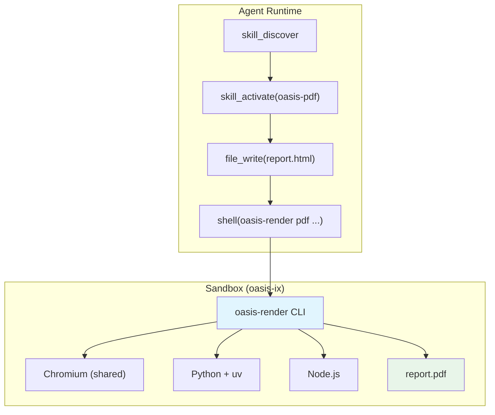
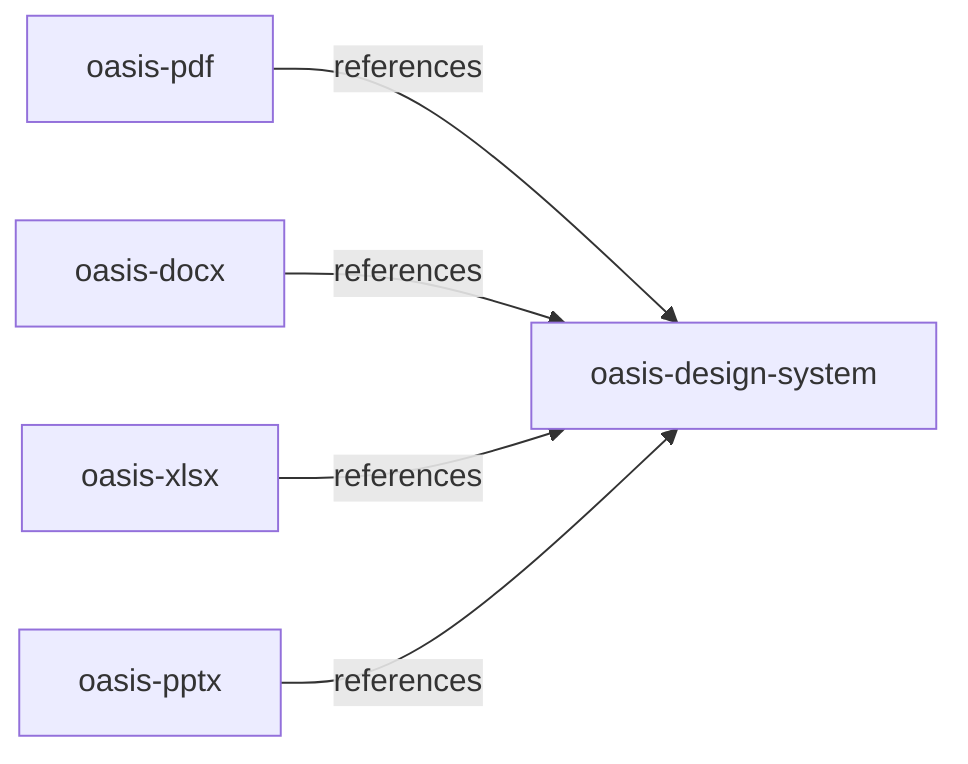
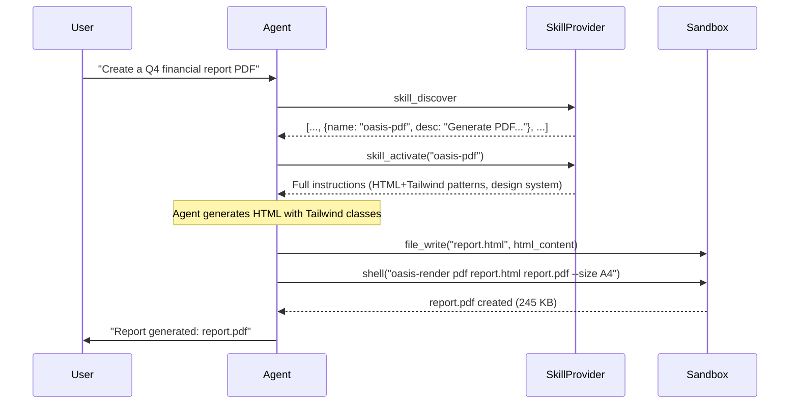

# Document Generation — Design Spec

**Date:** 2026-03-27
**Goal:** Give Oasis agents the ability to generate professional documents — PDF, DOCX, XLSX, PPTX — using file-based skills and the existing sandbox infrastructure.

**Framing:** Document generation is a skill, not a framework primitive. No new Go types, no new interfaces. Agents learn *how* to generate documents via SKILL.md instructions, produce structured input (HTML or JSON), and call a pre-installed renderer inside the sandbox. The sandbox's existing Chromium, Python, and Node.js runtimes do the heavy lifting.

---

## Architecture



### What the Agent Does vs What the Renderer Does

| Format | Agent Produces | Renderer Handles |
|--------|---------------|-----------------|
| **PDF** | HTML file with Tailwind CSS | Playwright `page.pdf()` — margins, page size, headers/footers |
| **DOCX** | JSON spec — typed content blocks | python-docx — styles, sections, page setup, images |
| **XLSX** | JSON spec — sheets, data, formulas, charts | openpyxl — workbook construction, chart rendering, formatting |
| **PPTX** | JSON spec — slides, elements, theme | PptxGenJS — slide assembly, chart rendering, theme application |

**Why HTML for PDF but JSON for the rest?**

- HTML *is* the rendering language for PDF. The agent writes the final visual output directly — Tailwind gives consistent design tokens, CSS gives unlimited expressiveness. No abstraction layer needed.
- DOCX/XLSX/PPTX are binary formats with complex library APIs. A JSON spec is simpler for the LLM to produce than library-specific code. The renderer script absorbs all library complexity — element ordering, namespace handling, relationship management. Even small models produce correct JSON.

### Why Sandbox, Not Host

1. **Dependencies are heavy.** Playwright needs Chromium (~400MB). python-docx, openpyxl, PptxGenJS each have dependency trees. Bake once into the Docker image — users install nothing.
2. **Security.** LLM-generated HTML/JSON is processed by scripts. Sandbox isolation contains the blast radius.
3. **Chromium is already there.** The sandbox `browser` tool already ships Chromium. Playwright reuses it — zero additional install.
4. **Reproducibility.** Same image = same output everywhere.

---

## Stack Decisions

Each format uses the technology that produces the best results from LLM-generated input, especially from smaller models.

### PDF — HTML + Tailwind + Playwright

**Why not Go-native (maroto, fpdf)?**
- maroto v2 is decent for tables/text but hits a ceiling on visual complexity — no gradients, no CSS grid, limited design control
- Go libraries have no charting — you'd pre-render to PNG and embed
- Cover pages and branded layouts need pixel-level control that only CSS provides

**Why not React-PDF?**
- `@react-pdf/renderer` uses its own `StyleSheet.create()` API, not CSS classes — **incompatible with Tailwind**
- Adding React means a build step (JSX compilation, package.json, node_modules) — a smaller model will mess up the config

**Why HTML + Tailwind + Playwright?**
- HTML/CSS is the language ALL LLMs know best — most represented in training data
- Tailwind CDN = one `<script>` tag, zero build step, consistent design tokens
- Playwright's `page.pdf()` produces identical output to any browser print — full CSS3 support
- Charts via inline Chart.js `<canvas>`, diagrams via inline SVG
- The sandbox already has Chromium — Playwright reuses it

### DOCX — Python (python-docx)

**Why not C# / .NET OpenXML SDK?**
- Drags in an entire .NET runtime into the Docker image
- C# OpenXML is verbose — a smaller model will mess up XML element ordering (`pPr` before runs, `tblPr` before grids)
- 95% spec coverage is overkill — skills generate from a bounded set of features

**Why not Go-native?**
- godocx (active, MIT) covers ~20-30% of the spec
- unioffice covers ~60-70% but requires a commercial license
- Go's DOCX ecosystem is the weakest across all formats

**Why python-docx?**
- Simple, Pythonic API: `doc.add_heading()`, `doc.add_table()`, `doc.add_picture()`
- Massive training data presence — StackOverflow, tutorials, GitHub examples
- Even small models use it correctly on first try
- But: the agent produces JSON, not python-docx code — the renderer script translates

### XLSX — Python (openpyxl)

**Why not raw XML manipulation (MiniMax approach)?**
- MiniMax used raw XML because Python's openpyxl destroys VBA/pivot tables on save
- Go's excelize (18k stars) has better preservation via passthrough, but less LLM training data
- For **new file generation** (90% of use cases), openpyxl is perfectly fine — destruction only matters when editing existing files
- openpyxl has 10x more training data than excelize

**Why openpyxl?**
- Most well-known spreadsheet lib in any language
- LLMs write correct openpyxl code on first try
- Charts, conditional formatting, data validation — all built in
- xlsxwriter also included as alternative for write-only, streaming large files

### PPTX — JavaScript (PptxGenJS)

**Why not python-pptx?**
- python-pptx requires manual coordinate math in inches/EMU for every element
- A smaller model needs to calculate exact x, y, width, height — error-prone
- No built-in shadow, gradient, or rounded corner support without low-level XML

**Why PptxGenJS?**
- **Percentage-based positioning**: `x: "10%", y: "15%"` — no coordinate math
- **Theme object contract**: `{primary, secondary, accent, light, bg}` passed to every slide
- **Built-in charts** with simple data arrays (bar, line, pie, doughnut, etc.)
- **100+ shape types**, shadows, gradients as one-liner options
- 2,500+ stars, actively maintained, MIT license

---

## Docker Image

Single image. Extend the existing `oasis-ix:latest` — no separate images per skill.

```dockerfile
FROM oasis-ix:latest

# --- Python deps via uv (not pip — 5-10x faster) ---
COPY --from=ghcr.io/astral-sh/uv:latest /uv /usr/local/bin/uv

COPY requirements.txt /tmp/requirements.txt
RUN uv pip install --system --no-cache -r /tmp/requirements.txt && \
    rm /tmp/requirements.txt

# --- Node.js global deps ---
RUN npm install -g \
    pptxgenjs \
    chartjs-node-canvas \
    @mermaid-js/mermaid-cli \
    sharp \
    papaparse

# --- oasis-render CLI + renderer scripts ---
COPY renderers/ /opt/oasis/renderers/
COPY bin/oasis-render /usr/local/bin/oasis-render
RUN chmod +x /usr/local/bin/oasis-render
```

### Python Dependencies (requirements.txt)

```
# Document generation
python-docx
openpyxl
xlsxwriter
pypdf

# Data & visualization
pandas
numpy
matplotlib
seaborn
plotly
kaleido

# Image processing
Pillow
cairosvg
qrcode[pil]

# Templating
jinja2
```

### Node.js Dependencies

| Package | Purpose |
|---------|---------|
| `pptxgenjs` | PPTX generation |
| `chartjs-node-canvas` | Server-side Chart.js → PNG |
| `@mermaid-js/mermaid-cli` | Mermaid diagrams → PNG/SVG |
| `sharp` | Fast image resize/convert |
| `papaparse` | CSV parsing |

### What's NOT Included (and Why)

| Skipped | Reason |
|---------|--------|
| reportlab | HTML+Playwright replaces it for PDF |
| python-pptx | PptxGenJS replaces it for PPTX |
| scikit-learn, torch | ML, not document generation |
| flask, fastapi | No web server in sandbox |
| python-barcode | QR codes (via qrcode) cover 90% of use cases |

### Runtime Availability

`uv` remains available at runtime. If an agent needs an ad-hoc package not pre-installed:

```bash
shell("uv pip install --system some-package")  # ~5-10x faster than pip
```

---

## oasis-render CLI

Unified entry point for all document rendering. Pre-installed in the Docker image at `/usr/local/bin/oasis-render`.

### Usage

```bash
oasis-render <format> <input> <output> [options]
```

### Commands

#### PDF

```bash
oasis-render pdf input.html output.pdf [options]
```

| Option | Default | Description |
|--------|---------|-------------|
| `--size` | `A4` | Page size: A4, Letter, Legal, A3 |
| `--margins` | `1in` | Margins (CSS format: `"1in"` or `"1in 0.75in"`) |
| `--landscape` | `false` | Landscape orientation |
| `--header` | none | HTML string for page header |
| `--footer` | none | HTML string for page footer |
| `--scale` | `1` | Scale factor |

**Implementation:** Launches Playwright with the sandbox's existing Chromium. Opens the HTML file, calls `page.pdf()` with the provided options. Exits.

```javascript
// renderers/pdf/render.js (simplified)
const { chromium } = require('playwright-core');

async function render(input, output, opts) {
    const browser = await chromium.launch({
        executablePath: process.env.CHROME_PATH || '/usr/bin/chromium',
    });
    const page = await browser.newPage();
    await page.goto(`file://${path.resolve(input)}`, { waitUntil: 'networkidle' });
    await page.pdf({
        path: output,
        format: opts.size || 'A4',
        margin: parseMargins(opts.margins),
        landscape: opts.landscape || false,
        printBackground: true,
        scale: opts.scale || 1,
        displayHeaderFooter: !!(opts.header || opts.footer),
        headerTemplate: opts.header || '',
        footerTemplate: opts.footer || '',
    });
    await browser.close();
}
```

#### PDF Fill

```bash
oasis-render pdf-fill input.pdf output.pdf --fields fields.json
```

**Implementation:** Uses `pypdf` to fill AcroForm fields.

```python
# renderers/pdf/fill.py (simplified)
from pypdf import PdfReader, PdfWriter
import json, sys

reader = PdfReader(sys.argv[1])
writer = PdfWriter()
writer.append(reader)

with open(sys.argv[3]) as f:
    fields = json.load(f)

writer.update_page_form_field_values(writer.pages[0], fields)
writer.write(sys.argv[2])
```

#### DOCX

```bash
oasis-render docx spec.json output.docx [options]
```

| Option | Default | Description |
|--------|---------|-------------|
| `--template` | none | Base .docx template file to use |
| `--style` | `business` | Style preset: business, academic, minimal |

**Implementation:** Reads JSON spec, constructs document using python-docx.

#### DOCX Template Fill

```bash
oasis-render docx-fill template.docx output.docx --data data.json
```

**Implementation:** Opens template, replaces `{{placeholder}}` tokens with data values.

#### XLSX

```bash
oasis-render xlsx spec.json output.xlsx
```

**Implementation:** Reads JSON spec, constructs workbook using openpyxl.

#### PPTX

```bash
oasis-render pptx spec.json output.pptx [options]
```

| Option | Default | Description |
|--------|---------|-------------|
| `--theme` | none | Theme JSON file override |

**Implementation:** Reads JSON spec, constructs presentation using PptxGenJS.

### CLI Entry Point

```bash
#!/usr/bin/env bash
# /usr/local/bin/oasis-render

set -euo pipefail

CMD="${1:?Usage: oasis-render <pdf|pdf-fill|docx|docx-fill|xlsx|pptx> <input> <output> [options]}"
shift

RENDERERS="/opt/oasis/renderers"

case "$CMD" in
    pdf)       node "$RENDERERS/pdf/render.js" "$@" ;;
    pdf-fill)  python3 "$RENDERERS/pdf/fill.py" "$@" ;;
    docx)      python3 "$RENDERERS/docx/generate.py" "$@" ;;
    docx-fill) python3 "$RENDERERS/docx/fill.py" "$@" ;;
    xlsx)      python3 "$RENDERERS/xlsx/generate.py" "$@" ;;
    pptx)      node "$RENDERERS/pptx/compile.js" "$@" ;;
    *)         echo "Unknown command: $CMD" >&2; exit 1 ;;
esac
```

---

## Skill Architecture

Skills are pure instruction packages — no scripts, no dependencies. All rendering logic lives in the Docker image. Skills teach the agent *what input to produce* and *what command to run*.

### Directory Layout

```
skills/
├── oasis-design-system/
│   └── SKILL.md
├── oasis-pdf/
│   ├── SKILL.md
│   ├── templates/
│   │   ├── report.html
│   │   └── invoice.html
│   └── references/
│       ├── print-css.md
│       └── chart-patterns.md
├── oasis-docx/
│   ├── SKILL.md
│   └── references/
│       ├── spec-format.md
│       └── style-recipes.md
├── oasis-xlsx/
│   ├── SKILL.md
│   └── references/
│       ├── spec-format.md
│       └── conventions.md
└── oasis-pptx/
    ├── SKILL.md
    └── references/
        ├── spec-format.md
        ├── slide-types.md
        └── layout-patterns.md
```

### Composability



All document skills reference `oasis-design-system` for consistent palettes, typography, and spacing. When activated, the application resolves references and merges design system instructions into the document skill's prompt.

### Agent Flow



---

## Skill Definitions

### oasis-design-system

```markdown
---
name: oasis-design-system
description: Shared design tokens for document generation — color palettes, typography, spacing scale
tags: [design, document]
---

# Design System

Consistent visual language across all document formats.

## Color Palettes

Use one palette per document. Every document skill references these tokens.

### Corporate
| Token | Hex | Usage |
|-------|-----|-------|
| primary | #1B2A4A | Headings, borders, primary actions |
| secondary | #2D5F8A | Subheadings, secondary elements |
| accent | #E8734A | Highlights, call-to-action, data emphasis |
| light | #F5F5F5 | Backgrounds, alternating rows |
| bg | #FFFFFF | Page background |
| text | #333333 | Body text |
| muted | #6B7280 | Captions, footnotes |

### Minimal
| Token | Hex | Usage |
|-------|-----|-------|
| primary | #111111 | Headings |
| secondary | #444444 | Subheadings |
| accent | #0066CC | Links, highlights |
| light | #FAFAFA | Backgrounds |
| bg | #FFFFFF | Page background |
| text | #222222 | Body text |
| muted | #999999 | Captions |

### Bold
| Token | Hex | Usage |
|-------|-----|-------|
| primary | #FF6B35 | Headings, primary actions |
| secondary | #004E89 | Subheadings, charts |
| accent | #2EC4B6 | Highlights, badges |
| light | #F0F4F8 | Backgrounds |
| bg | #FFFFFF | Page background |
| text | #1A1A2E | Body text |
| muted | #7C8DB0 | Captions |

### Dark
| Token | Hex | Usage |
|-------|-----|-------|
| primary | #E2E8F0 | Headings |
| secondary | #94A3B8 | Subheadings |
| accent | #38BDF8 | Highlights, links |
| light | #1E293B | Card backgrounds |
| bg | #0F172A | Page background |
| text | #CBD5E1 | Body text |
| muted | #64748B | Captions |

## Typography

### Font Stacks

| Name | Stack | Use for |
|------|-------|---------|
| sans | `Inter, system-ui, -apple-system, sans-serif` | Body text, UI elements |
| serif | `Merriweather, Georgia, serif` | Long-form reading, academic |
| mono | `JetBrains Mono, Fira Code, monospace` | Code, data, technical |

### Scale

| Level | Size | Weight | Use for |
|-------|------|--------|---------|
| display | 36px / 2.25rem | 700 | Cover page titles |
| h1 | 28px / 1.75rem | 700 | Document title |
| h2 | 22px / 1.375rem | 600 | Section headings |
| h3 | 18px / 1.125rem | 600 | Subsection headings |
| body | 14px / 0.875rem | 400 | Body text |
| small | 12px / 0.75rem | 400 | Captions, footnotes |
| tiny | 10px / 0.625rem | 400 | Legal text, page numbers |

## Spacing Scale

Use consistent spacing based on a 4px grid:

| Token | Value | Use for |
|-------|-------|---------|
| xs | 4px / 0.25rem | Tight inline spacing |
| sm | 8px / 0.5rem | Between related elements |
| md | 16px / 1rem | Between sections |
| lg | 24px / 1.5rem | Between major sections |
| xl | 32px / 2rem | Page margins, large gaps |
| 2xl | 48px / 3rem | Cover page spacing |
| 3xl | 64px / 4rem | Cover page hero spacing |
```

### oasis-pdf

```markdown
---
name: oasis-pdf
description: Generate PDF documents from HTML and Tailwind CSS. Use when the user asks to create, generate, or export a PDF file — reports, invoices, resumes, proposals, or any printable document.
tags: [document, pdf, export]
tools: [shell, file_write, file_read]
references: [oasis-design-system]
---

# PDF Generation

Generate PDFs by writing HTML with Tailwind CSS, then rendering via Playwright.

## Route Table

| Route | Trigger | Pipeline |
|-------|---------|----------|
| CREATE | "create/generate/make/export a PDF" | Write HTML → `oasis-render pdf` |
| FILL | "fill this PDF form / populate form fields" | Write fields JSON → `oasis-render pdf-fill` |

## CREATE Route

### Step 1: Write HTML

Write a complete HTML file with Tailwind CDN. The file must be self-contained — all styles inline or via Tailwind classes.

**Base structure:**

```html
<!DOCTYPE html>
<html>
<head>
    <meta charset="UTF-8">
    <script src="https://cdn.tailwindcss.com"></script>
    <style>
        @page {
            size: A4;
            margin: 1in;
        }
        @media print {
            .page-break { page-break-before: always; }
            .no-break { page-break-inside: avoid; }
        }
    </style>
</head>
<body class="font-sans text-gray-800 text-sm leading-relaxed">

    <!-- Cover page -->
    <div class="flex flex-col justify-center items-center min-h-screen text-center">
        <h1 class="text-4xl font-bold text-slate-800">Document Title</h1>
        <p class="mt-4 text-lg text-slate-500">Subtitle or description</p>
        <p class="mt-8 text-sm text-slate-400">March 2026</p>
    </div>

    <!-- Page break -->
    <div class="page-break"></div>

    <!-- Content pages -->
    <h2 class="text-xl font-semibold text-slate-700 border-b-2 border-blue-600 pb-2 mb-4">
        Section Title
    </h2>
    <p>Content here...</p>

</body>
</html>
```

### Step 2: Render

```bash
oasis-render pdf report.html report.pdf --size A4
```

**Options:**

| Option | Default | Description |
|--------|---------|-------------|
| `--size` | `A4` | A4, Letter, Legal, A3 |
| `--margins` | `1in` | CSS margin format |
| `--landscape` | false | Landscape orientation |
| `--header` | none | HTML for page header |
| `--footer` | none | HTML for page footer |

### Design Rules

1. **Use Tailwind classes** for all styling. Never write raw CSS unless it's print-specific (`@page`, `@media print`).
2. **Use the design system palette.** Apply colors from oasis-design-system — pick one palette and be consistent.
3. **Page breaks.** Use `<div class="page-break"></div>` between logical sections. Use `class="no-break"` on elements that must not split across pages (tables, figures).
4. **Tables.** Always add `class="no-break"` to tables shorter than half a page. For long tables, let them flow naturally.
5. **Charts.** Use inline Chart.js with a `<canvas>` element. The chart renders in Chromium before PDF capture. See references/chart-patterns.md.
6. **Images.** Use `` with absolute paths or base64 data URIs. Relative paths resolve from the HTML file's directory.
7. **Fonts.** Tailwind CDN loads Inter by default. For serif documents, add a Google Fonts link.

### Document Types

| Type | Cover | Font | Palette | Notes |
|------|-------|------|---------|-------|
| Report | Full-page centered title | sans | Corporate | Formal, structured sections |
| Invoice | Company header + invoice # | mono data, sans labels | Minimal | Table-heavy, totals row bolded |
| Resume | Name + contact header | sans | Minimal | Two-column layout, tight spacing |
| Proposal | Full-page hero + subtitle | sans | Corporate or Bold | Executive summary first |
| Academic | Title page + abstract | serif | Minimal | Footnotes, bibliography, double-spaced option |
| Dashboard | No cover, data-first | mono data, sans labels | Corporate | Grid of chart cards |

## FILL Route

For filling existing PDF forms (AcroForms).

### Step 1: Write fields JSON

```json
{
    "full_name": "John Doe",
    "date": "2026-03-27",
    "amount": "$1,250.00",
    "signature": "John Doe"
}
```

### Step 2: Fill

```bash
oasis-render pdf-fill form.pdf filled.pdf --fields fields.json
```
```

### oasis-docx

```markdown
---
name: oasis-docx
description: Generate Word documents (DOCX) from a JSON content specification. Use when the user asks to create, generate, or export a Word document — reports, letters, memos, contracts, or academic papers.
tags: [document, docx, word, export]
tools: [shell, file_write, file_read]
references: [oasis-design-system]
---

# DOCX Generation

Generate Word documents by writing a JSON content specification, then rendering via python-docx.

## Route Table

| Route | Trigger | Pipeline |
|-------|---------|----------|
| CREATE | "create/generate/make a Word document" | Write JSON spec → `oasis-render docx` |
| TEMPLATE-FILL | "fill this template / use this Word template" | Write data JSON → `oasis-render docx-fill` |

## CREATE Route

### Step 1: Write JSON Spec

```json
{
    "style": "business",
    "page": {
        "size": "A4",
        "margins": { "top": 1, "bottom": 1, "left": 1.25, "right": 1.25 }
    },
    "content": [
        { "type": "heading", "level": 1, "text": "Document Title" },
        { "type": "paragraph", "text": "Introduction paragraph..." },
        { "type": "heading", "level": 2, "text": "Section" },
        { "type": "table", "headers": ["Col A", "Col B"], "rows": [["val1", "val2"]] },
        { "type": "image", "path": "chart.png", "width": 5, "caption": "Figure 1" },
        { "type": "page_break" },
        { "type": "list", "ordered": true, "items": ["First", "Second", "Third"] },
        { "type": "toc" }
    ]
}
```

### Content Block Types

| Type | Required Fields | Optional Fields | Description |
|------|----------------|-----------------|-------------|
| `heading` | `level` (1-4), `text` | — | Section heading |
| `paragraph` | `text` | `bold`, `italic`, `align` | Body paragraph |
| `table` | `headers`, `rows` | `caption`, `style` | Data table |
| `image` | `path` | `width` (inches), `caption`, `align` | Embedded image |
| `list` | `items` | `ordered` (bool) | Bulleted or numbered list |
| `page_break` | — | — | Force page break |
| `toc` | — | `depth` (default 3) | Table of contents (field code) |
| `code` | `text` | `language` | Code block (monospace, gray background) |
| `quote` | `text` | `author` | Block quote with optional attribution |
| `hr` | — | — | Horizontal rule |

### Step 2: Render

```bash
oasis-render docx spec.json report.docx --style business
```

**Options:**

| Option | Default | Description |
|--------|---------|-------------|
| `--template` | none | Base .docx template to use |
| `--style` | `business` | Preset: business, academic, minimal, formal |

## TEMPLATE-FILL Route

For filling existing Word templates with placeholder tokens.

### Step 1: Write data JSON

```json
{
    "{{company_name}}": "Acme Corp",
    "{{date}}": "March 27, 2026",
    "{{client_name}}": "Jane Smith",
    "{{total_amount}}": "$15,000.00"
}
```

### Step 2: Fill

```bash
oasis-render docx-fill template.docx output.docx --data data.json
```

### Style Presets

| Style | Font | Heading Color | Body Size | Use For |
|-------|------|--------------|-----------|---------|
| business | Calibri | #1B2A4A | 11pt | Corporate reports, memos |
| academic | Times New Roman | #000000 | 12pt | Papers, theses (double-spaced) |
| minimal | Inter | #111111 | 10.5pt | Clean, modern documents |
| formal | Garamond | #1a1a1a | 12pt | Legal, contracts |
```

### oasis-xlsx

```markdown
---
name: oasis-xlsx
description: Generate Excel spreadsheets (XLSX) from a JSON specification. Use when the user asks to create, generate, or export a spreadsheet — financial reports, data exports, dashboards, budgets, or any tabular data with charts.
tags: [document, xlsx, excel, spreadsheet, export]
tools: [shell, file_write, file_read]
references: [oasis-design-system]
---

# XLSX Generation

Generate Excel spreadsheets by writing a JSON specification, then rendering via openpyxl.

## Route Table

| Route | Trigger | Pipeline |
|-------|---------|----------|
| CREATE | "create/generate/make a spreadsheet" | Write JSON spec → `oasis-render xlsx` |
| READ | "read/analyze this Excel file" | `execute_code` with openpyxl/pandas → agent analyzes |
| EDIT | "modify/update this Excel" | Read → modify spec → `oasis-render xlsx` |

## CREATE Route

### Step 1: Write JSON Spec

```json
{
    "sheets": [
        {
            "name": "Revenue",
            "freeze_panes": "A2",
            "columns": [
                { "header": "Month", "width": 15 },
                { "header": "Revenue", "width": 15, "format": "$#,##0" },
                { "header": "Expenses", "width": 15, "format": "$#,##0" },
                { "header": "Profit", "width": 15, "format": "$#,##0" },
                { "header": "Margin", "width": 12, "format": "0.0%" }
            ],
            "rows": [
                ["Jan", 120000, 85000, 35000, 0.292],
                ["Feb", 135000, 90000, 45000, 0.333],
                ["Mar", 128000, 82000, 46000, 0.359]
            ],
            "formulas": [
                { "cell": "D2", "formula": "=B2-C2" },
                { "cell": "E2", "formula": "=D2/B2" }
            ],
            "charts": [
                {
                    "type": "bar",
                    "title": "Monthly Revenue vs Expenses",
                    "data_range": "A1:C13",
                    "position": "G2",
                    "size": { "width": 15, "height": 10 }
                }
            ],
            "conditional_formatting": [
                {
                    "range": "E2:E13",
                    "type": "color_scale",
                    "min_color": "#F87171",
                    "max_color": "#34D399"
                }
            ]
        },
        {
            "name": "Summary",
            "columns": [
                { "header": "Metric", "width": 20 },
                { "header": "Value", "width": 15, "format": "$#,##0" }
            ],
            "rows": [
                ["Total Revenue", null],
                ["Total Expenses", null],
                ["Net Profit", null]
            ],
            "formulas": [
                { "cell": "B2", "formula": "=SUM(Revenue!B2:B13)" },
                { "cell": "B3", "formula": "=SUM(Revenue!C2:C13)" },
                { "cell": "B4", "formula": "=B2-B3" }
            ]
        }
    ]
}
```

### Spec Reference

#### Sheet Object

| Field | Type | Required | Description |
|-------|------|----------|-------------|
| `name` | string | yes | Sheet tab name |
| `columns` | array | yes | Column definitions |
| `rows` | array | yes | Row data (2D array) |
| `formulas` | array | no | Cell formulas |
| `charts` | array | no | Chart configurations |
| `freeze_panes` | string | no | Cell reference for freeze (e.g., "A2") |
| `conditional_formatting` | array | no | Conditional format rules |
| `data_validation` | array | no | Validation rules |

#### Column Object

| Field | Type | Required | Description |
|-------|------|----------|-------------|
| `header` | string | yes | Column header text |
| `width` | number | no | Column width in characters |
| `format` | string | no | Number format (Excel format codes) |

#### Chart Object

| Field | Type | Required | Description |
|-------|------|----------|-------------|
| `type` | string | yes | bar, line, pie, scatter, area, doughnut |
| `title` | string | no | Chart title |
| `data_range` | string | yes | Data range (e.g., "A1:C13") |
| `position` | string | yes | Top-left cell for chart placement |
| `size` | object | no | `{width, height}` in chart units |

### Step 2: Render

```bash
oasis-render xlsx spec.json report.xlsx
```

### Conventions

1. **Financial coloring:** Blue (#0000FF) for hard-coded inputs, black for formulas, green (#006100) for cross-sheet references.
2. **Header row:** Always bold, with bottom border, frozen.
3. **Number formats:** Use Excel format codes — `$#,##0` for currency, `0.0%` for percentages, `yyyy-mm-dd` for dates.
4. **Sheet naming:** Short, descriptive, no special characters.

## READ Route

For reading existing Excel files, use `execute_code` with pandas:

```python
import pandas as pd
df = pd.read_excel("data.xlsx", sheet_name="Sheet1")
print(df.describe())
print(df.head(20))
```

Do not use `oasis-render` for reading — use pandas directly via `execute_code`.
```

### oasis-pptx

```markdown
---
name: oasis-pptx
description: Generate PowerPoint presentations (PPTX) from a JSON specification. Use when the user asks to create, generate, or export a presentation — pitch decks, quarterly reviews, training materials, or any slide-based content.
tags: [document, pptx, powerpoint, presentation, export]
tools: [shell, file_write, file_read]
references: [oasis-design-system]
---

# PPTX Generation

Generate presentations by writing a JSON specification with slides and a theme, then rendering via PptxGenJS.

## Route Table

| Route | Trigger | Pipeline |
|-------|---------|----------|
| CREATE | "create/make/generate a presentation/deck/slides" | Write JSON spec → `oasis-render pptx` |

## CREATE Route

### Step 1: Write JSON Spec

```json
{
    "theme": {
        "primary": "#1B2A4A",
        "secondary": "#2D5F8A",
        "accent": "#E8734A",
        "light": "#F5F5F5",
        "bg": "#FFFFFF",
        "fontFace": "Inter"
    },
    "slides": [
        {
            "layout": "cover",
            "title": "Q4 Business Review",
            "subtitle": "Prepared for Board of Directors",
            "date": "March 2026"
        },
        {
            "layout": "toc",
            "title": "Agenda",
            "items": ["Financial Overview", "Product Updates", "Roadmap", "Q&A"]
        },
        {
            "layout": "section",
            "title": "Financial Overview",
            "subtitle": "Revenue, margins, and growth metrics"
        },
        {
            "layout": "content",
            "title": "Revenue Growth",
            "elements": [
                {
                    "type": "chart",
                    "chartType": "bar",
                    "data": {
                        "labels": ["Q1", "Q2", "Q3", "Q4"],
                        "series": [
                            { "name": "2025", "values": [1.2, 1.4, 1.5, 1.8] },
                            { "name": "2026", "values": [1.9, 2.1, 2.3, null] }
                        ]
                    },
                    "position": { "x": "5%", "y": "20%", "w": "55%", "h": "70%" }
                },
                {
                    "type": "text",
                    "text": "Revenue grew 25% YoY driven by enterprise expansion",
                    "position": { "x": "65%", "y": "25%", "w": "30%" },
                    "fontSize": 16,
                    "color": "secondary"
                },
                {
                    "type": "kpi",
                    "label": "YoY Growth",
                    "value": "+25%",
                    "position": { "x": "65%", "y": "55%", "w": "30%", "h": "15%" }
                }
            ]
        },
        {
            "layout": "content",
            "title": "Key Metrics",
            "elements": [
                {
                    "type": "table",
                    "headers": ["Metric", "Q3", "Q4", "Change"],
                    "rows": [
                        ["ARR", "$18M", "$22.5M", "+25%"],
                        ["Customers", "145", "178", "+23%"],
                        ["NRR", "118%", "122%", "+4pp"]
                    ],
                    "position": { "x": "5%", "y": "20%", "w": "90%", "h": "35%" }
                }
            ]
        },
        {
            "layout": "summary",
            "title": "Key Takeaways",
            "bullets": [
                "Revenue exceeded targets by 12%",
                "Enterprise segment grew 40% — largest growth driver",
                "Q1 2026 pipeline is 2.3x target"
            ]
        }
    ]
}
```

### Theme Object

The theme is passed to every slide. All color references in elements use theme token names.

| Field | Required | Description |
|-------|----------|-------------|
| `primary` | yes | Headings, primary elements, chart color 1 |
| `secondary` | yes | Subheadings, supporting elements, chart color 2 |
| `accent` | yes | Highlights, call-to-action, chart color 3 |
| `light` | yes | Backgrounds, alternating rows |
| `bg` | yes | Slide background |
| `fontFace` | no | Font family (default: Inter) |

### Slide Layouts

| Layout | Purpose | Required Fields |
|--------|---------|----------------|
| `cover` | Title slide | `title`, optional `subtitle`, `date` |
| `toc` | Table of contents | `title`, `items` (string array) |
| `section` | Section divider | `title`, optional `subtitle` |
| `content` | Main content | `title`, `elements` (array) |
| `summary` | Closing / takeaways | `title`, `bullets` (string array) |

### Element Types

All positions use **percentage-based coordinates** — no pixel/inch math needed.

| Type | Required Fields | Optional Fields |
|------|----------------|-----------------|
| `text` | `text`, `position` | `fontSize`, `fontFace`, `color` (theme token), `bold`, `italic`, `align` |
| `chart` | `chartType`, `data`, `position` | `title`, `showValue`, `showLegend` |
| `table` | `headers`, `rows`, `position` | `headerColor` (theme token), `fontSize` |
| `image` | `path`, `position` | `sizing` (`cover`, `contain`) |
| `shape` | `shapeType`, `position` | `fill` (theme token), `text`, `shadow` |
| `kpi` | `label`, `value`, `position` | `valueSize` (default 36), `labelSize` (default 12), `color` |

### Chart Types

| chartType | Data Format |
|-----------|-------------|
| `bar` | labels + series with values |
| `line` | labels + series with values |
| `pie` | labels + single series |
| `doughnut` | labels + single series |
| `area` | labels + series with values |
| `scatter` | series with `[x, y]` value pairs |

### Step 2: Render

```bash
oasis-render pptx spec.json presentation.pptx
```

**Options:**

| Option | Default | Description |
|--------|---------|-------------|
| `--theme` | none | Theme JSON file override (overrides spec theme) |

### Design Rules

1. **6 slides maximum** for a focused deck. Expand only if the user explicitly requests more.
2. **One idea per slide.** Don't cram multiple charts or concepts.
3. **Percentage positions only.** Never use absolute inches/pixels — percentages scale to any screen.
4. **Chart + insight pattern.** When showing a chart, pair it with a text element that states the key takeaway.
5. **Consistent colors.** Always use theme token names (`primary`, `accent`), never raw hex in elements.
```

---

## Renderer Scripts

All live at `/opt/oasis/renderers/` inside the Docker image.

### Directory Structure

```
renderers/
├── pdf/
│   ├── render.js          # HTML → PDF via Playwright
│   └── fill.py            # PDF form fill via pypdf
├── docx/
│   ├── generate.py        # JSON spec → DOCX via python-docx
│   └── fill.py            # Template placeholder fill
├── xlsx/
│   └── generate.py        # JSON spec → XLSX via openpyxl
└── pptx/
    └── compile.js          # JSON spec → PPTX via PptxGenJS
```

### Renderer Contracts

Every renderer follows the same contract:

1. **Input:** Read file path from CLI args
2. **Output:** Write to output file path from CLI args
3. **Errors:** Print to stderr, exit with non-zero code
4. **No network:** All resources must be local (fonts, images referenced in input)
5. **Stdout:** Print only the output file path on success (for tool result parsing)

---

## Implementation Plan

### Phase 1: Foundation

- [ ] **oasis-render CLI** — Shell script entry point with subcommand routing
- [ ] **PDF renderer** (`renderers/pdf/render.js`) — Playwright HTML→PDF with options
- [ ] **PDF fill** (`renderers/pdf/fill.py`) — pypdf form filling
- [ ] **Dockerfile changes** — Extend oasis-ix with uv, Python deps, Node deps, oasis-render
- [ ] **oasis-pdf skill** — SKILL.md + templates + references
- [ ] **oasis-design-system skill** — SKILL.md with palettes, typography, spacing
- [ ] **End-to-end test** — Agent activates skill, generates HTML, renders PDF

### Phase 2: Office Formats

- [ ] **DOCX renderer** (`renderers/docx/generate.py`) — JSON spec → python-docx
- [ ] **DOCX fill** (`renderers/docx/fill.py`) — Template placeholder replacement
- [ ] **XLSX renderer** (`renderers/xlsx/generate.py`) — JSON spec → openpyxl
- [ ] **PPTX renderer** (`renderers/pptx/compile.js`) — JSON spec → PptxGenJS
- [ ] **oasis-docx skill** — SKILL.md + references
- [ ] **oasis-xlsx skill** — SKILL.md + references
- [ ] **oasis-pptx skill** — SKILL.md + references

### Phase 3: Polish

- [ ] **Reference docs** — print-css.md, chart-patterns.md, style-recipes.md, conventions.md, layout-patterns.md
- [ ] **HTML templates** — Starter templates for common document types (report, invoice, resume)
- [ ] **Validation** — Input spec validation in renderers with actionable error messages
- [ ] **Docs** — Concept page + guide page in docs/

### Files Created/Modified

```
Created:
  bin/oasis-render                                    -- CLI entry point (shell script)
  renderers/pdf/render.js                             -- Playwright HTML→PDF
  renderers/pdf/fill.py                               -- pypdf form fill
  renderers/docx/generate.py                          -- python-docx generation
  renderers/docx/fill.py                              -- Template fill
  renderers/xlsx/generate.py                          -- openpyxl generation
  renderers/pptx/compile.js                           -- PptxGenJS compilation
  requirements.txt                                    -- Python deps for Docker image
  skills/oasis-design-system/SKILL.md                 -- Shared design tokens
  skills/oasis-pdf/SKILL.md                           -- PDF skill instructions
  skills/oasis-pdf/templates/report.html              -- Starter report template
  skills/oasis-pdf/templates/invoice.html             -- Starter invoice template
  skills/oasis-pdf/references/print-css.md            -- Print CSS reference
  skills/oasis-pdf/references/chart-patterns.md       -- Chart.js patterns
  skills/oasis-docx/SKILL.md                          -- DOCX skill instructions
  skills/oasis-docx/references/spec-format.md         -- JSON spec schema
  skills/oasis-docx/references/style-recipes.md       -- APA, Chicago, etc.
  skills/oasis-xlsx/SKILL.md                          -- XLSX skill instructions
  skills/oasis-xlsx/references/spec-format.md         -- JSON spec schema
  skills/oasis-xlsx/references/conventions.md         -- Financial conventions
  skills/oasis-pptx/SKILL.md                          -- PPTX skill instructions
  skills/oasis-pptx/references/spec-format.md         -- JSON spec schema
  skills/oasis-pptx/references/slide-types.md         -- Slide layout reference
  skills/oasis-pptx/references/layout-patterns.md     -- Visual hierarchy patterns
  docs/concepts/document-generation.md                -- Concept page
  docs/guides/document-generation.md                  -- How-to guide

Modified:
  cmd/ix/Dockerfile                                    -- Add uv, Python/Node deps, oasis-render, Chrome
  docs/concepts/index.md                              -- Add document-generation link
```
