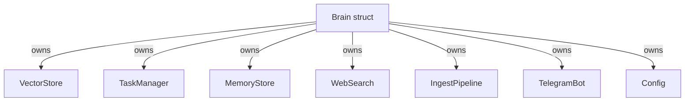
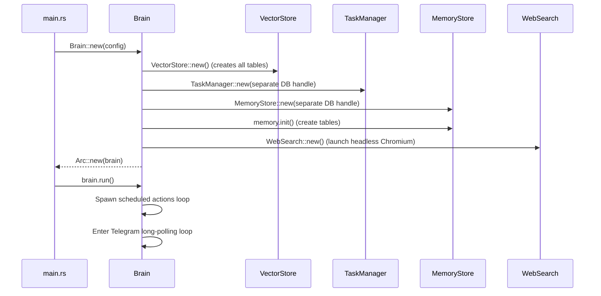
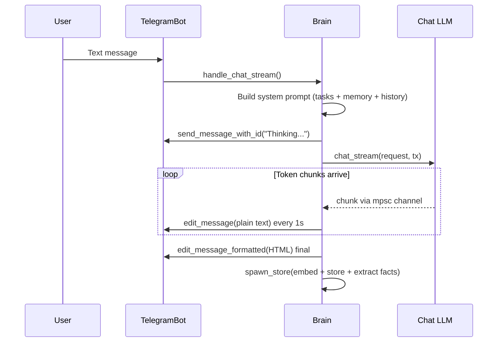
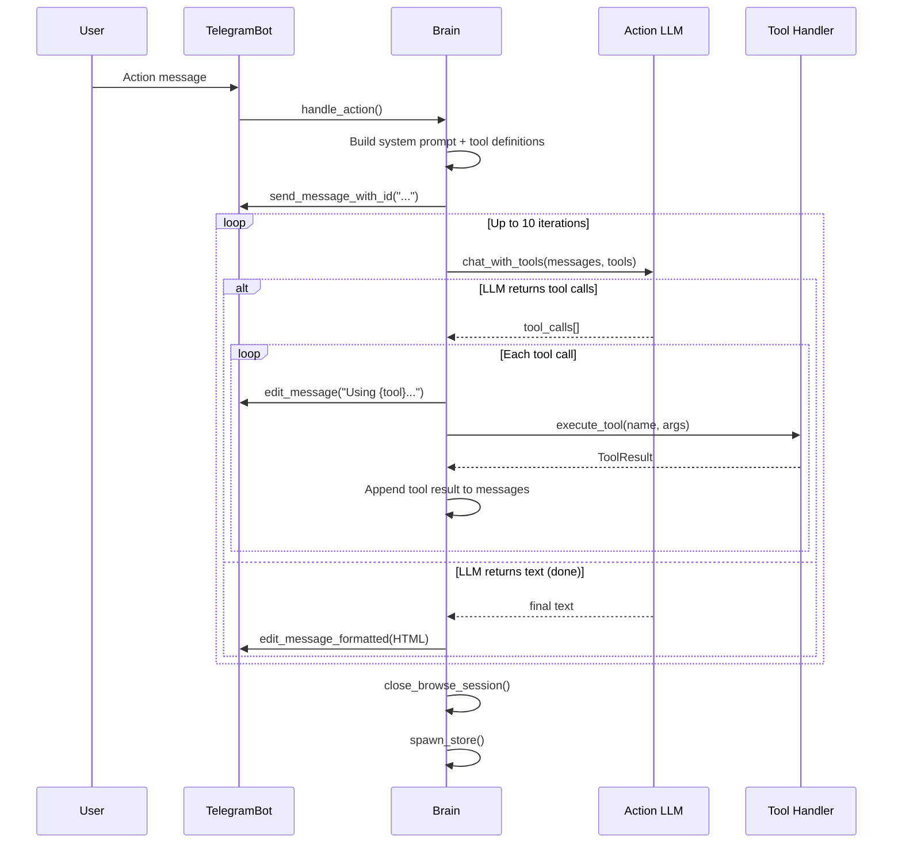

# oasis-brain

The orchestration layer. Brain owns all other components, runs the Telegram polling loop, classifies intents, routes messages, manages the tool execution loop, and handles streaming chat.

## Key Files

- `src/brain.rs` - The `Brain` struct and all orchestration logic (~2100 lines)
- `src/intent.rs` - `Intent` enum and JSON parsing

## Architecture



Brain is wrapped in `Arc<Self>` to allow spawning background tasks via `tokio::spawn`.

## Initialization Flow



## Intent Classification

Every text message (not files, URLs, or commands) is classified by the intent LLM:

| Intent | Behavior |
|--------|----------|
| `Chat` | Stream response from the Chat LLM. No tools. |
| `Action` | Enter tool execution loop with the Action LLM. Up to 10 iterations. |

The intent classifier uses a simple JSON response: `{"intent":"chat"}` or `{"intent":"action"}`.

If JSON parsing fails, defaults to `Action` (safer — lets the tool-use LLM decide).

Intent LLM has **3x exponential backoff retry** for transient errors (429, 500-504).

## Chat Flow (Streaming)



Key details:
- Intermediate edits use **plain text** (markdown may be incomplete mid-stream)
- Final edit uses **HTML** via pulldown-cmark conversion
- Edit rate limited to **once per second** to avoid Telegram rate limits
- Edit errors are silently ignored (`let _ =`) — fallback ensures text isn't lost

## Action Flow (Tool Loop)



**Short-circuit optimization**: For single simple tools (`task_create`, `task_list`, `task_update`, `task_delete`, `remember`, `schedule_*`), the tool output is sent directly without an extra LLM synthesis round-trip.

## System Prompt Construction

The system prompt is built dynamically and includes:
1. Bot identity and current date/time (with timezone)
2. Tool usage guidelines (when to use browser vs web_search)
3. Active task summary (injected from TaskManager)
4. Memory context (user facts from MemoryStore)
5. Recent conversation history (last N messages from VectorStore)

## Background Storage (`spawn_store`)

After every response, a background tokio task:
1. Embeds the user message (assistant message is NOT embedded to save API calls)
2. Stores both user and assistant messages in the `messages` table
3. Extracts user facts from the conversation turn using the intent LLM
4. Upserts extracted facts into the `user_facts` table

## Scheduled Actions Loop

Runs every 60 seconds in the background:
1. Query `scheduled_actions` for enabled actions where `next_run <= now`
2. Execute each action's tool calls
3. Optionally synthesize results with the intent LLM using `synthesis_prompt`
4. Send the result to the owner via Telegram
5. Compute and store the next run time

## Helper Functions

| Function | Purpose |
|----------|---------|
| `is_owner()` | Auth check: DB owner → config → auto-register first user |
| `classify_intent()` | Send message to intent LLM, parse JSON response |
| `rank_search_results()` | Chunk web results, embed, rank by cosine similarity |
| `format_due()` | Unix timestamp → human-readable date string |
| `compute_next_run()` | Parse schedule string → next UTC timestamp |
| `parse_date_to_unix()` | Date string (local time) → UTC unix timestamp |
| `day_name_to_dow()` | Day name (EN/ID) → day-of-week number |

## LLM Dispatch Pattern

LLM providers are created on-the-fly in static dispatch methods:

```
match provider {
    "gemini"    => GeminiLlm::new(key, model).chat(request),
    "anthropic" => AnthropicLlm::new(key, model).chat(request),
    "openai"    => OpenAiLlm::new(key, model).chat(request),
    "ollama"    => OllamaLlm::new(url, model).chat(request),
}
```

Three dispatch methods exist:
- `chat_intent_llm()` — uses `config.intent.*` (with retry)
- `chat_stream_dispatch()` — uses `config.llm.*` (streaming, spawned task)
- `chat_with_tools_dispatch()` — uses `config.action.*` (function calling)
