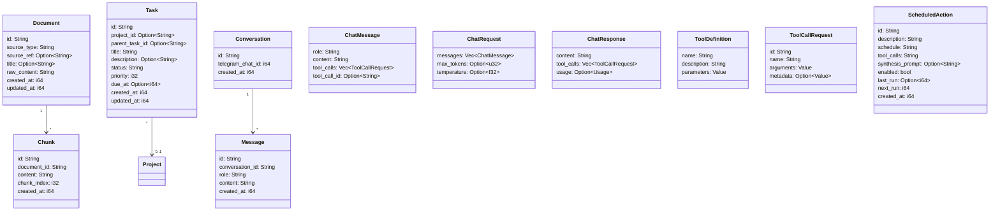
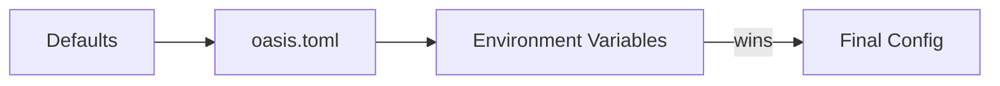

# oasis-core

Foundation crate providing shared types, configuration, error handling, and utility functions used by all other crates.

## Key Files

- `src/types.rs` - All shared data types
- `src/config.rs` - Configuration loading and structs
- `src/error.rs` - Error type and Result alias
- `src/lib.rs` - Re-exports

## Data Types

## ChatMessage Variants

`ChatMessage` serves multiple roles in the LLM conversation:

| Constructor | role | Purpose |
|-------------|------|---------|
| `ChatMessage::text("system", ...)` | system | System prompt |
| `ChatMessage::text("user", ...)` | user | User message |
| `ChatMessage::assistant_tool_calls(...)` | assistant | LLM requesting tool execution |
| `ChatMessage::tool_result(id, ...)` | tool | Tool execution result fed back to LLM |

## Utility Functions

| Function | Purpose |
|----------|---------|
| `new_id()` | Generate ULID-like ID: 12-char hex timestamp + 16-char hex random from `/dev/urandom` |
| `now_unix()` | Current Unix timestamp in seconds |

## Error Handling

`OasisError` is a custom enum (no thiserror/anyhow):

| Variant | Source |
|---------|--------|
| `Config(String)` | Configuration errors |
| `Database(String)` | libSQL/Turso errors |
| `Llm { provider, message }` | LLM API errors |
| `Embedding(String)` | Embedding API errors |
| `Ingest(String)` | Text extraction/ingestion errors |
| `Telegram(String)` | Telegram API errors |
| `Http { status, body }` | HTTP errors with status code |

All crates use `oasis_core::error::Result<T>` (alias for `std::result::Result<T, OasisError>`).

## Config Loading

Config sections: `telegram`, `llm`, `intent`, `action`, `embedding`, `database`, `chunking`, `brain`, `ollama`.

Fallback rules:
- `intent.api_key` falls back to `llm.api_key`
- `action.provider` + `action.model` fall back to `llm.*`
- `action.api_key` falls back to `llm.api_key`
