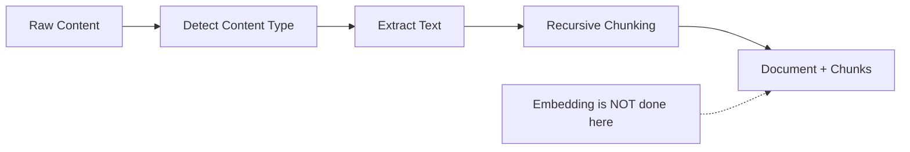
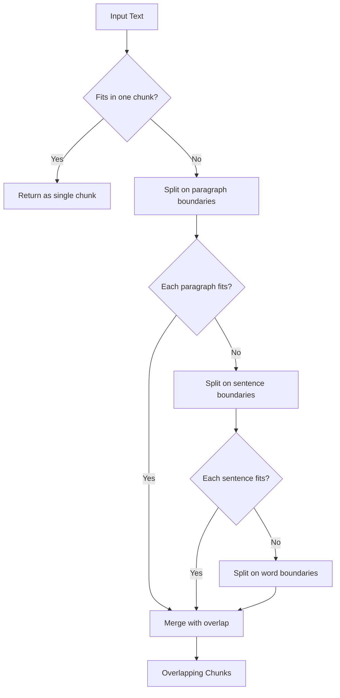
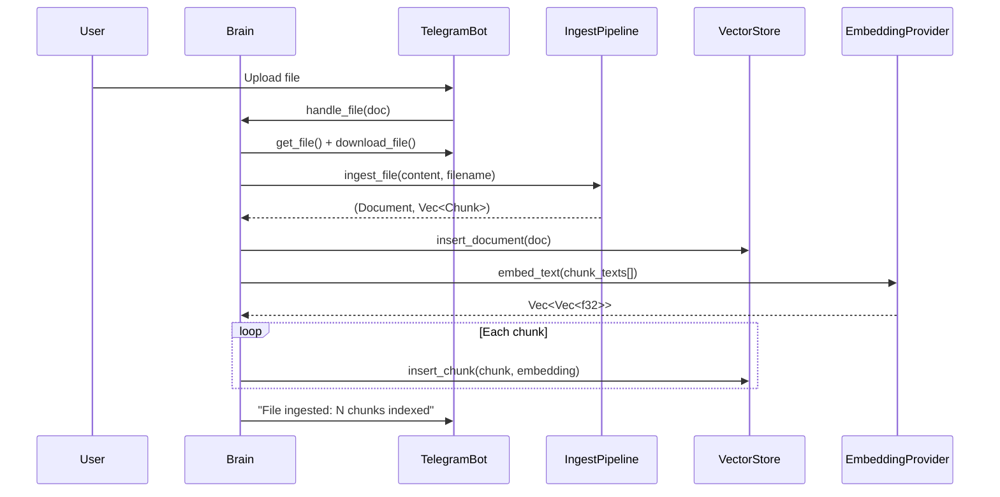

# oasis-ingest

Text extraction and chunking pipeline. Converts files, URLs, and raw text into `Document` + `Chunk` structs ready for embedding.

## Key Files

- `src/pipeline.rs` - `IngestPipeline` struct, high-level ingestion methods
- `src/chunker.rs` - Recursive text chunking with overlap
- `src/extractor.rs` - Text extraction from HTML, Markdown, plain text

## Architecture

The pipeline intentionally does NOT embed or store — Brain handles that by calling the embedding provider and VectorStore separately.

## Ingestion Methods

| Method | Input | source_type |
|--------|-------|-------------|
| `ingest_text()` | Plain text string | caller-specified |
| `ingest_html()` | HTML string | "url" |
| `ingest_file()` | File content + filename | "file" |
| `fetch_url()` | URL (static) | - (returns HTML) |

## Content Type Detection

`ingest_file()` determines content type from the file extension:

| Extension | Content Type |
|-----------|-------------|
| `.html`, `.htm` | HTML |
| `.md`, `.markdown` | Markdown |
| Everything else | Plain text |

## Text Extraction

The extractor strips formatting from content:
- **HTML**: Removes tags, scripts, styles; decodes entities; collapses whitespace
- **Markdown**: Strips markdown syntax (`**`, `*`, `#`, etc.) to plain text
- **Plain text**: Passed through as-is

## Chunking Strategy

### Configuration

| Parameter | Default | Purpose |
|-----------|---------|---------|
| `max_tokens` | 512 | Max tokens per chunk |
| `overlap_tokens` | 50 | Overlap between consecutive chunks |

Tokens are approximated as `tokens * 4 = characters`.

Default: max 2048 chars per chunk, 200 chars overlap.

### Overlap

Each chunk (except the first) starts with the last `overlap_chars` characters from the previous chunk. This ensures no information is lost at chunk boundaries and improves retrieval quality.

## Data Flow: File Upload

## Data Flow: URL Ingestion

Same as file upload, except:
1. `IngestPipeline::fetch_url()` downloads the HTML
2. `ingest_html()` extracts text from HTML before chunking
3. source_type is "url" instead of "file"
