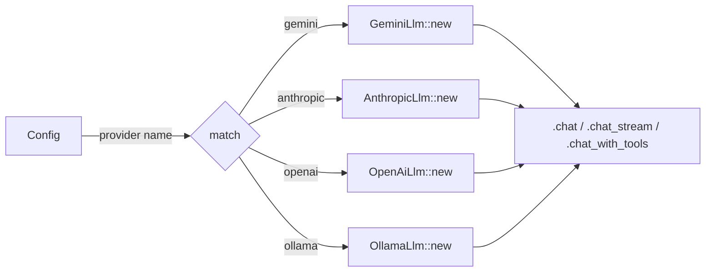

# oasis-llm

LLM and embedding provider implementations. All providers use raw HTTP via reqwest — no SDK dependencies.

## Key Files

- `src/provider.rs` - `LlmProvider` and `EmbeddingProvider` traits
- `src/gemini.rs` - Google Gemini (chat, streaming via SSE, embeddings, function calling)
- `src/anthropic.rs` - Anthropic Claude (chat, streaming via SSE, function calling)
- `src/openai.rs` - OpenAI (chat, streaming via SSE, embeddings, function calling)
- `src/ollama.rs` - Ollama local models (chat, streaming, embeddings, function calling)

## Provider Traits

```rust
trait LlmProvider {
    async fn chat(&self, request: ChatRequest) -> Result<ChatResponse>;
    async fn chat_stream(&self, request: ChatRequest, tx: UnboundedSender<String>) -> Result<ChatResponse>;
    async fn chat_with_tools(&self, request: ChatRequest, tools: &[ToolDefinition]) -> Result<ChatResponse>;
}

trait EmbeddingProvider {
    async fn embed(&self, texts: &[&str]) -> Result<Vec<Vec<f32>>>;
}
```

## Provider Matrix

| Provider | Chat | Stream | Tools | Embeddings |
|----------|------|--------|-------|------------|
| Gemini | `GeminiLlm` | SSE | Yes | `GeminiEmbedding` |
| Anthropic | `AnthropicLlm` | SSE | Yes | - |
| OpenAI | `OpenAiLlm` | SSE | Yes | `OpenAiEmbedding` |
| Ollama | `OllamaLlm` | SSE | Yes | `OllamaEmbedding` |

## How Providers Are Used

Providers are **not stored as trait objects**. They are created on-the-fly in Brain's dispatch methods:



This avoids `dyn LlmProvider` complexity since `chat_stream` returns a future that isn't `Send` with trait objects.

## Streaming Protocol

All providers implement SSE-based streaming:
1. Brain creates an `mpsc::unbounded_channel`
2. LLM call is spawned as a tokio task, receives the `tx` sender
3. As SSE chunks arrive, text deltas are sent via `tx.send(chunk)`
4. Brain receives chunks from `rx` and batches Telegram edits
5. When the stream ends, the spawned task returns the final `ChatResponse` (with usage stats)

## Function Calling (Tools)

For `chat_with_tools`, each provider converts `ToolDefinition[]` into its native format:
- **Gemini**: `tools[].function_declarations[]`
- **Anthropic**: `tools[]` with `input_schema`
- **OpenAI**: `tools[]` with `type: "function"` wrapper
- **Ollama**: Same as OpenAI format

Tool call responses are parsed into the unified `ToolCallRequest` struct with `id`, `name`, `arguments`.

## Embedding

Embedding providers accept a batch of text strings and return vectors:

| Provider | Default Model | Default Dimensions |
|----------|--------------|-------------------|
| OpenAI | `text-embedding-3-small` | 1536 |
| Gemini | (configurable) | (configurable) |
| Ollama | (configurable) | (configurable) |

The embedding dimension must match the `F32_BLOB(1536)` column in the database. If using a different dimension, both the config and DB schema must be updated.
