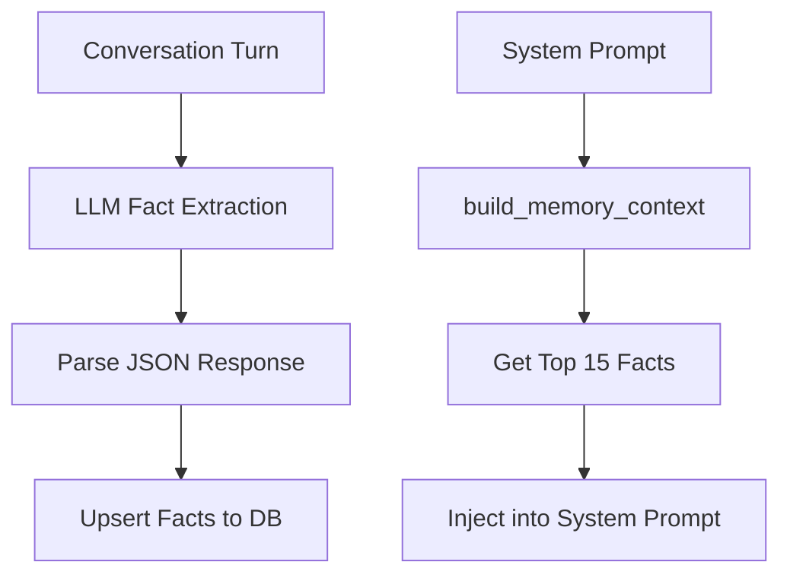
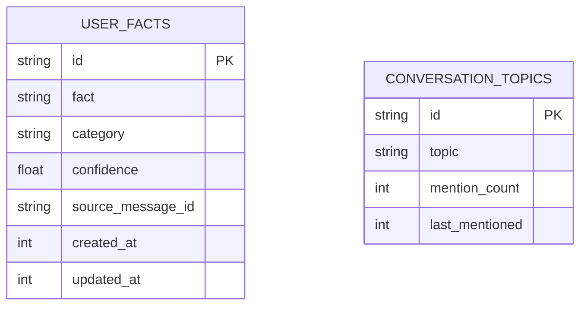

# oasis-memory

Automatic user fact extraction and long-term memory. Learns about the user from conversations and injects relevant facts into the system prompt.

## Key Files

- `src/memory.rs` - `MemoryStore` struct, fact extraction prompt, parsing

## Architecture

## How It Works

### Extraction (after every message)

1. Brain's `spawn_store()` calls `extract_and_store_facts()` in a background task
2. Fetches existing facts (top 30) to avoid re-extracting known information
3. Sends the conversation turn + extraction prompt to the **intent LLM** (Flash-Lite)
4. Parses the response as JSON array of `{fact, category}` objects
5. Upserts each fact into the `user_facts` table

### Injection (before every response)

1. `build_memory_context()` fetches top 15 facts sorted by confidence and recency
2. Formats them as a markdown section: `## What you know about the user`
3. Brain injects this into the system prompt for both chat and action flows

## Fact Categories

| Category | Examples |
|----------|---------|
| `personal` | Name, location, timezone |
| `preference` | Communication style, tools, languages |
| `work` | Job, current projects, goals |
| `habit` | Routines, patterns |
| `relationship` | People mentioned, connections |

## Confidence System

- New facts start at confidence `1.0`
- Re-extracted facts get +0.1 (capped at 1.0)
- Facts not reinforced in 7+ days decay by `*0.95`
- Facts below `0.3` confidence AND older than 30 days are pruned
- Only facts with confidence >= 0.3 are included in the system prompt

## Data Model

## Extraction Prompt

The extraction prompt instructs the LLM to:
- Only extract facts about the **user** (not the assistant)
- Return a JSON array: `[{"fact": "...", "category": "..."}]`
- Return `[]` if no new facts found
- Skip facts already in the "known facts" list (passed as context)

## Operations

| Method | Purpose |
|--------|---------|
| `init()` | Create `user_facts` and `conversation_topics` tables |
| `parse_extracted_facts()` | Parse LLM JSON response into `ExtractedFact[]` |
| `upsert_fact()` | Insert new fact or bump confidence of existing one |
| `get_top_facts(limit)` | Top facts by confidence DESC, updated_at DESC |
| `build_memory_context()` | Format top 15 facts for system prompt injection |
| `delete_matching_facts()` | Delete facts matching a query (for "forget" commands) |
| `decay_old_facts()` | Apply confidence decay and prune stale facts |
