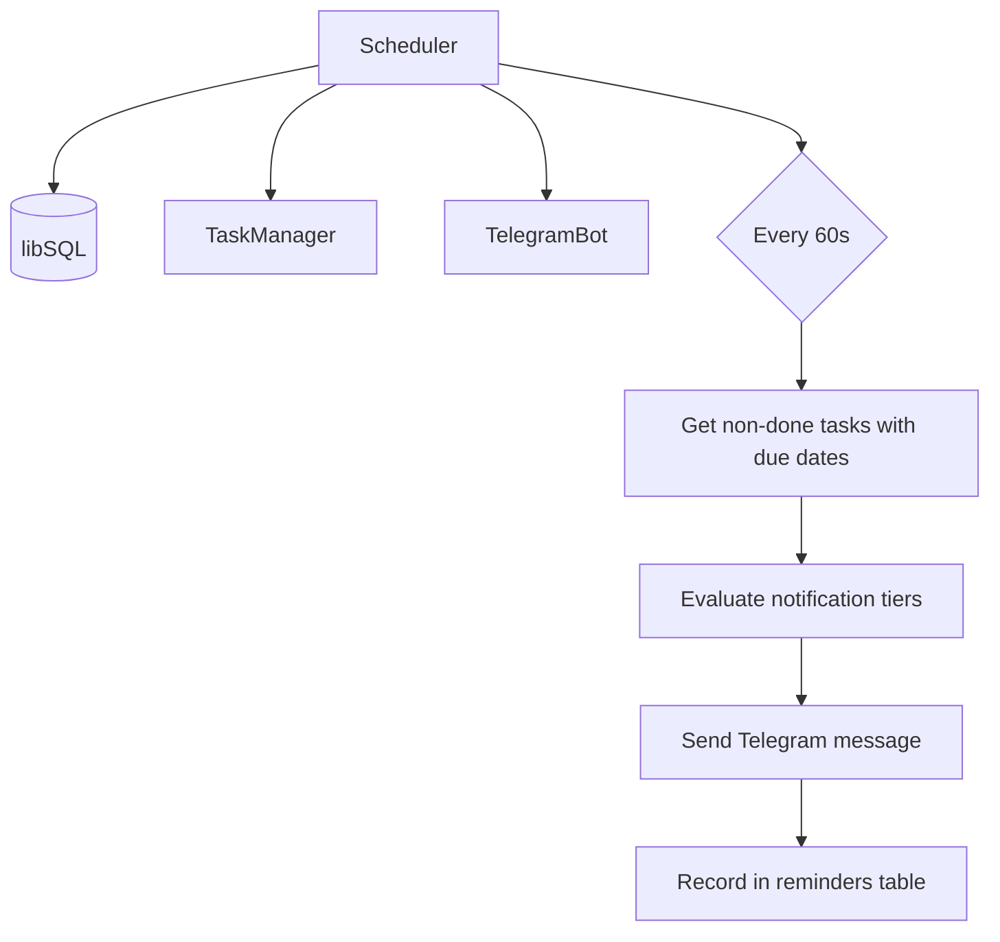
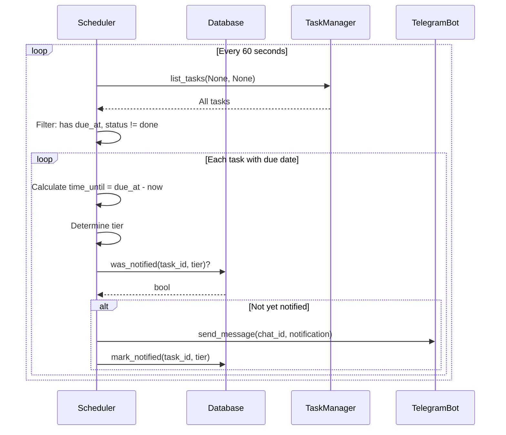

# oasis-scheduler

Background task reminder system. Sends proactive Telegram notifications when tasks with due dates are approaching.

## Key Files

- `src/scheduler.rs` - `Scheduler` struct, notification tiers, background loop

## Architecture

The Scheduler runs independently from Brain — it has its own DB handle, TaskManager, and TelegramBot instance. Both run in parallel via `tokio::select!` in main.rs.

## Notification Tiers

```mermaid
gantt
    title Notification Timeline
    dateFormat X
    axisFormat %s

    section Tiers
    24h before    :a, 0, 1
    1h before     :b, 1, 2
    Due now       :c, 2, 3
    Overdue       :crit, d, 3, 4
```

| Tier | Trigger | Message |
|------|---------|---------|
| `24h` | 1-24 hours before due | "Due tomorrow: {title}" |
| `1h` | 5 min - 1 hour before due | "Coming up in ~1 hour: {title}" |
| `due` | Within 5 minutes of due | "Due now: {title}" |
| `overdue` | Past due | "Overdue: {title}" |

Each tier fires **at most once** per task. The `reminders` table tracks which (task_id, tier) combinations have been notified.

## Data Flow

## Startup Behavior

1. Scheduler reads `owner_user_id` from the config table
2. If no owner registered yet (first run), `chat_id = 0` — scheduler runs but skips sending
3. Each check cycle re-reads `chat_id` from DB in case owner registered after startup
4. On startup, immediately runs one check cycle to catch any missed notifications

## Separate from Scheduled Actions

Note: The Scheduler (task reminders) is different from **Scheduled Actions** (automated recurring tool execution). Scheduled Actions are managed by Brain's `run_scheduled_actions_loop()` and stored in the `scheduled_actions` table. The Scheduler only handles task due date reminders.

| Feature | Scheduler | Scheduled Actions |
|---------|-----------|-------------------|
| Purpose | Task due date reminders | Recurring automated actions |
| Owner | oasis-scheduler crate | oasis-brain (Brain struct) |
| Runs in | Separate tokio task via main.rs | Brain's background loop |
| Interval | 60 seconds | 60 seconds |
| DB table | `reminders` | `scheduled_actions` |
| User-created | No (automatic) | Yes (via `schedule_create` tool) |
