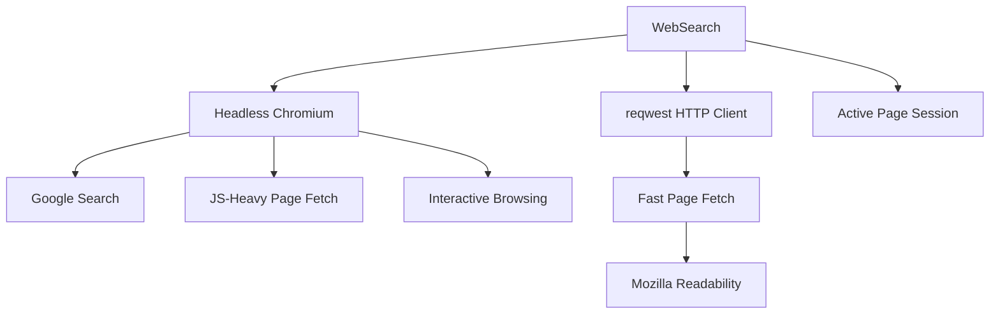
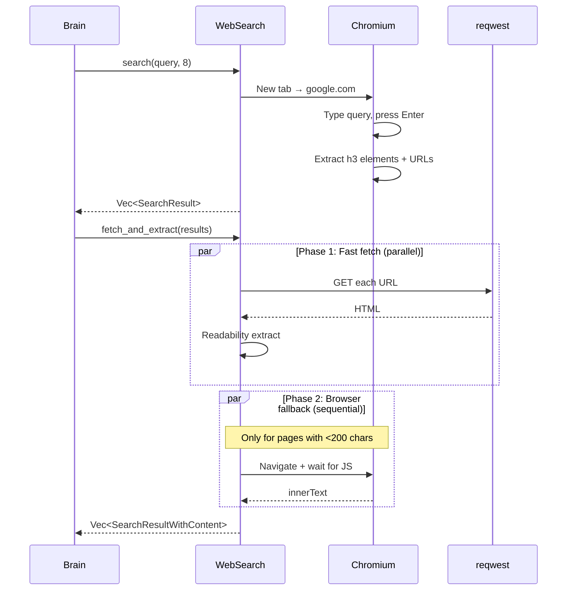
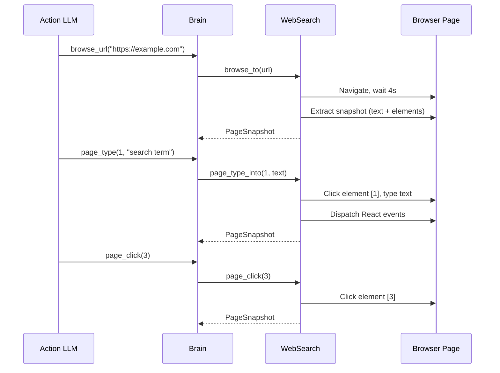

# oasis-search

Web search and interactive browser functionality using a headless Chromium instance.

## Key Files

- `src/search.rs` - `WebSearch` struct, Google scraping, page fetching, interactive browser

## Architecture



## Two Modes

### 1. Search Mode (used by `web_search` tool)



Key details:
- Google search uses **stealth mode**: navigates to google.com first, then types + submits (simulates human behavior to avoid CAPTCHA)
- Page fetching is **two-phase**: fast reqwest+Readability first, headless Chromium fallback for JS-heavy pages
- Results are deduplicated by URL

### 2. Interactive Browser Mode (used by `browse_url`, `page_click`, `page_type`, `page_read` tools)



## Page Snapshot

Each interaction returns a `PageSnapshot`:

```
Page: https://example.com
Title: Example Site

--- Content ---
(truncated page text, max 5000 chars)

--- Interactive Elements ---
[1] input (text) "Search" value=""
[2] button "Submit"
[3] a (link) "Products"
```

Elements are tagged with `data-oi` attributes in the DOM so they can be targeted by index. The extraction prioritizes:
1. **Overlays/modals** first (detects high z-index fixed elements)
2. Inputs, textareas, selects
3. ARIA role elements (combobox, searchbox, option, menuitem)
4. Buttons
5. Links with text

Maximum 50 elements per snapshot.

## Search Result Ranking

Brain's `rank_search_results()` (in oasis-brain) performs embedding-based ranking:

1. Chunk each page's content into ~500-char pieces
2. Embed query + all chunks in one batch
3. Compute cosine similarity between query vector and each chunk vector
4. Sort chunks by score descending, take top 8
5. If top score < 0.35, retry with expanded results (12 instead of 8)

## Constants

| Constant | Value | Purpose |
|----------|-------|---------|
| `PAGE_FETCH_TIMEOUT` | 10s | reqwest timeout per page |
| `SEARCH_RENDER_WAIT` | 3s | Wait for Google results to render |
| `BROWSER_PAGE_WAIT` | 4s | Wait for JS-heavy page to render |
| `BROWSE_ACTION_WAIT` | 2s | Wait after click/type for page update |
| `MAX_PAGE_CHARS` | 12,000 | Max chars kept from fetched page |
| `MAX_SNAPSHOT_TEXT` | 5,000 | Max text content in page snapshot |
| `MAX_ELEMENTS` | 50 | Max interactive elements per snapshot |
| `MIN_USEFUL_CHARS` | 200 | Below this, fallback to browser |

## Session Management

- `browse_to()` closes any existing page before opening a new one
- `close_browse_session()` is called at the end of every action loop to free resources
- The active page is stored in `Mutex<Option<Page>>` for thread safety
