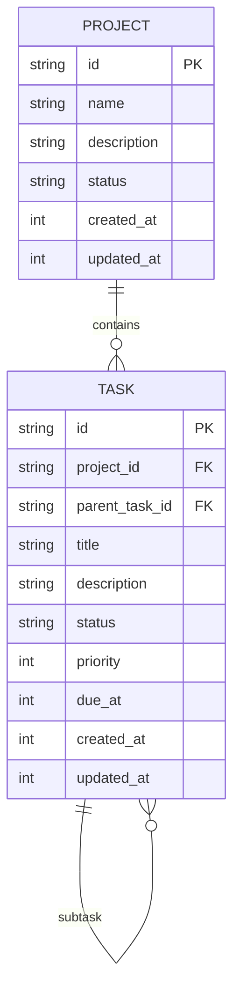
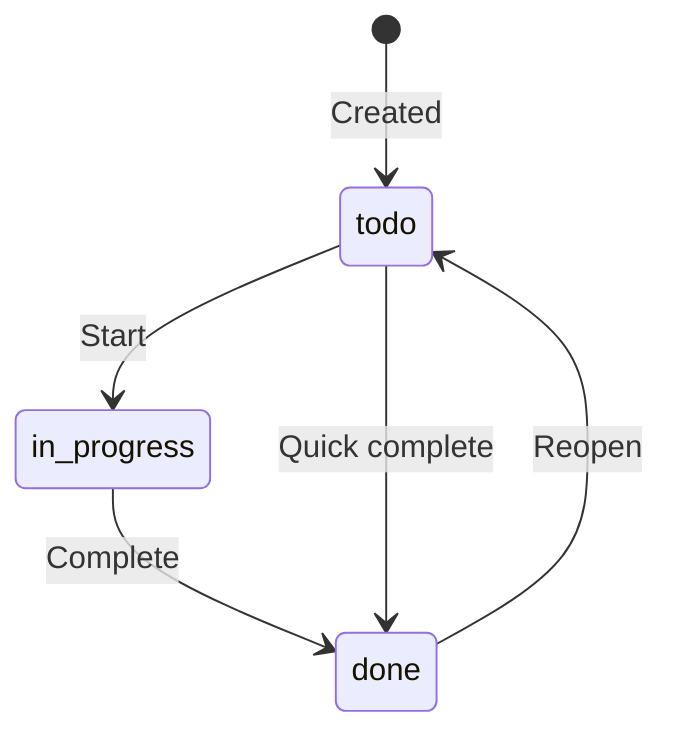

# oasis-tasks

Task and project management. Provides CRUD operations on tasks with support for status tracking, priorities, due dates, and project grouping.

## Key Files

- `src/manager.rs` - `TaskManager` struct and all operations

## Data Model



## Task Statuses



Valid statuses: `todo`, `in_progress`, `done`.

## Task Priorities

| Value | Label |
|-------|-------|
| 0 | normal (default) |
| 1 | low |
| 2 | medium |
| 3 | high |

Tasks are sorted by priority DESC, then created_at ASC.

## Task Lookup

Brain uses `find_tasks_smart()` which tries three strategies in order:

1. **`#short_id`** — if query starts with `#`, match task ID suffix
2. **Bare hex** — if 4-8 hex chars, try as short ID first
3. **Title substring** — case-insensitive LIKE match

Short IDs are the last 6 characters of the full ULID-like ID.

## Operations

| Method | Purpose |
|--------|---------|
| `create_task()` | Create task with optional project, parent, description, priority, due date |
| `update_task_status()` | Change status (validates against allowed values) |
| `list_tasks()` | List with optional project_id and status filters |
| `get_task()` | Get single task by ID |
| `find_task_by_title()` | LIKE search on title |
| `find_task_by_short_id()` | Suffix match on ID |
| `get_active_task_summary()` | Formatted summary of non-done tasks grouped by project (injected into system prompt) |
| `delete_task()` | Delete single task |
| `delete_all_tasks()` | Delete all tasks |

## System Prompt Integration

`get_active_task_summary()` produces a formatted string like:

```
Project: Work
  - [todo] #a1b2c3 Write documentation (due: 2026-02-20)
  - [in_progress] #d4e5f6 Review PR

Unassigned:
  - [todo] #g7h8i9 Buy groceries
```

This is injected into every system prompt so the LLM always knows what tasks exist.
