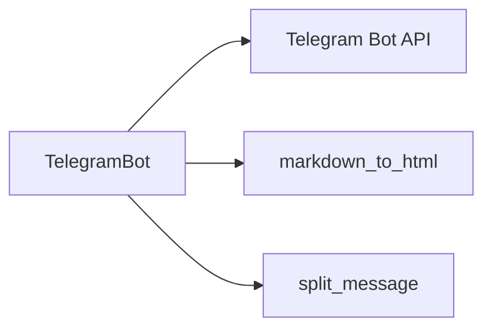
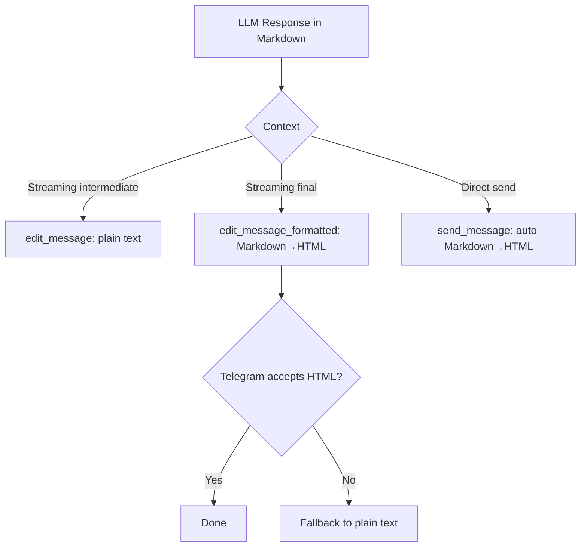
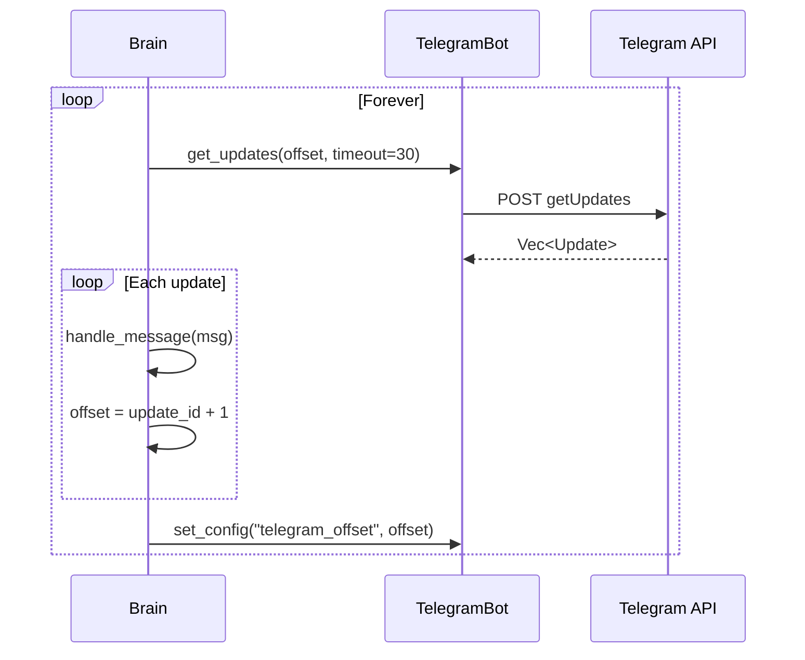

# oasis-telegram

Hand-rolled Telegram Bot API client using long polling. No bot framework dependency — just raw HTTP via reqwest.

## Key Files

- `src/bot.rs` - `TelegramBot` struct and all API methods
- `src/types.rs` - Telegram API type definitions

## Architecture



## API Methods

| Method | Telegram API | Purpose |
|--------|-------------|---------|
| `get_me()` | getMe | Verify bot token, get bot info |
| `get_updates()` | getUpdates | Long-poll for new messages |
| `send_message()` | sendMessage | Send with auto Markdown→HTML conversion |
| `send_message_with_id()` | sendMessage | Send plain text, return message_id for editing |
| `edit_message()` | editMessageText | Edit as plain text (streaming intermediate) |
| `edit_message_formatted()` | editMessageText | Edit with HTML formatting (final edit) |
| `send_typing()` | sendChatAction | Show "typing..." indicator |
| `get_file()` | getFile | Get file info for download |
| `download_file()` | /file/bot{token}/{path} | Download file bytes |
| `set_my_commands()` | setMyCommands | Register command menu |

## Message Formatting Strategy



Why this strategy:
- **Intermediate edits use plain text** because markdown may be incomplete mid-stream (unclosed `**`, partial code blocks)
- **Final edit uses HTML** because the complete text should have valid markdown
- **HTML fallback** catches cases where pulldown-cmark produces HTML that Telegram rejects

## Markdown to HTML Conversion

Uses `pulldown-cmark` to convert standard Markdown to Telegram-compatible HTML:

| Markdown | HTML |
|----------|------|
| `**bold**` | `<b>bold</b>` |
| `*italic*` | `<i>italic</i>` |
| `` `code` `` | `<code>code</code>` |
| ` ```code block``` ` | `<pre><code>...</code></pre>` |
| `~~strike~~` | `<s>strike</s>` |
| `### Header` | `<b>Header</b>` (rendered as bold) |
| `[text](url)` | `<a href="url">text</a>` |
| `> quote` | `<blockquote>quote</blockquote>` |
| `- item` | `• item` |

Telegram does NOT support `###` headers natively — they're converted to bold text.

## Message Splitting

Telegram has a 4096-character message limit. `split_message()` splits long messages:
1. If text fits in one message, send as-is
2. Otherwise, split at newline boundaries (prefer paragraph breaks)
3. If no newline found within limit, hard-split at 4096 chars

## Long Polling Loop



The `telegram_offset` is persisted to the database so messages aren't reprocessed after restart.

## Error Handling

- `"message is not modified"` errors from edit_message are silently ignored (common during streaming when content hasn't changed)
- Network errors during polling cause a 5-second sleep then retry
- HTML formatting failures fall back to plain text
