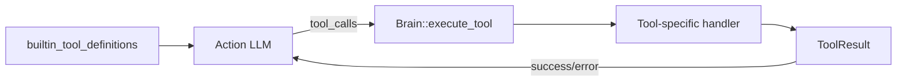

# oasis-tools

Tool definitions for LLM function calling. Defines the schema of all available tools that the Action LLM can invoke.

## Key Files

- `src/tool.rs` - `ToolResult` struct, `builtin_tool_definitions()`, all tool definition functions

## Architecture



## Tool Definitions

Each tool is defined as a `ToolDefinition` with:
- `name` — tool identifier
- `description` — human-readable description (LLM uses this to decide when to call)
- `parameters` — JSON Schema for the tool's arguments

The definitions are returned by `builtin_tool_definitions()` and passed to the Action LLM's `chat_with_tools()` call.

## ToolResult

```rust
struct ToolResult {
    output: String,  // Human-readable output
}
```

Two constructors:
- `ToolResult::ok(output)` — success, output as-is
- `ToolResult::err(message)` — prefixes with "Error: "

## Tool Categories

### Task Management
| Tool | Required Args | Optional Args |
|------|--------------|---------------|
| `task_create` | title | description, due (YYYY-MM-DD or YYYY-MM-DDTHH:MM), priority (low/medium/high) |
| `task_list` | - | status (todo/in_progress/done) |
| `task_update` | title_query, new_status | - |
| `task_delete` | title_query (or "*") | - |

### Information Retrieval
| Tool | Required Args | Notes |
|------|--------------|-------|
| `web_search` | query | Search query optimized for search engines |
| `knowledge_search` | query | Searches personal knowledge base and past conversations |
| `remember` | content | Saves text to knowledge base via ingestion pipeline |

### Scheduling
| Tool | Required Args | Optional Args |
|------|--------------|---------------|
| `schedule_create` | description, time (HH:MM), recurrence, tools[] | day, synthesis_prompt |
| `schedule_list` | - | - |
| `schedule_update` | description_query | enabled, time, recurrence, day |
| `schedule_delete` | description_query (or "*") | - |

### Browser Interaction
| Tool | Required Args | Notes |
|------|--------------|-------|
| `browse_url` | url | Opens URL, returns page snapshot with elements |
| `page_click` | element | Click element by number (e.g., "3") |
| `page_type` | element, text | Type into input field by element number |
| `page_read` | - | Re-read current page state |

## Execution Flow

Tool execution happens in Brain's `execute_tool()` method, which matches on the tool name and delegates to the appropriate handler. The tool definitions in this crate only define the **schema** — the actual execution logic lives in oasis-brain.

## Short-Circuit Optimization

Brain skips the LLM synthesis round-trip for "simple" tools whose output is already human-readable:
- `task_create`, `task_list`, `task_update`, `task_delete`
- `remember`
- `schedule_create`, `schedule_list`, `schedule_update`, `schedule_delete`

For these tools, when only one tool is called and it succeeds, the raw output is sent directly to the user.
