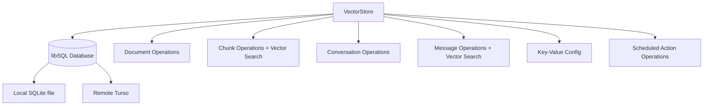
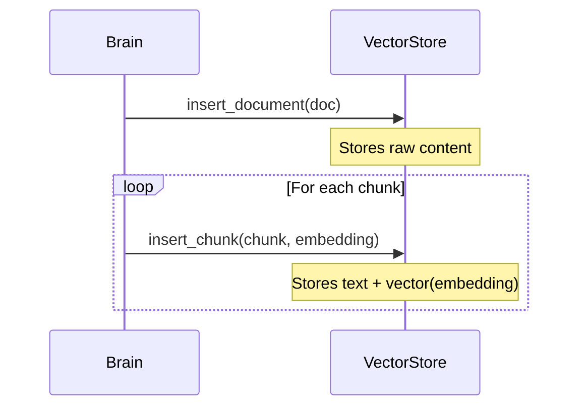
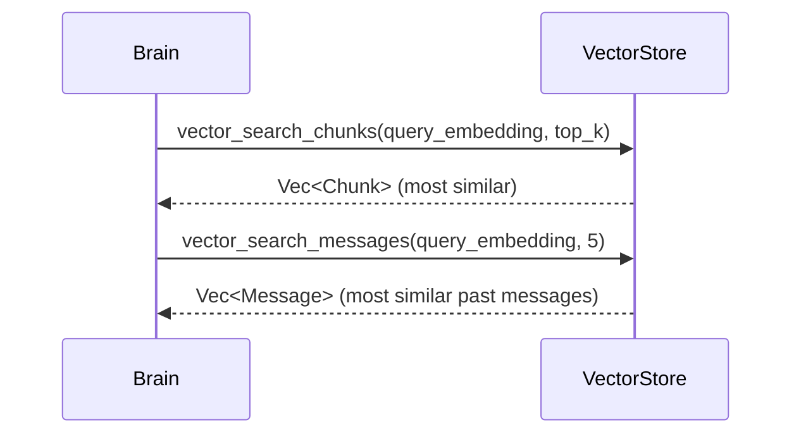

# oasis-vector

Database layer wrapping libSQL with DiskANN vector indexes. Manages all persistent storage: documents, chunks, conversations, messages, config, and scheduled actions.

## Key Files

- `src/store.rs` - `VectorStore` struct and all database operations

## Architecture



## Connection Strategy

Each method call creates a **fresh connection** via `self.db.connect()`. For remote Turso databases, this creates a new Hrana stream, avoiding `STREAM_EXPIRED` errors on long-lived connections.

## Tables

### `documents`
Stores ingested content (files, URLs, text messages).
- Primary key: ULID-like `id`
- `source_type`: "file", "url", "message", "note"
- `source_ref`: original filename or URL
- `raw_content`: full original text

### `chunks`
Document fragments with embedding vectors for similarity search.
- `document_id` → references `documents(id)`
- `embedding`: `F32_BLOB(1536)` — vector column
- `chunk_index`: position within the parent document
- **Vector index**: `chunks_vector_idx` using DiskANN with cosine metric

### `messages`
Chat messages with optional embedding vectors.
- `conversation_id` → references `conversations(id)`
- `role`: "user" or "assistant"
- `embedding`: `F32_BLOB(1536)` — only user messages are embedded
- **Vector index**: `messages_vector_idx` using DiskANN with cosine metric

### `conversations`
Groups messages by Telegram chat session. Creating a new conversation (`/new` command) starts a fresh context window.

### `config`
Simple key-value store for runtime state:
- `telegram_offset` — last processed Telegram update ID (survives restarts)
- `owner_user_id` — auto-registered owner's Telegram user ID

### `scheduled_actions`
Recurring automated actions with cron-like scheduling. See [scheduler.md](scheduler.md).

### `projects` / `tasks`
Task management tables. See [tasks.md](tasks.md).

## Vector Search

Both chunk and message search use libSQL's `vector_top_k` function:

```sql
SELECT * FROM chunks
WHERE rowid IN vector_top_k('chunks_vector_idx', vector(?), ?)
```

This performs approximate nearest neighbor search using the DiskANN index. The query vector is passed as a JSON-encoded float array.

## Data Flow: Ingestion



## Data Flow: Retrieval (RAG)


